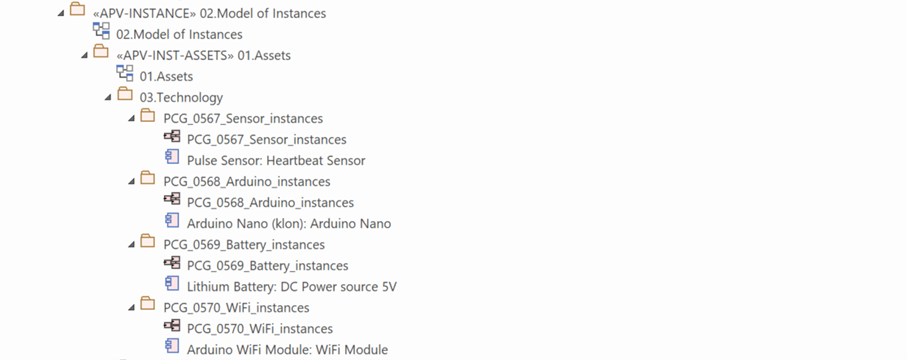
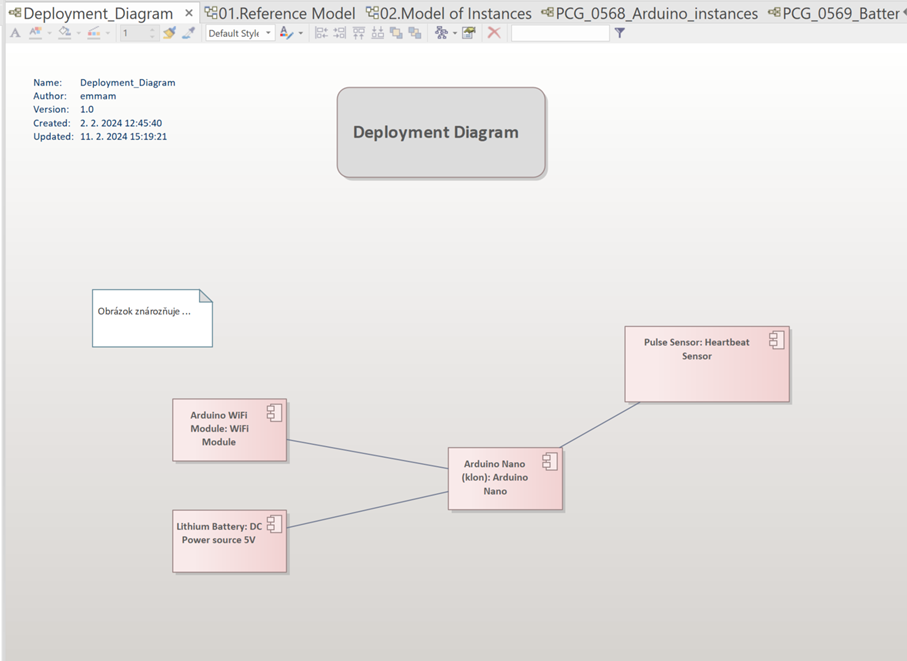
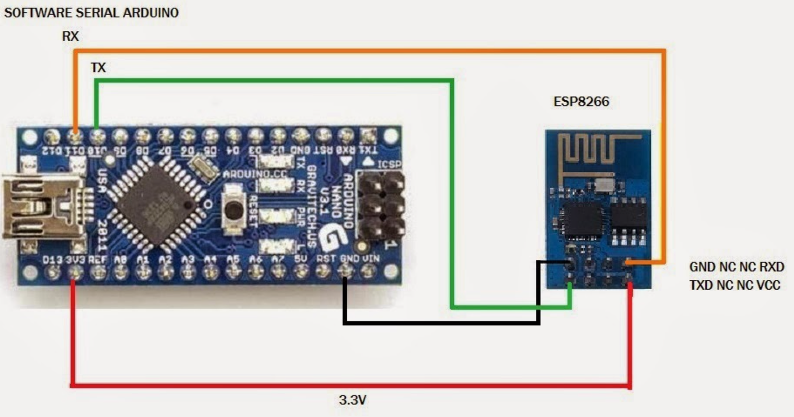
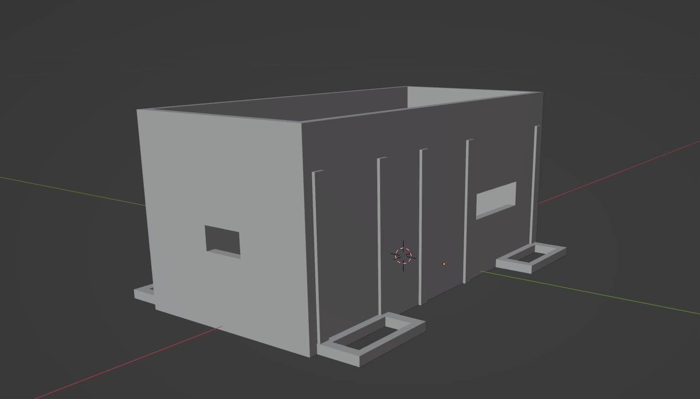
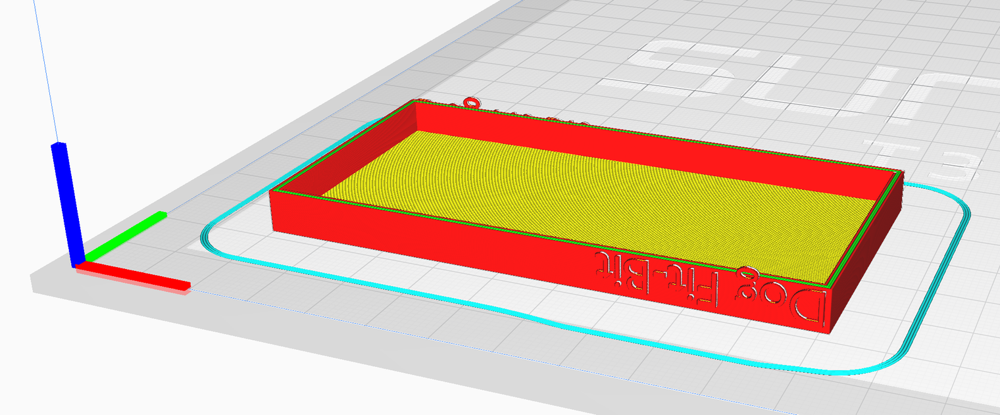
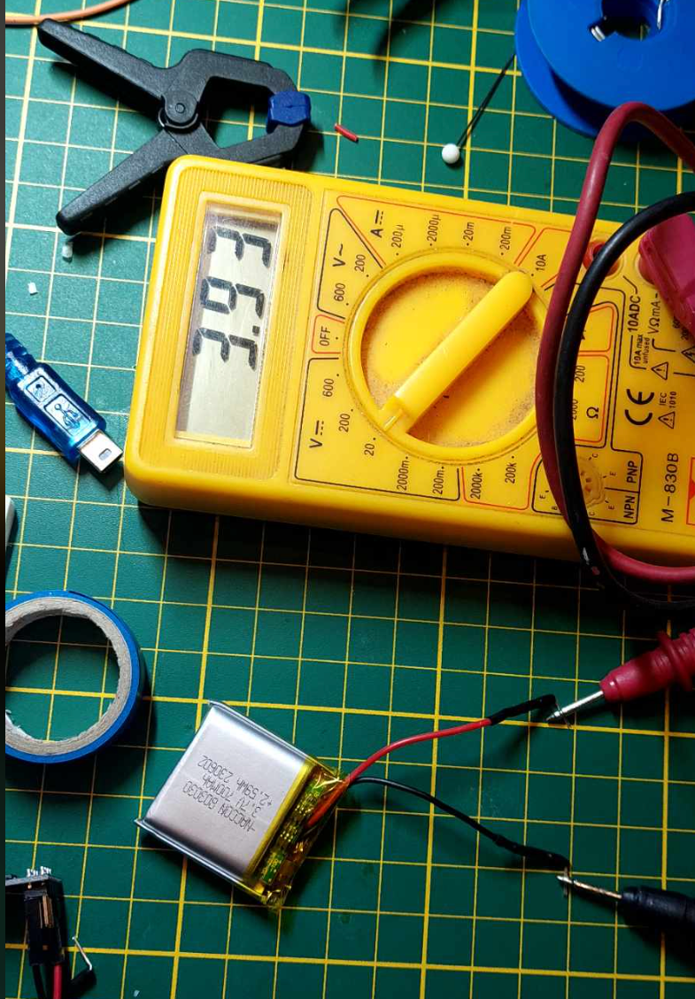
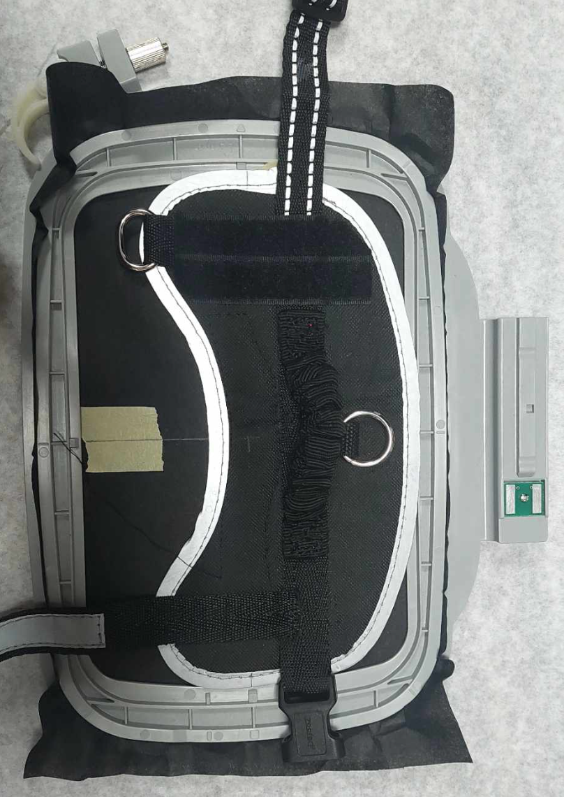

# Dog-Fit

## Table of contents
1. [Description](#Description)
2. [Motivation](#motivation)
3. [Use Cases](#use-cases)
4. [Business View](#business-view)
5. [Lemontree, Paralel Modelling and Digital Duplicate](#lemontree-paralel-modelling-and-digital-duplicate)
6. [Technology Layer](#technology-layer)
7. [Lessons Learned](#lessons-learned)

## Description
In today's rapidly evolving digital world, the health of our beloved pets is becoming an increasingly important aspect of caring for them. With this goal in mind, we have decided to create a revolutionary product that combines the latest technologies with love for our four-legged friends. Our project is Dog-Fit, an innovative device created using digital fabrication, 3D printing, and Arduino technology, focused on monitoring the heart activity of dogs.

## Motivation
Heart activity is a critical indicator of a dog's overall health, and that's why we've decided to create a device that offers precise measurements and compatibility with everyday life.
With Dog-Fit, owners can monitor their dogs' heart rate and gain valuable insights into their activity levels, health, and overall well-being. This device is designed with a focus on the safety and comfort of dogs.
Our goal is to provide owners with a reliable and modern tool for monitoring their dogs' health, allowing them to build an even stronger and healthier bond with their faithful companions.
Dog-Fit, because the health of your dog is our priority.

## Use Cases
- **Monitoring Physical Activity:**
  Owners can track their dogs' level of physical activity with Dog-Fit, allowing them to better plan daily walks and exercise.

- **Early Detection of Heart Issues:**
  Dog-Fit provides owners the ability to monitor their dogs' heart rate in real-time, enabling early detection of potential heart issues and a prompt response to veterinary care.

- **Optimizing Diet and Exercise:**
  Based on heart activity data, owners can adjust their dogs' diet and exercise routine to support overall health and fitness.

- **Training and Behavior Improvement:**
  Dog-Fit can be utilized in dog training and behavior improvement. Owners can observe how heart activity changes in response to various stimuli, facilitating more effective training.

- **Sleep Monitoring:**
  Dog-Fit can also monitor dogs' sleep patterns, giving owners a better insight into the quality of their pets' nighttime rest.

- **Sharing Data with Veterinarians:**
  Data from Dog-Fit can be shared with veterinarians, enabling better diagnosis and healthcare for dogs during veterinary visits.

- **Community Interaction:**
  The Dog-Fit application may offer social features such as creating dog profiles, participating in challenges and competitions with other dog owners, adding a social integration element, and promoting responsible ownership.

- **Alerts for Irregularities:**
  Dog-Fit can send alerts to owners in case of irregularities in heart activity, allowing for a quick response to potential health issues.

## Business View

- **Unique Value for Customers:**
  Dog-Fit provides dog owners with a real-time health monitoring tool, enhancing their comfort and responsibility towards their pets.

- **Collaboration with Veterinary Clinics and Partners:**
  Dog-Fit can establish partnerships with veterinary clinics and other businesses in the pet industry.

- **Sales Opportunities:**
  In addition to the sale of the Dog-Fit device, the project can explore additional sales opportunities through accessories, additional services, and software updates, increasing revenue and expanding its reach.

- **Customization and Personalization:**
  Utilizing 3D printing and digital fabrication technology, Dog-Fit can offer customization and personalization options according to the needs and preferences of each owner and dog, adding value and uniqueness to the product.

- **Wide Range of Applications:**
  - **Home Environment:**
    Monitoring physical activity, heart rate, and behavior patterns provides owners with valuable information about the overall health and well-being of their pets.
  
  - **Training and Education:**
    For professional trainers and owners engaged in dog training, Dog-Fit provides data that can optimize training programs and track progress.
  
  - **Veterinary Care:**
    In the field of veterinary care, Dog-Fit can play a crucial role in monitoring the health of dogs and assisting veterinarians in diagnosis and treatment.
  
  - **Sports and Recreational Activities:**
    For dog owners involved in sports and recreational activities with their pets, Dog-Fit offers specific data on their performance and fitness.
  
  - **Veterinary Research Studies:**
    Dog-Fit can serve as a useful tool in veterinary research studies, providing objective data on the heart activity of dogs to contribute to a better understanding of their health in various situations and environments.

With this broad range of applications, Dog-Fit not only provides value to dog owners but also opens doors to various business opportunities in the pet care, dog training, and veterinary care industries.

### State of market

### Business Process Viewpoint
To create the Business Process Viewpoint diagram for a typical Dog-Fit user, we can identify several key processes that dog owners will utilize when interacting with this device.

1. **Acquiring Dog-Fit:**
   - The user purchases Dog-Fit through an online store or brick-and-mortar shop.

2. **Activation and Connection:**
   - The user activates Dog-Fit and connects it to their mobile device using the mobile application.

3. **Profile Personalization:**
   - The user creates a profile for their dog in the application, where they can customize settings and track their pet's specific needs.

4. **Wearing Dog-Fit:**
   - Following the instructions provided in the manual, the user places Dog-Fit on their dog.

5. **Monitoring Activity:**
   - While Dog-Fit is worn, the user monitors their dog's physical activity in real-time through the mobile application.

6. **Data Analysis:**
   - The user accesses analytical tools in the application to track long-term trends and patterns in their dog's activities.

7. **Notifications and Alerts:**
   - If Dog-Fit detects irregularities or actions requiring attention, the application automatically generates notifications or alerts for the user.

8. **Sharing Data with the Veterinarian:**
   - If necessary, the user can share recorded data with the veterinarian through the application.

9. **Updates and Maintenance:**
   - The user receives information about software updates and maintenance through notifications and can perform them via the mobile application.

10. **Community Engagement:**
    - The user can involve their dog in the Dog-Fit community, share achievements, challenges, and receive support from other dog owners.

### Business Solution Concept Viewpoint

1. **User Motivation:**
   - The user is motivated to monitor and improve their dog's health through accurate tracking of heart activity and physical activity.

2. **Prevention of Health Issues:**
   - The user aims for the prevention and early detection of potential health problems in their dog through notifications and alerts generated by Dog-Fit.

3. **Optimization of Exercise Activities:**
   - The user is interested in better optimizing their dog's exercise activities based on precise activity data.

4. **Personalized Pet Care:**
   - The user's goal is to provide personalized care and treatment for their dog, tailored to its unique needs and lifestyle.

5. **Sharing Successes with the Community:**
   - The user is interested in sharing successes, challenges, and experiences with their dog with other Dog-Fit community members, creating strong communities and support among dog owners.

6. **Offering Optimal Nutritional Needs:**
   - The user aims to provide optimal nutritional needs for their dog based on the analysis of activity data and the specific requirements of their pet.

7. **Long-Term Monitoring and Analysis:**
   - The goal is long-term monitoring and analysis of trends in the dog's behavior and health, allowing the user to better understand the long-term needs and preferences of their dog.

8. **Collaboration with the Veterinarian:**
   - The user aims to actively collaborate with the veterinarian to ensure optimal health care for their dog and share relevant data for more accurate diagnosis.

9. **Building a Relationship with the Dog:**
   - The user seeks ways to strengthen their relationship with their dog by sharing daily activities and achieving health goals together.

## LemonTree, Paralel Modelling and Digital Duplicate

### LemonTree
LemonTree is a version control and model diffing tool used in Enterprise Architect (EA). It enables collaborative modeling by allowing users to manage changes made to UML models and track modifications over time. LemonTree facilitates team collaboration, ensuring that different team members can work on the same model concurrently while managing and merging changes efficiently.

### Parallel Modeling in Enterprise Architect (EA)
Parallel modeling in EA refers to the simultaneous development or modification of different aspects or branches of a UML model. This approach allows multiple team members to work independently on various parts of the model concurrently, promoting efficiency and parallel progress. With parallel modeling, different stakeholders can contribute to the development of a complex system or project concurrently, enhancing collaboration and speeding up the overall modeling process in EA.

### Digital Duplicate 

The term "Digital Duplicate" generally refers to a digital representation or copy of a physical object, system, or environment. It involves creating a virtual or digital version that mirrors the characteristics, properties, and functionalities of the original physical entity. 

#### Reference Model
A Reference Model is an abstract framework or blueprint used to understand and describe the general aspects and relationships of various components in a particular context.

#### Instance Model
An Instance Model refers to a specific realization or instantiation of a reference model. It represents a concrete example or implementation based on the guidelines provided by the reference model.

#### Deployment Diagram
A Deployment Diagram is a type of diagram in the Unified Modeling Language (UML) that visualizes the physical deployment of software components in a system. It shows how software artifacts, such as classes or modules, are mapped to hardware components like servers or nodes.

## Technology Layer
1. [Step 0: Design](#step-0-design)
- Initial concept and design planning.
2. [Step 1: Circuit](#step-1-circuit)
- Selection of hardware components:
  - Arduino (clone)
  - Pulse Sensor
  - WiFi Module
  - Battery
- Circuit wiring.
3. [Step 2: 3D Model](#step-2-3d-model)
- Prototype #1 
- Prototype #2
4. [Step 3: Harness Construction](#step-3-harness-construction)
- Prototype #1
5. [Step 4: Software](#step-4-software)
- Development and implementation of the software.
6. [Step 5: Implementation (Steps)](#step-5-implementation-steps)
- Soldering Arduino.
- Design and creation of the harness.
    - Cutting.
    - Harness creation.
    - Creation of the hardware box cover.   
    - Embroidery.
- Finalization.
7. [Step 6: Result](#step-6-result)
- Assessment and presentation of the final Dog-Fit device.

### Step 0: Design
During the design phase, the goal was to create a harness for the dog that would be comfortable for long-term wear both indoors and outdoors. It needed to be well-ventilated, allowing for layering in cooler weather, and capable of providing space for sensors in contact with the body.
The initial sketches looked as follows:

The placement of the pulse sensor was tested using smartwatches. The ideal location for the LED sensor was found to be the area around the front legs, on the lower chest.

The back of the dog was chosen as the likely location for placing the Arduino and other components, as it would not restrict movement.
The main components and their arrangement are as follows:

### Step 1: Circuit

#### Hardware Selection
| Component                      | Cost (EUR) |
|--------------------------------|------------|
| Arduino                        | 8.20       |
| ESP8266-01 WiFi Module         | 3.50       |
| Pulse Sensor                   | 3.50       |
| Breadboard                     | 1.90       |
| Jumper Wires F-F               | 2.90       |
| Jumper Wires M-M               | 2.40       |
| Jumper Wires M-F               | 2.40       |
| Power Supply                   | 8.60       |

The components can be connected as follows:

- **Arduino (clone)**
  Suitable for projects where space is limited. The pins are on the backside for connection to a breadboard.
  - Chip: ATmega328
  - Frequency: 16 MHz
  - Memory: 32 kB
  - SRAM: 2 kB
  - EEPROM: 1 kB

- **Pulse Sensor**
  When a finger is placed on the sensor, the analog output can detect ECG/heart rate per minute. The sensor works on the principle of monitoring changes in light, hence there is a light LED diode on the board. No pressure is required during measurement; a gentle touch with the finger is sufficient.
  - Operating Voltage: 5V
  - Operating Current: 4mA
  - Amplifier: MCP6001
  - Phototransistor: APDS-9008

- **WiFi Module**
  The ESP8266 is a module with an integrated TCP/IP protocol that can provide any microcontroller access to a WiFi network. The module has firmware programmed in memory containing AT commands, which can be used to control ESP8266. Recommended voltage is 3.3V.

- **Battery**

#### Connection

We connected the components according to the above-mentioned scheme. The detailed wiring can be observed in the following diagrams:

(Pin numbers according to Arduino documentation)

(WiFi module wiring)

(Battery wiring)

(Pulse sensor wiring)

The components will be connected using a breadboard for easier manipulation.

## WiFi Module Wiring:
- Green (TX) - J3/D10 - Pin 13
- Orange (RX) - I2/D11 - Pin 14
- Black (GND) - A14/GND - Pin 29
- Red (Power) - C2/3.3V - Pin 17

## Pulse Sensor Wiring:
- White (S) - A4/A0 - Pin 26
- Purple (GND) - B14/GND - Pin 29
- Gray (Power) - C12/5V - Pin 27

## Battery Wiring:
- Red (Power) - B15/VIN - Pin 30
- Black (GND) - C14/GND - Pin 29

### Step 2: 3D Model

#### Prototype No.1:

The initial 3D model was designed to accommodate the entire breadboard and had dimensions of approximately 4x4x8cm.

The prototype featured one opening for power/USB and another for routing the cable for the Pulse Sensor. Additionally, it had handles on the sides for attachment to the harness.

(Ultimaker Cura preparation)

(Ultimaker Cura preparation)

(Blender model of the box)

(Ultimaker Cura preparation)

(Blender model of the top part of the box)

#### Implementation of Prototype:

(Printed Prototype 1)

(Printed Prototype 1)

#### Prototype No.2:

The second version of the box was reduced in size to dimensions of 4x2x7.9cm.
This version featured a smaller opening for the cable to the Pulse Sensor and an added opening on the top for the power button.
The print was done with the following settings:

- Infill density: 50%
- Infill pattern: "lines"
- Layer height: 0.1mm
- Support: Yes
- Material: PLA

(Ultimaker Cura preparation)

(Ultimaker Cura preparation)

(Blender model of the top part of the box)

(Blender model of the box)

### Step 3: Harness Construction

#### Prototype No.1 - Initial Harness Design

The initial prototype served to determine suitable dimensions for the harness for the dog.

(Initial cut for the harness)

(Initial cut for the harness)

From this cut, unnecessary material was subsequently removed, which was not needed for securing the hardware. More details can be found in the section on creating the harness.

### Step 4: Software

The software operates using the components mentioned above.

(Serial Monitor output sample in Arduino IDE)

(Serial Monitor output sample in Arduino IDE)

For data visualization, we use the ThingSpeak platform, which provides this functionality for free.

For future use, it would be possible to implement a custom web application.

(Data visualization sample on ThingSpeak)

### Step 5: Implementation (Steps)

#### Connecting Arduino
Initially, we attempted to connect Arduino using the above diagrams to the breadboard with the help of jumper wires.

(Original wiring on the breadboard)

However, this proved to be unnecessarily space-consuming. Therefore, we decided to minimize the required space by bending the wires 90 degrees as follows:

(Modified termination of jumper wires)

We then wrapped the bent wires in protective tubing.

(Modified termination of jumper wires)

To further reduce the content inside the box, we shortened the excessively long wires for connecting the WiFi module and power:

(Shortening wires)

(Shortening wires)

(Shortening wires)

(Shortening wires)

For space-saving, we decided to halve the size of the breadboard:

(Reduced size of the breadboard)

We connected the peripherals to the newly reduced breadboard with shortened wires and tested the functionality:

(New reduced wiring)

(New reduced wiring - functionality test)

Next, we connected the battery, added a switch, and placed the hardware into the 3D-printed box:

(Multimeter check)

(Placement in the box)

#### Pattern Cutting
The initial pattern was transferred to the test fabric, cut, and ironed.

(Transferred pattern)

(Cut pattern)

While it fit the dog, it was unnecessarily large, so we decided to replace part of it with straps and remove excess fabric.

(Size reduction plan)

#### Harness Creation
Straps were measured to fit precisely around the dog's chest, providing contact for the sensor.

(Adding straps)

(Process)

(Process)

Dry zippers were placed on the edge of the harness for securing the hardware box.

(Adding dry zippers)

#### Creating a Cover for the Hardware Box
A cover with a dry zipper was created for the hardware box.

(Measuring)

This cover was placed on the harness.

#### Embroidery
We decided to add an embroidery with the project name (Dog-Fit) to the harness using an embroidery machine.

(Embroidery attempt 1)

(Embroidery attempts 2 and 3)

For embroidery on the harness, we used a holding grid with backing fabric.

(Holding grid)

The harness was centered on the grid, and a light stitch was used for attachment.

(Harness on holding grid)

(Embroidery process)

(Final embroidery)

#### Finalization
The connected hardware was placed into the created box, and both the switch and the box were fixed together using a screw and a 3D-printed circular washer. The sensor was sewn onto the harness in the chest area, which was initially selected as the most suitable.

(Final placement of devices)

(Fixing the sensor)

(Sensor placement)

### Step 6: Result

(Result Image 1)

(Result Image 2)

(Result Image 3)

(Result Image 4)

## Lessons Learned

Our journey in creating the Dog-Fit project was enlightening and provided us with numerous valuable experiences. This study allowed us to delve into the processes of digital fabrication, 3D printing, and device development with a focus on monitoring the health of pets.

During the hardware assembly, we refined our original design, shortened cables, adjusted dimensions, and minimized the space required for the device, helping us optimize the performance and appearance of our product.

The Dog-Fit project allowed us to explore the benefits of integrating various technologies, including digital fabrication, 3D printing, and Arduino technology. We found that these technologies can be harmoniously combined to create innovative and functional devices.

