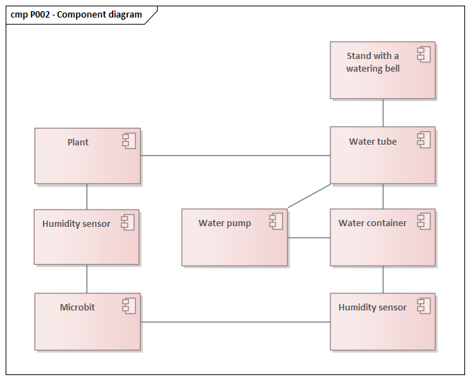
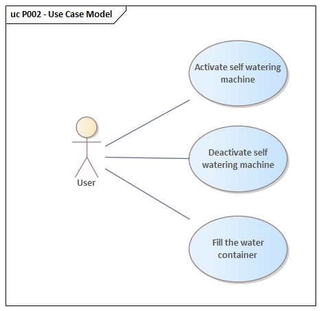
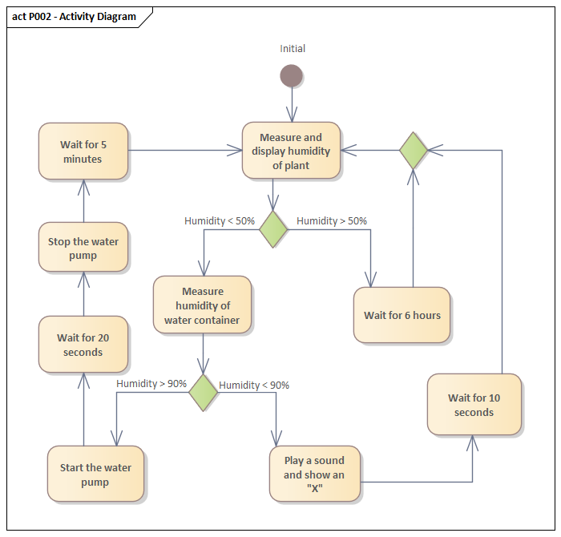

# 03. System Layer (2023-2024-S013-S038)
* * *

## Component diagram

Our system consists of two humidity sensors for monitoring the humidity of the plant and the second sensor for monitoring the humidity in the water container. In our system we use Micro:bit and we are using it as a control unit with speaker to notify the user about the low level of water in the water container.

For the controlled flow of water, the end piece on the tube is a watering bell, allowing water to distribute evenly.

## Use case diagram

User can activate or deactivate self watering machine. The main use case is to fill the water container. Our system notify user when to fill the water container.

## Activity diagram

The main task is to maintain the plants alive with the self watering system. Our system firstly measures the humidity of the plant and displays it. If plant’s humidity is more than 50%, the system waits for 6 hours.

Otherwise, it measures the humidity of a water container. If the value is less than 90% the container is empty — “X” is displayed and sound is played. If there is enough water in the container, the system turns the water pump for 20 seconds and waits 5 minutes before the next readings, waiting for the water to absorb.

