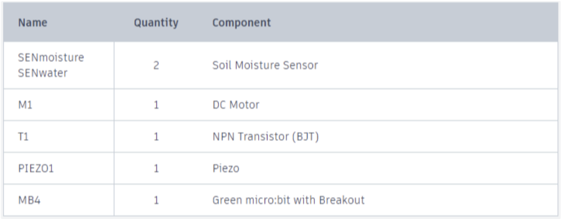
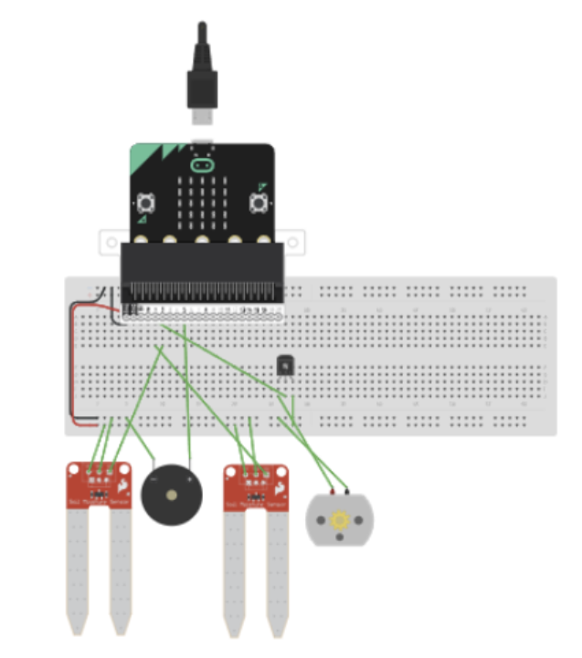
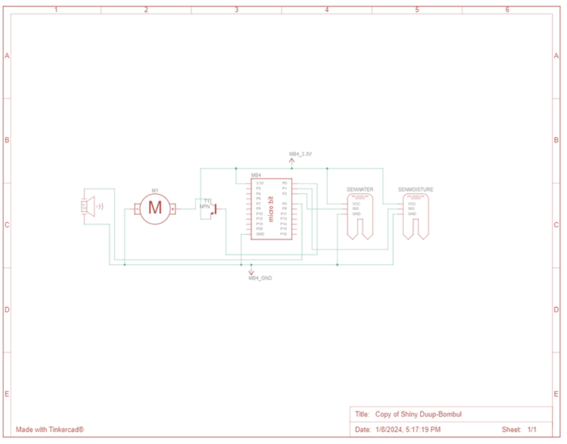
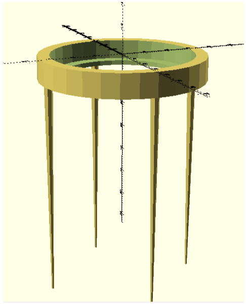

# 04. Technical documentation (2023-2024-S013-S038)

* * *

The project is implemented in the form of:

* Functional electronic circuit diagram with code
* EA model of individual aspects of the proposed product
* 3D models for additional components

## Circuit

Tinkercad was used to create the electronic circuit by using code blocks to establish the logic. The final solution includes a circuit schematic, code, and a working prototype, all of which are provided in a README file. To run the simulation, open the link from the README and adjust the values of the soil moisture sensors labeled 'water' and 'moisture.' The 'water' sensor checks for the presence of water in the water container, and the 'moisture' sensor simulates data from the plant's soil.

The circuit is not 100% correct for two reasons:

1. Tinkercad does not support playing sounds using Micro:bit, so piezo had to be added.
2. Tinkercad does not have water pumps, instead of it the DC Motor was used.

### List of used components:



### Circuit in Tinkercad



### Circuit schema



### Code

```py
moisture = 0
water = 0
unnamed = 0
pins.analog_set_pitch_pin(AnalogPin.P5)

def on_forever():
  global water
  global moisture
  water = Math.map(pins.analog_read_pin(AnalogPin.P2), 0, 813, 0, 100)
  moisture = Math.map(pins.analog_read_pin(AnalogPin.P1), 0, 813, 0, 100)
  basic.show_number(moisture)
  while moisture < 50:
    basic.show_number(moisture)
    if water > 90:
      pins.digital_write_pin(DigitalPin.P0, 1)
      basic.pause(20000)
      pins.digital_write_pin(DigitalPin.P0, 0)
      basic.pause(300000)
    else:
      basic.show_icon(IconNames.No)
      pins.analog_pitch(440, 200)
      basic.pause(10000)
    water = Math.map(pins.analog_read_pin(AnalogPin.P2), 0, 813, 0, 100)
    moisture = Math.map(pins.analog_read_pin(AnalogPin.P1), 0, 813, 0, 100)
  pins.digital_write_pin(DigitalPin.P0, 0)
  basic.pause(21600000)
basic.forever(on_forever)
```

Interactive model: [https://www.tinkercad.com/things/3cc6KGKm7qY-copy-of-shiny-duup-bombul?sharecode=EdoSCYPRnXqAW7ilkaymZm1k1slbnQYI9jjtr23gSAU](https://www.tinkercad.com/things/3cc6KGKm7qY-copy-of-shiny-duup-bombul?sharecode=EdoSCYPRnXqAW7ilkaymZm1k1slbnQYI9jjtr23gSAU).

## The EA project

The EA model consists of:

* Activity diagram
* Component diagram
* Requirements
* Use Case model
* Business process

## 3D models

OpenSCAD was used to create 3D models from scratch, without the use of prebuilt models. The resulting models are parameterizable and intended to be used together. They consist of a watering bell and a bell holder, satisfying one of the non-functional requirements of the project (REQ11).

### Holder

#### Image



#### Code

```
cylinder_radius = 35;
cylinder_height = 10;
union () {
    difference() {
        cylinder( r = cylinder_radius, h = cylinder_height);
        translate([0,0,-4])
        cylinder( r = cylinder_radius-5, h = cylinder_height+2);
        translate([0,0,1])
        cylinder( r = cylinder_radius-10, h = cylinder_height+5);
    }
    //legs
    translate([cylinder_radius-3,0,0])
        cylinder(r1=2, r2=0.5, h=100);
    translate([-cylinder_radius+3,0,0])
        cylinder(r1=2, r2=0.5, h=100);
    translate([0,cylinder_radius-3,0])
        cylinder(r1=2, r2=0.5, h=100);
    translate([0,-cylinder_radius+3,0])
        cylinder(r1=2, r2=0.5, h=100);
}
```

### Watering bell

#### Image


#### Code

```java
// Parameters
hole_radius = 1;
thickness = 3;
hole_depth = thickness+2;
cylinder1_radius1 = 30;
cylinder1_radius2 = 12;
cylinder1_height = 20;
cylinder2_radius1 = cylinder1_radius1-thickness*2;
cylinder2_radius2 = cylinder1_radius2-thickness;
cylinder2_height = cylinder1_height-thickness*2;
handle_radius = 3;
handle_height = 10;
union(){
    //cylinder
    difference() {
        cylinder( r1 = cylinder1_radius1, r2 = cylinder1_radius2, h = cylinder1_height);
        translate([0,0,thickness])
        cylinder( r1 = cylinder2_radius1, r2 = cylinder2_radius2, h = cylinder2_height);
        
        //hole for handle
        translate([0, 0, cylinder1_height-hole_depth-1])
            cylinder(h = hole_depth+handle_height+1, r = handle_radius);
        
        //holes
        translate([0,0,-1])
            cylinder(r = hole_radius, h = hole_depth);
        
        translate([-15,0,-1])
            cylinder(r = hole_radius, h = hole_depth);
        translate([-5,0,-1])
            cylinder(r = hole_radius, h = hole_depth);
        translate([5,0,-1])
            cylinder(r = hole_radius, h = hole_depth);
        translate([15,0,-1])
            cylinder(r = hole_radius, h = hole_depth);
        
        translate([0,5,-1])
            cylinder(r = hole_radius, h = hole_depth);
        translate([0,15,-1])
            cylinder(r = hole_radius, h = hole_depth);
        translate([0,-5,-1])
            cylinder(r = hole_radius, h = hole_depth);
        translate([0,-15,-1])
            cylinder(r = hole_radius, h = hole_depth);
        }
    //handle
    difference() {
        translate([0, 0, cylinder2_height+thickness])
            cylinder(h = handle_height+thickness+3, r = handle_radius);
        translate([0, 0, cylinder2_height+thickness-1])
            cylinder(h = handle_height+thickness+5, r = handle_radius-1);
    }
}
```