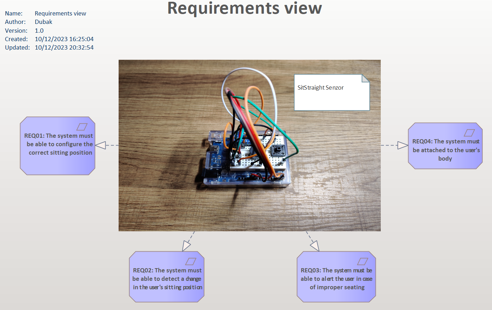
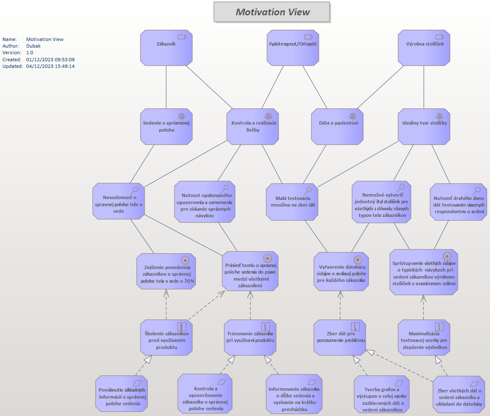
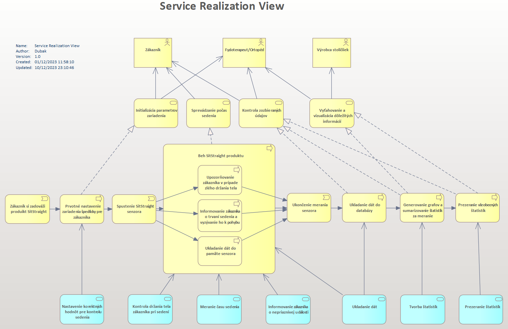

In TOGAF (The Open Group Architecture Framework), the Business Architecture layer is one of the key architectural domains. It focuses on understanding the organization's structure, goals, processes, and functions. It essentially defines how the organization operates from a business perspective.

# Theory:

Understanding and effectively leveraging the Business Architecture layer within TOGAF is key to aligning IT strategies with business objectives and ensuring successful enterprise architecture planning and implementation.

### **Purpose**

1.  _Understanding the business strategy:_ it helps to align the IT architecture with the overall business strategy of the organization.
    
2.  _Defining business capabilities:_ Identifying and defining the capabilities needed to achieve business goals.
    
3.  _Business Process Mapping:_ Documenting and analyzing business processes to improve efficiency and effectiveness.
    

### **Relationship with other layers**

1.  _Linkage to Information Systems:_ the Business Architecture layer strongly influences the Information Systems and Technology Architecture layers by providing requirements and guidance based on business needs.
    
2.  _Connection to Technology:_ Defines how technology can enable and support business processes and capabilities.
    

### **Benefits**

1.  _Alignment:_ aligning business goals with IT strategies.
    
2.  _Clarity:_ Provides a clear overview of the organization's business model and processes.
    
3.  _Efficiency:_ Improves operational efficiency by optimizing business processes.
    
4.  _Adaptability:_ Helps adapt to changes in the business environment.
    

# Praxis:

As far as our project is concerned, we have created two types of diagrams in order to be able to best describe the planned structure for several types of stakeholders:

## Simplified model:

With this type of model, we have tried to capture as simply as possible the very functionality our device is intended to bring to our users. To make it even easier to understand, a picture of the prototype itself has been added.

In the middle of the figure there is one image that represents a prototype of our sensor. From the sensor, arrows point out to the four most basic functional requirements that we require the sensor to meet in order to successfully build the first prototype.

## Complex model:

This model is intended for stakeholders who need to understand the functioning of the whole system at a more detailed level. It also shows the vision for the future and specifies the next steps of development.

Motivačný diagram

In the motivation diagram, we focus on a detailed analysis of single stakeholder and the features that our system could offer. In particular, we briefly address three stakeholders. Namely, the Customer, the Physiotherapist and the Chair Manufacturer.

-   We want to offer the _customer_ knowledge about the correct posture during the sitting position and at the same time train this knowledge in practice by repeated training.
    
-   The _Physiotherapist/Orthopedist_ often has little data and information to set up the correct treatment for a patient with scoliosis and other spinal related conditions. Therefore, we want to offer him/her data measured directly from the patient during sedentary activity during the day.
    
-   _Chair manufacturers_ have to spend a lot of money on testing and collecting customer data to be able to set the right seat measurements. This way we can offer them this data cheaper and collected on a larger test sample.
    

**Objectives of our project:**

1.  Increased customer awareness of correct sitting posture by 70%
    
2.  Bring the theory of correct sitting position into practice among all customers
    
3.  Create a database of seating position data for each customer
    
4.  Make all data on typical customer sitting habits available to chair manufacturers in an anonymous mode
    

Implementation of services

In this model, we have tried to describe the basic concept of the functioning of the system and the application services that will perform the individual functionalities.

**The basic procedure for using the whole system:**

1.  Customer purchases SitStraight sensor
    
2.  Customer configures the correct sitting position in the SitStraight sensor (by himself according to the manual or under the expert supervision of an orthopaedic surgeon)
    
3.  Customer starts the sensor
    
4.  Sensor notifies the customer of his sitting position
    
5.  Sensor stores all data about the customer's sitting position in a database
    
6.  The system offers the customer full access to their data via a web application
    
7.  System offers anonymised access to general customer data to chair manufacturers