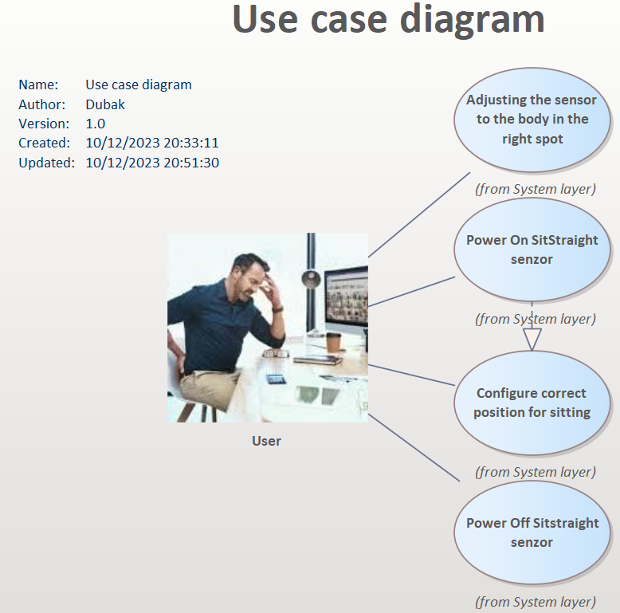
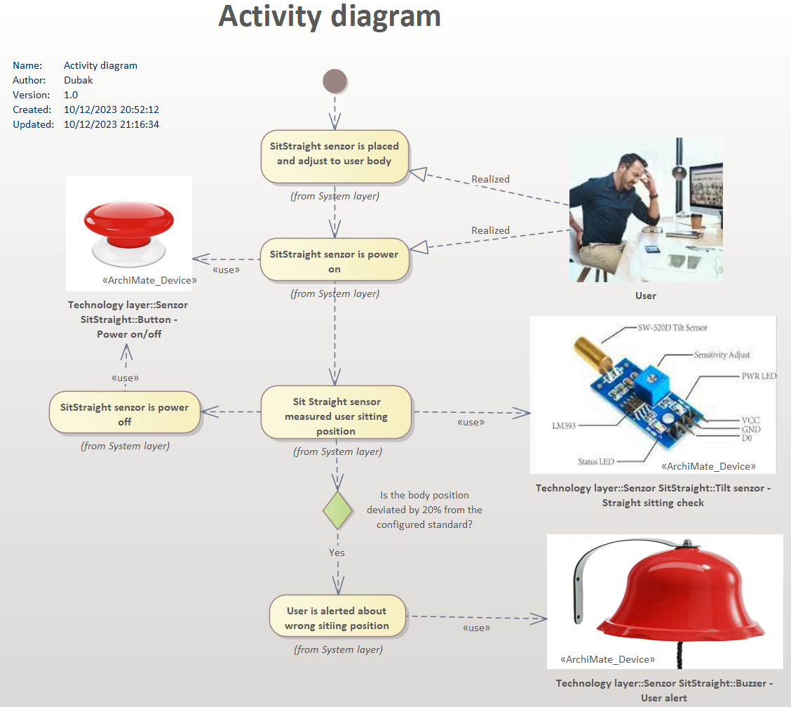
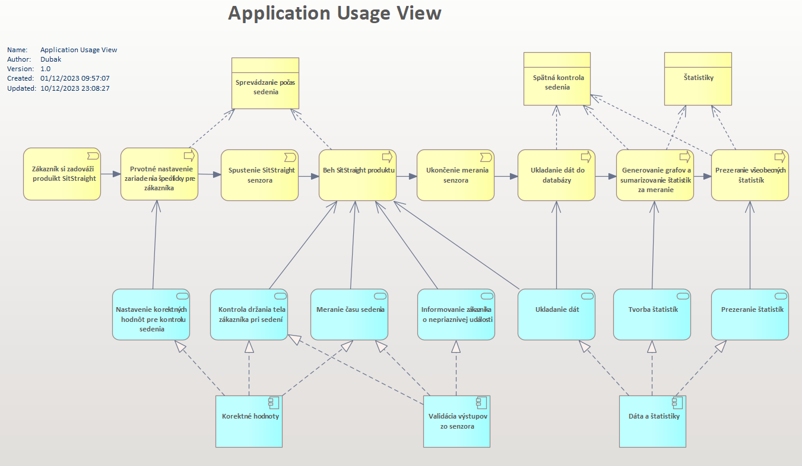

In TOGAF (The Open Group Architecture Framework), the System Architecture layer is a key part of the overall enterprise architecture. It focuses on defining the structure and behavior of the IT systems that support an organization's operations.

# Theory:

Understanding and effectively implementing the Systems Architecture layer within TOGAF is key to aligning technical solutions with business objectives, ensuring efficient IT operations, and enabling the organization to adapt to changing needs and technologies.

### Purpose

1.  _IT Systems Design:_ developing the architecture and design of IT systems required to support business functions.
    
2.  _Integration and Interoperability._
    
3.  _Technical Requirements Definition:_ Detailed specifications, standards and protocols for systems development and integration.
    

### Vzťah s ostatnými vrstvami

1.  _Spojenie s Obchodnou architektúrou:_ Vrstva Systémovej architektúry prekladá obchodné požiadavky do technických špecifikácií a riešení.
    
2.  _Integrácia s Technologickou architektúrou:_ Definuje, ako sa technologické komponenty štruktúrujú a vzájomne interagujú v IT infraštruktúre.
    

### Advantages

1.  _Efficiency:_ optimal system design and integration leads to improved operational efficiency.
    
2.  _Scalability:_ Systems can be designed to handle growth and changing business needs.
    
3.  _Interoperability:_ Seamless interaction between different systems improves overall functionality.
    
4.  _Security:_ Incorporating security measures protects against potential threats.
    

## Simplified models:

Use case diagram

The use case diagram shows the customer's interaction with our prototype in more detail. The customer has the opportunity to perform four basic steps, which can be seen in the figure. Meanwhile, the configuration of the device takes place directly when the sensor is switched on, so it is important that the customer has the sensor snapped in the right place before the sensor is switched on.

Activity diagram

This diagram describes the basic procedure for using our prototype, including the objects responsible for implementing each step. The diagram also shows the customer, and their interaction with the system during the steps of the procedure.

## Comprehensive diagram

Use of application services view

This more complex diagram already directly describes which services will provide which functionalities in our system. Basically, it is an extended view and a little insight into the actual implementation of the solution, described in the chapter [Business layer](Business_Layer.md).