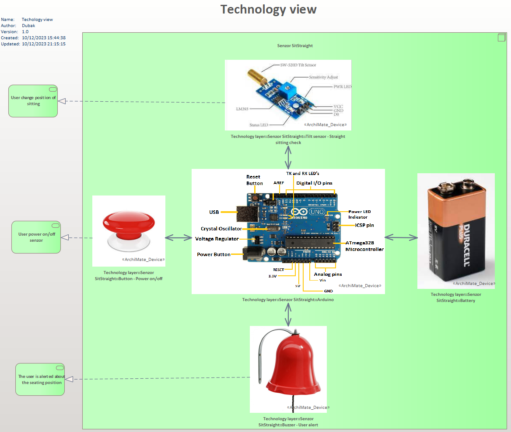
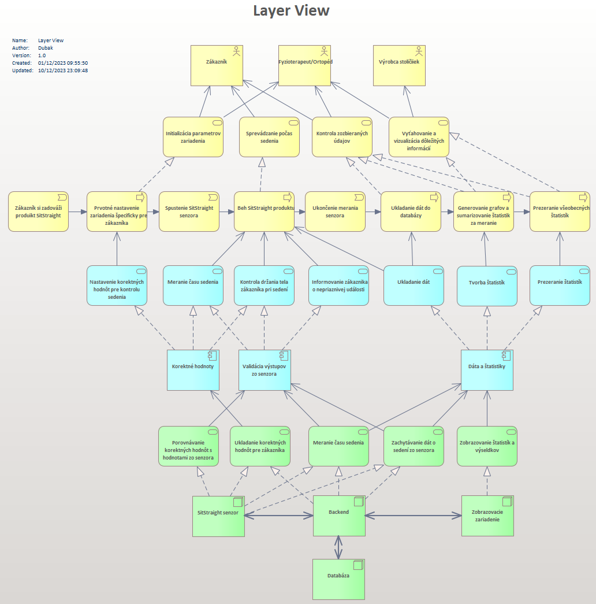

Within TOGAF (The Open Group Architecture Framework), the Technology Architecture is one of the key layers within the overall enterprise architecture. Its main objective is to define the technology enablers and environment required to implement information systems and their infrastructure in the enterprise.

# Theory:

Understanding and effectively implementing the Technology Architecture layer within TOGAF is important to ensure that technology solutions are focused on supporting the organization's business objectives and that resources and technology assets are used efficiently.

### Purpose

1.  _Defining Technology Tools:_ identification and specification of technology components (hardware, software, networks).
    
2.  _Standards and Protocols:_ Identification of standards and protocols for integration and interoperability of technology systems.
    
3.  _Systems Support:_ Providing the means for implementing and operating enterprise information systems.
    

### Relationship with other layers

1.  _Connection to System Architecture:_ The Technology Architecture defines the means and environment for implementing systems based on requirements from the System Architecture.
    
2.  _Integration with the Business Architecture:_ ensures that technology assets and solutions are aligned with the business objectives of the organization.
    

### Benefits

1.  _Optimizing Technology Investment:_ Ensuring that technology matches the needs of the organization.
    
2.  _Efficient Operations:_ A well-designed technology architecture improves the efficiency and performance of IT systems.
    
3.  _Flexibility and Scalability:_ The architecture allows you to adapt to changing requirements and growing needs.
    

# Prax

## Simplified model:

Diagram komponentov senzora SitStraight

In the component diatogram, we tried to create a **digital twin** of our real SitStraight prorotype sensor. The whole sensor consists of 5 components:

1.  _Arduino Uno_ serves as a communicator (communication of the remaining components is done through this component) and computing power of the whole solution.
    
2.  _The Tilt sensor_ is used to capture the user's acute seating position.
    
3.  _A button_ ensures switching the sensor on and off, while switching it on configures the basic setting of the correct seating position
    
4.  _The bell_ notifies the customer with a loud and intense sound that they are sitting in the wrong position for their spine
    
5.  _The baterry_ provides the "juice", i.e. the driving force, to this entire system
    

## Complex models

Use of technology

With this diagram, we have tried to illustrate the different technologies that will need to be addressed in the future and their information exchange. The actual merging of the SitStraight components into a single unit and their internal communication is shown here. We have designed the communication of the backend with the database, the actual information flows between them, and the individual components that will provide the functionality of the solution. Finally, the graph shows the actual display of the measured data from SitStraight sensors for the users of our solution.

A view of the entire system through all layers

It is a combination of all layers and information from this layer, the [System layer](System_Layer.md) and the [Business layer](Business_Layer.md). In this way, the stakeholders can visualize the system as a whole and understand the basic concept of the direction of our project.