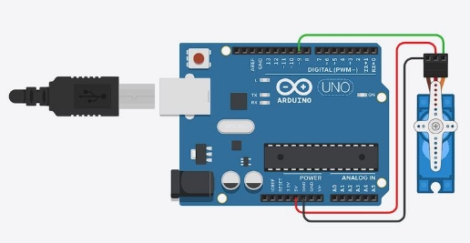

# 04\.PROJECTS OUTCOMES (2023-2024-S002) Motivácia


Keď som sa na tomto predmete dozvedel, že je potrebné vytvoriť projekt, ktorého výstupný produkt je predmet/nástroj/vec vytvorený za použitia 3D tlačiarne, tak som sa hneď doma otca pýtal, či ho niečo nenapadá, čo by mu uľahčilo život. Po nejakej dobe rozmýšľanie prišiel s týmto nápadom vytvoriť automatické krmidlo pre psa alebo sliepky.

## Opis projektu

Vždy keď sa ide na dovolenku treba riešiť kto príde nakŕmiť psa a sliepky. Keďže naším zvieratám nemá zmysel dať viac jedla, s tým, že to je na dlhšiu dobu lebo zjedia všetko naraz tak riešením tohto problému by bolo zariadenie, ktoré automaticky v časovom intervale dá zvieraťu určitú porciu jedla. Toto zariadenie by malo byť použiteľné pre všetky zvieratá, ktoré konzumujú suchú stravu ideálne vo forme granulí. 

## Analýza

Pri prieskume iných na trhu dostupných automatických kŕmidiel pre zvieratá sme zistili, že varianty, ktoré na pravidelnej báze dávajú jedlo zvieratám sa pohybujú v cenovom rozpätí od ~30€ do ~100€. Navyše veľa týchto produktov je určených na použitie vo vnútri a obsahuje veľké množstvo elektronických súčastí, ktoré môžu predstavovať problém ak by sa zariadenie ocitlo von vo vlhkom počasí.

Prvotne navrhované riešenie na základe špirály sa javí ako najjednoduchšie, najefektívnejšie a hlavne najodolnejšie vonkajším vplyvom počasie, keďže minimalizuje potrebu elektroniky len na tie najnutnejšie súčiastky.

### Náklady na výrobu

Arduino Nano clone - 7.95€

Servo Motorček - 7.11€

Zdroj USB C kábel - 1.80€

3D vytlačená časť - 6.50€

23\.36

Po sčítaní nákladov na naše krmidlo vidíme, že cena je v priemere o 64% nižšia.

### Diagram komponentov

Prompt na vytvorenie diagramu pomocou AI:

1. Can you draw a system diagram of an automatic pet feeder, which consists of power supply, that supplies arduino, which controls servo motor that spins a spiral that lets a food out it also has a container that contains the food that spiral pushed out when spinned  (Output was a wrong type of diagram)
1. Can you make an UML diagram for me instead


### Aktivity diagram

3. Can you also make an activity diagram? (Not satisfied with the outcome)
3. Additional info the motor will spin every 12 hours and it will spin for 20 seconds (Non satisfied with the outcome)
3. There is no check every 12 hours the arduino contains timer of 43,200,000 milliseconds which when that runs out it will activate the motor


### Use case diagram

6. Thank you, also create use case diagram (This diagram I edited manually and removed a couple of elements)


## Dizajn

Návrh zapojenia Arduina a Servo motorčeka.



Kód, ktorý bude spúštať servo každých 12 hodín na 13 sekúnd.
```
#include <Servo.h>

Servo myServo;  // Create servo object 4

const long interval = 43200000; // 12 hours in milliseconds
const int spinTime = 13000; // Spin time in milliseconds
unsigned long previousMillis = 0; // Stores last time servo was activated

void setup() {
	myServo.attach(9); // Attaches the servo on pin 9 to the servo object
	Serial.begin(9600); // Starts serial communication, can be omitted if not debugging
}

void loop() {
	unsigned long currentMillis = millis(); 

	// Check if 12 hours have passed; if so, activate the servo
	if (currentMillis - previousMillis >= interval) {
		// Save the last time you activated the servo
		previousMillis = currentMillis;

		// Spin the servo continuously for 13 seconds
		myServo.write(180);
		unsigned long startSpinTime = millis();

		while(millis() - startSpinTime < spinTime){
			// Keep spinning for 13 seconds
		}

		// Stop the servo from spinning
		myServo.write(90);
		Serial.println("Servo spun for 13 seconds.");
	}
}
```

### 3D modely častí kŕmidla


*Nástavec na zásobník*

*potravy*


*Špirála vytlačajúca kŕmivo*


*Telo kŕmidla*


*Nadstavec na pripevnenie*

*serva*


*Očakávaný výsledný produkt*

## Lessons Learned

Práca s nástrojmi na 3D modelovanie UML diagramy a ich tvorba pomocou AI
