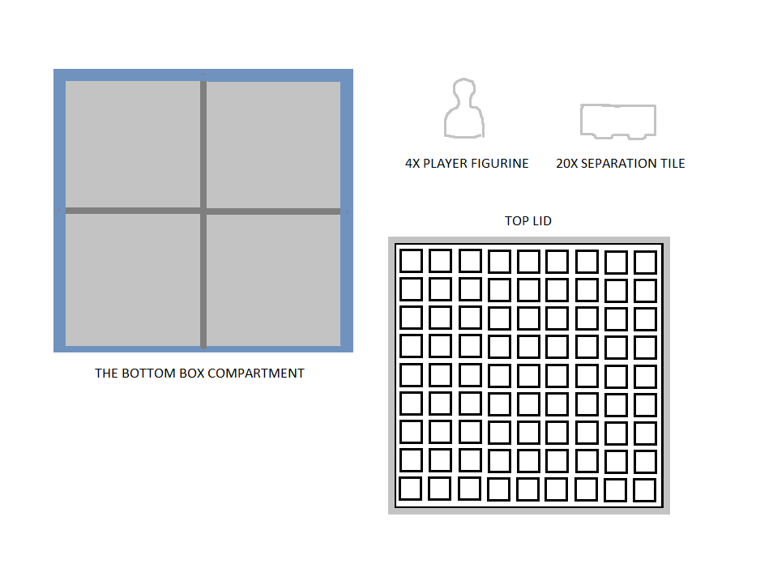
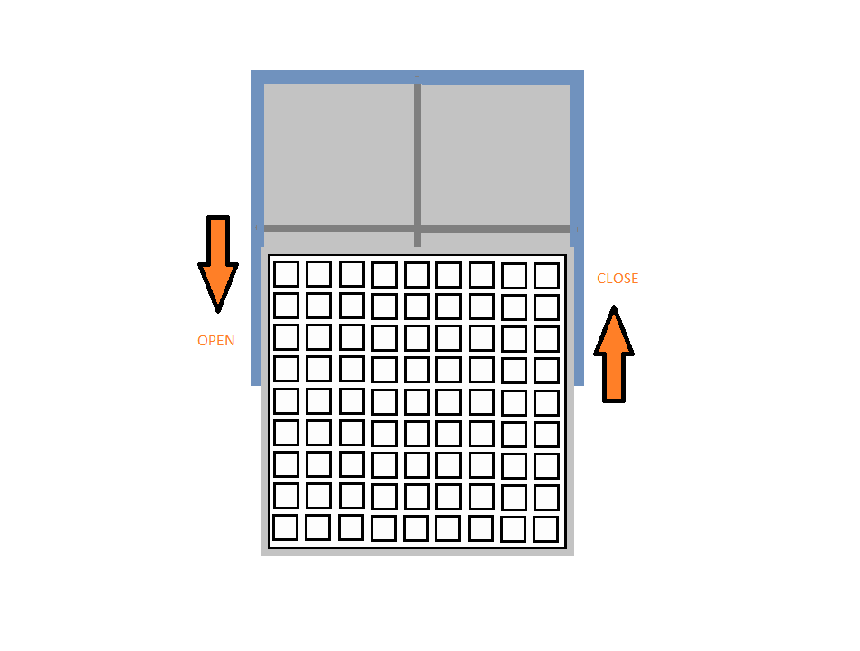
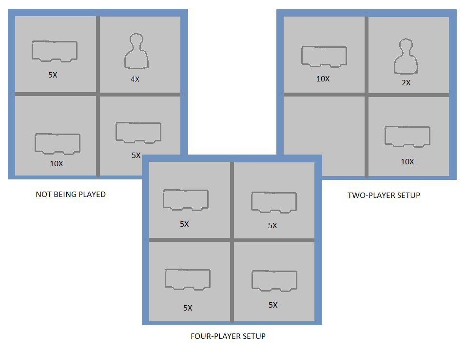
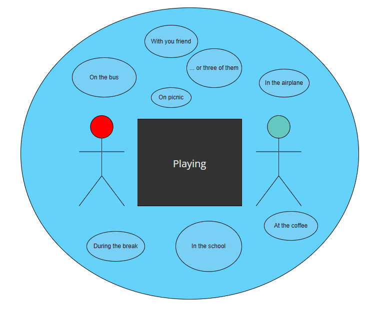
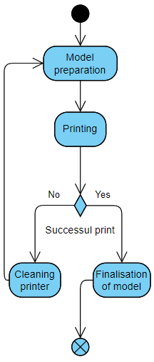

# System Layer

In this section, we describe various aspects of our project in terms of the system context. This means that we talk about the various components of our product and how they can interact with each other; we also describe the functionality of our product including the rules of the game and use cases in which our product can be utilized.

## Components

First, let us describe the components of the game. The board game Quoridor is comprised of three major types of components. Depending on how you look at it we add one component on top of that. The three original component types are as follows:

Player Figurines - As with any other board game that has pieces that represent players, Quoridor also includes small “bowling pin“-shaped figurines that represent players. There are 4 of them.

Tiles - tiles are basically walls that can be placed on the playboard grid, these occupy the space between two sets of squares and separate them. 

Playboard - the most important component of the game is the playboard - made to represent a 9x9 grid of squares that have ridges in between them to allow for the placement of separation tiles.

The component that we are adding is the box that is used to hold all the other components. It functions as a bottom to the playboard (the playboard is the box’s lid). It is made up of 4 individual symmetric compartments that can each hold a number of tiles and/or player figurines. 

The following diagram depicts the 4 components of our product:

## Functionality

Our version of the game can be played on the go. The top lid can be removed and the pieces can be either left in to contain them during gameplay, or they can removed and the lid can be placed back on top. to have a nicer-looking playboard. 

The following diagram shows the opening mechanism of the playboard:

The 20 tiles and the 4 player figurines can be organized however the players want, but the separation into 4 compartments allows for ease of organizing these game pieces. In the case of a two-player game the diagonal (or any combination of) compartments can be used to hold 10 tiles each (per player), and one of the remaining two compartments can be used to hold the two remaining player figures.

In a four-player setup the tiles can nicely be distributed into the four compartments. 

## Use Cases

## Process of Creation

