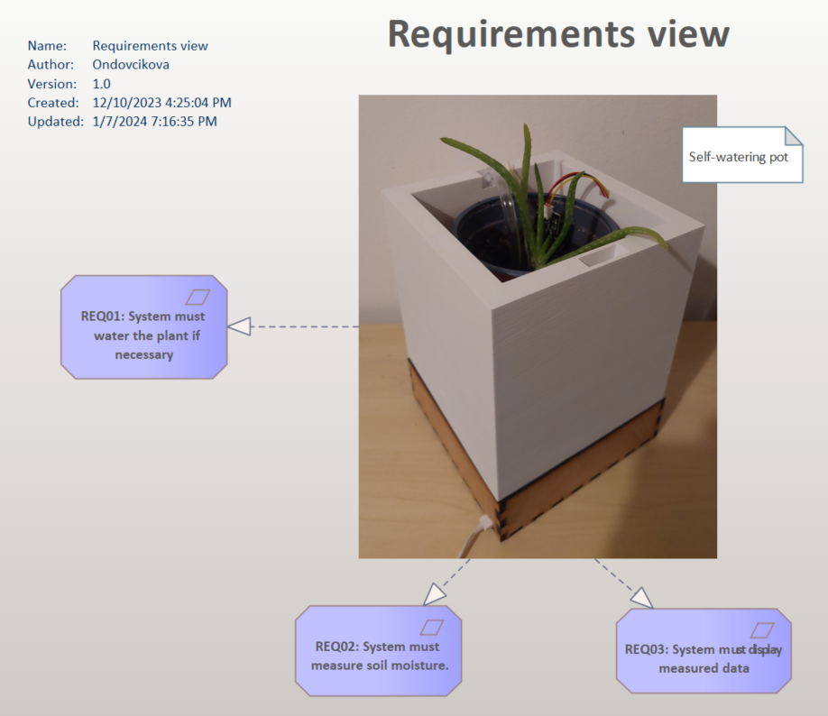
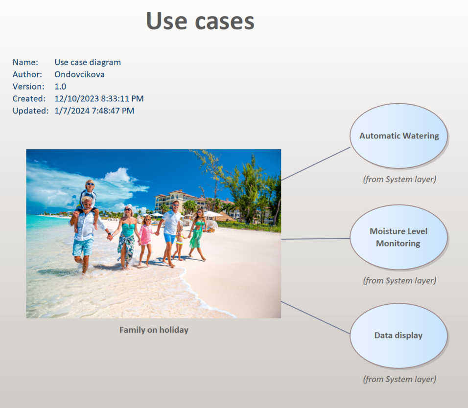
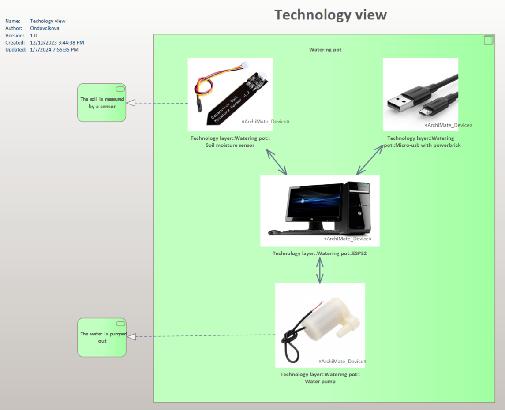
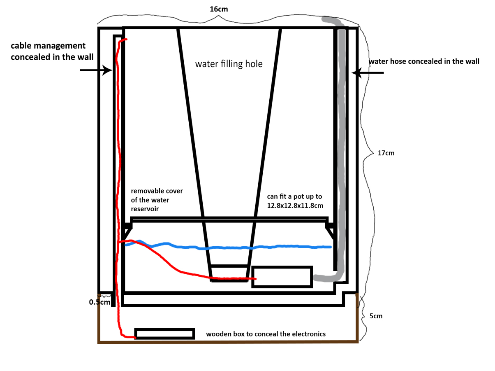
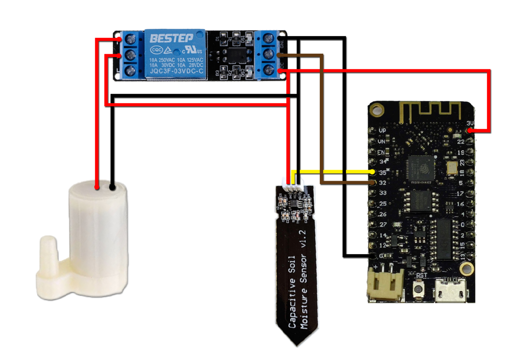

# 042\.P042-2023-2024-Self\_watering\_planter\_S031\_S040

Link to: [Project](https://systemthinking-in-it.atlassian.net/wiki/x/AYD-AQ)[overview](https://systemthinking-in-it.atlassian.net/wiki/x/AYD-AQ)

During our project, we delved into ESP32 documentation, gaining an understanding that goes beyond basic familiarity with its functionalities and programming nuances. Our exploration was methodical, involving an examination of technical guidelines and advanced usage scenarios to ensure we could exploit the ESP32's full potential effectively.

Simultaneously, we enhanced our system by integrating additional advanced technologies, building on our existing technical experience. To validate our approach and refine our outcomes, we regularly consulted with an experienced professional whose practical insights were invaluable in optimizing our application of these technologies and ensuring the project's success.

## Layer system

This overview encapsulates the Business, System, and Technology layers that collectively ensure the seamless operation of our automated plant-care solution. Each layer is designed to address the challenges of plant care during periods when families are away. Together, they form the intelligent Self-Watering Pot System that operates with minimal human intervention, ensuring plants remain thriving in their owners' absence.

### Bussines layer

#### REQ01: Automatic Watering

- **Description:** The system must possess the capability to autonomously water the plant as needed. This function is crucial for maintaining optimal soil moisture levels without manual intervention.
- **Rationale:** This requirement ensures that the plant's watering needs are met consistently, which is especially beneficial for users who may not always be available to water the plants manually.

#### REQ02: Soil Moisture Measurement

- **Description:** The system is required to measure the soil's moisture content. It should have integrated sensors that can accurately detect moisture levels.
- **Rationale:** By measuring soil moisture, the system can make informed decisions about when to activate the watering mechanism, thus maintaining an ideal growing environment for the plant.

#### REQ03: Data Display

- **Description:** The system must display the measured data to the user.
- **Rationale:** Displaying the moisture level data ensures that the user is kept informed about the plant's condition and the system's actions, allowing for manual adjustments if desired.

### System layer

This layer provides an overview of the identified use cases of our project. As shown in the picture above, our target user is a family, that is on a holiday trip. The use cases detailed in the diagram are as follows:

#### Automatic Watering

This use case highlights the system's primary feature of self-watering, which is essential for maintaining plants without manual intervention, perfect for families on holiday.

#### Moisture Level Monitoring

It describes the system's continuous monitoring of soil moisture, ensuring that the plants receive precise watering based on real-time soil conditions.

#### Data Display

This functionality allows the system to provide feedback to the user on the moisture levels and watering activities, which can be monitored remotely, adding convenience for the traveling family.

As a family prepares for a holiday trip, they can rely on this Self-Watering Plant System to care for their plants during their absence. The system follows a set of programmed activities to ensure the plants are maintained without the need for manual intervention.

#### Benefits for the Family on a Trip

This automated process ensures that the family's plants receive proper care while they are enjoying their holiday. There's no need for them to worry about finding someone to water their plants or coming home to wilted foliage. With this self-watering system, they can have the peace of mind that their green friends are in good hands, and they can return to healthy, well-maintained plants.

### Technology layer

**Soil Moisture Sensor** measures the soil's moisture levels. Its readings are crucial for determining when the pot's watering system should be activated.

**Micro-USB with Powerbrick** provides a stable power source for the system, ensuring continuous operation without the need for battery changes or manual charging.

**ESP32 Microcontroller** serves as the central processing unit of the system. It receives data from the soil moisture sensor, processes it, and controls the water pump based on the moisture level readings.

**Water Pump** delivers water from a reservoir to the plant, ensuring the soil remains adequately moist.

## Lemontree
Although we didn’t have to use the Lemontree tool (due to project roles), we also tried to work with it and implement it into our product realization flow. Lemontree streamlines workflows to boost the effectiveness, consistency, and quality of digital services for its users. It optimizes processes aiding clients in accelerating changes and enhancing the digital service quality. It simplifies complex tasks and eliminates time-consuming activities, thereby facilitating efficient results, and also offers comprehensive solutions by leveraging top-tier products from its partners.

Initially, the user launches the Lemontree application and chooses the specific files for comparison. Following this selection, the application redirects the user to a screen, where the interface is used for comparing different versions of diagrams or elements within a software architecture or project, allowing the user to track changes and conflicts between versions A and B, as shown in the image below. The third column represents the final version of the merged project.

As we can see, we did some spring cleaning during our project realization, which required us to carry out a merge. The author then selected the elements that were no longer pertinent and commenced the merging procedure. Following this, the project was brought current with its latest version.

## Product design

## Implementation

### Step 1: Preparing the ESP32

**Solder Connections**: We soldered wires to the ESP32 for connecting the soil moisture sensor and the relay module. The sensor's analog output was connected to an ADC pin, and its power and ground were linked to the 3.3V and GND pins. Similarly, for the relay, we soldered a wire from a GPIO pin and connected it to the relay's control input and connected its power and ground using clamps.

### Step 2: Assembling the Watering System

**Connect Water Pump to Relay**: We used the clamps on the relay to attach the water pump's power cables to the relay's NO and COM terminals.

**Insert Soil Moisture Sensor**: We placed the capacitive soil moisture sensor in the soil of the planter, ensuring it was positioned for accurate moisture measurement.

### Step 3: Designing and Fabricating the Plant Pot and Wooden Box

**Modeling the Plant Pot in Blender**: We modelled the plant pot in Blender according to the design, tailoring it to our system's specifications.

**3D Printing the Plant Pot**: Using a Prusa 3D printer, we printed the pot from the Blender model, adjusting settings in PrusaSlicer for optimal quality.

**Creating the Wooden Box**: We generated a design for a wooden box on 
[MakerCase](http://makercase.com/)[-](http://makercase.com/)[Easy](http://makercase.com/)[Laser](http://makercase.com/)[Cut](http://makercase.com/)[Case](http://makercase.com/)[Design](http://makercase.com/), which was then laser-cut from plywood and assembled to house our system's electronics.

### Step 4: Loading MicroPython onto the ESP32

**Download MicroPython Firmware**: We installed the latest MicroPython firmware for the ESP32 from the official MicroPython website.

**Flash Firmware**: Using a flashing tool esptool.py, we uploaded the MicroPython firmware onto the ESP32. This involved selecting the appropriate COM port, specifying the firmware file, and executing the flash command.

### Step 5: Setting Up the Development Environment

**Connect ESP32 to Laptop**: We used a USB cable to connect the ESP32 to our laptop.

**Install Development Tools**: We installed Visual Studio Code (VS Code) and the Pymakr plugin, which facilitates development with MicroPython.

**Configure Pymakr in VS Code**: We set up Pymakr in VS Code to recognize the ESP32, enabling us to edit and upload code directly to the device.

### Step 6: Programming and Testing

**Upload Script**: We wrote and uploaded the boot.py script to the ESP32 using VS Code with Pymakr. This script included logic for reading the soil moisture sensor, controlling the relay, and managing the watering schedule as per config.json .

**Test the System**: After powering up the ESP32, we observed the system's operation, ensuring the soil moisture readings were accurate and that the water pump was activated when the moisture level fell below the threshold set in config.json .

---

By following these steps, we successfully set up and programmed our self-watering planter system, effectively utilizing the capabilities of the ESP32 and MicroPython.

## Technical documentation

The system automates the watering of a plant based on soil moisture levels, using an ESP32 microcontroller as the central processing unit. The ESP32 is interfaced with a capacitive soil moisture sensor and controls a water pump through a relay. The entire system, including the sensor, relay, and pump, is powered via the 3.3V output from the ESP32. The system's operation is governed by a MicroPython script.

### Components

1\. **ESP32 Microcontroller**: Acts as the central processing unit, controlling the other components based on the logic defined in the MicroPython script.

[Wemos](https://techfun.sk/produkt/wemos-lolin32-lite-esp32-4mb-wifibluetooth-s-bateriovym-konektorom-2/)[LoLin32](https://techfun.sk/produkt/wemos-lolin32-lite-esp32-4mb-wifibluetooth-s-bateriovym-konektorom-2/)[Lite](https://techfun.sk/produkt/wemos-lolin32-lite-esp32-4mb-wifibluetooth-s-bateriovym-konektorom-2/)[ESP32](https://techfun.sk/produkt/wemos-lolin32-lite-esp32-4mb-wifibluetooth-s-bateriovym-konektorom-2/)[4MB](https://techfun.sk/produkt/wemos-lolin32-lite-esp32-4mb-wifibluetooth-s-bateriovym-konektorom-2/)[WiFi+Bluetooth](https://techfun.sk/produkt/wemos-lolin32-lite-esp32-4mb-wifibluetooth-s-bateriovym-konektorom-2/)[s](https://techfun.sk/produkt/wemos-lolin32-lite-esp32-4mb-wifibluetooth-s-bateriovym-konektorom-2/)[batériovým](https://techfun.sk/produkt/wemos-lolin32-lite-esp32-4mb-wifibluetooth-s-bateriovym-konektorom-2/)[konektorom](https://techfun.sk/produkt/wemos-lolin32-lite-esp32-4mb-wifibluetooth-s-bateriovym-konektorom-2/)

2\. **Capacitive Soil Moisture Sensor**: Measures the moisture level of the soil. It provides an analog output that is read by the ESP32 to determine the soil's current moisture state.

[Malá](https://techfun.sk/produkt/mala-vodna-pumpa/)[vodná](https://techfun.sk/produkt/mala-vodna-pumpa/)[pumpa](https://techfun.sk/produkt/mala-vodna-pumpa/)

3\. **Relay Module**: Serves as an electronic switch, controlled by the ESP32. It is used to turn the water pump on and off.

[Kapacitný](https://techfun.sk/produkt/kapacitny-senzor-vlhkosti-pody/)[senzor](https://techfun.sk/produkt/kapacitny-senzor-vlhkosti-pody/)[vlhkosti](https://techfun.sk/produkt/kapacitny-senzor-vlhkosti-pody/)[pôdy](https://techfun.sk/produkt/kapacitny-senzor-vlhkosti-pody/)

4\. **Water Pump**: Pumps water from a reservoir to the plant soil. It is activated when the soil moisture level falls below a predefined threshold.

[Relé](https://techfun.sk/produkt/rele-modul-1-kanal-3v/)[modul](https://techfun.sk/produkt/rele-modul-1-kanal-3v/)[1](https://techfun.sk/produkt/rele-modul-1-kanal-3v/)[kanál](https://techfun.sk/produkt/rele-modul-1-kanal-3v/)[3V](https://techfun.sk/produkt/rele-modul-1-kanal-3v/)

5\. **Power Supply**: The ESP is powered through a microUSB cabel connected to the grid via a powergrid. The 3.3V output from the ESP32 powers all the other components.

### Operation

**Boot Process**

- On boot, the ESP32 runs boot.py , a MicroPython script.
- boot.py initializes the system and loads configuration settings from config.json .

**Configuration (** config.json **)**

- moisture\_threshold : The soil moisture level below which watering is initiated.
- pump\_duration : Duration for which the water pump remains active during each watering cycle.
- check\_interval : Time interval at which the soil moisture level is checked.

### Functionality

1\. **Moisture Level Checking**: At regular intervals (defined by check\_interval ), the ESP32 reads the moisture level from the soil moisture sensor.

2\. **Watering Decision**: If the moisture level is below moisture\_threshold , the ESP32 activates the relay, which in turn powers the water pump.

3\. **Watering Duration**: The water pump remains active for a period specified by pump\_duration , ensuring adequate watering.

4\. **Safety and Power Management**: The system is designed to minimize power consumption and prevent over-watering.

## Outcomes

The Self-Watering Planter project, tailored for families on holiday trips, has successfully combined technical innovation with user convenience. Integrating moisture sensors and an automated watering system, the planter ensures optimal plant care during the family's absence, providing peace of mind and eliminating the need for manual watering. This system not only simplifies plant care for busy or traveling families but also contributes to eco-friendly practices.

### Future work

Moving forward, the Self-Watering Planter project aims to enhance its functionality through several upgrades. We plan to incorporate a water-level sensor to monitor the reservoir accurately, ensuring timely refills. Additionally, an LED indicator will be integrated to provide a clear, visual signal when the water level is low, making it more user-friendly. Lastly, we intend to develop a comprehensive end-user interface, which will allow users to interact with the planter more intuitively, customizing settings according to their specific needs and preferences. These enhancements are geared towards making plant care even more effortless and efficient for users.

