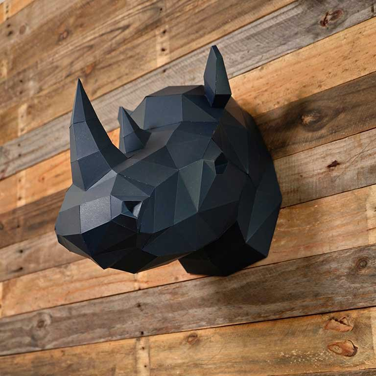
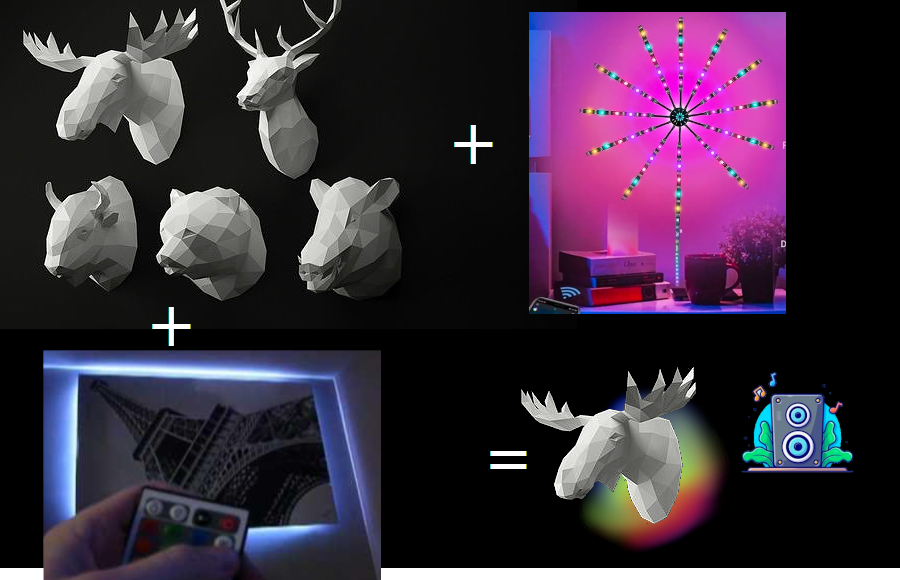

# 04.PROJECTS OUTCOMES (2023-2024-S016)

* * *

# Low-poly Music Ambient Visualiser

While enjoying music, we usually focus on the sounds. But imagine adding a visual twist to the beats, especially during parties or family gatherings.

This device doubles as a cool party decoration and a stylish room accessory. It brings a lively visual element to your music experience, making it a versatile addition to any setting.

# Description

The system comprises a primary docking base featuring a backlight control mechanism, a bezel equipped with LEDs, and a swappable low-poly head component. Additionally, it offers a versatile and user-friendly design, seamlessly integrating these elements for enhanced functionality and ease of use.

# Analysis

There's no need to reinvent the wheel; practical visualisation solutions, including those compatible with the Arduino platform, are already available. Utilising these existing solutions can not only streamline the development process but also help in minimising unnecessary financial expenditures and saving valuable time.

As for the heads, drawing inspiration from the world of Papercraft, which inherently involves low-poly 3D models, opens up a treasure trove of possibilities. The internet hosts a vast database of freely available 3D models, ready to be employed for various purposes. Leveraging this extensive collection not only ensures a cost-effective approach but also provides a rich resource for diverse and creative head designs, enhancing the overall appeal of your project without breaking the bank.

# Decision

For the main controller will be used already fine documented solution based on Arduino ([Link](https://alexgyver.ru/colormusic/)).

For the swappable heads, we will need a custom design and probably 3D printer.

# Design

Beyond being a mere toy, the device is designed with practical utility in mind. Recognising that switchable heads may accumulate dust during daily use, a solution has been implemented to make them easily detachable and washable, ensuring a hygienic and user-friendly experience.

Furthermore, the universal connector is a key element, intended to not only support current functionalities but also accommodate future improvements seamlessly. In the initial design phase, a magnetic connector was conceived for its convenience. However, after encountering various complications during development, a decision was made to transition to the more conventional pin-based connector, prioritising reliability and ease of use in the final design.

:

Now it is time to document the design. First of all, business diagram tells us a about the design from the business view. Then component diagram will show what components will be used in the solution to achieve defined goals. The last one will provide information about physical components will be used in the solution.

After creating a documented sketch and finalising list of features to be implemented, design was digitalised in the[https://www.tinkercad.com/](https://www.tinkercad.com/).

After some design iterations, a need of the **LED holder** was confirmed - switchable head, containing a lot of plastic, should be washable (as mentioned before), so it must not contain any electronics.

After designing a base model and some heads, there is also a need to design an electronical part. It was done with help of the EasyEDA tool ([https://easyeda.com/](https://easyeda.com/) ).

After the first round of schematics, when we assumed, that 7V power is enough (2x 18650 batteries), we found that our LED strip need a stable 5V input with at least 600 mA power. Arduino can hold up to 500 mA of output power, so we needed a better solution for converting voltage - adding a step-down converter is a common solution.

# Implementation

Now its time to 3D print heads, buy and solder an electronical part.

After 3D printing, we needed to remove supports, produced during slicing process in order to prepare 3D model to print. Some of them are easy removable, but sometimes it is hard to remove them clearly.

_Soldering process:_

Now prototype is ready, we can test it.

# Validation, Verification

[Verification.mp4](Verification.mp4)

# Lessons Learned

* Some 3D printed models can have artefacts
* Generated supports sometimes hard to remove
* Soldering can be complicated, then it is useful to fabricate a PCB
* Schematics and simulation is very helpful when dealing with electronics
* Do not reinvent a wheel
* Good documentation = Good project
* Device design some times need to go through cycles to be good enough