# Úvod

V našej domácnosti sa snažíme zjednodušovať bežné procesy, ktoré vykonávame každý deň. Robíme to vytváraním automatizácii, čím si tvoríme našu inteligentnú domácnosť. Každý deň príde ďalšia zaujímavá myšlienka čo by sa ešte dalo vylepšiť. Na predmete SMVIT sa nám naskytla ďalšia príležitosť posunúť našu inteligentnú domácnosť o niečo ďalše a preto sme prišli na nápad s meračom obsadenosti postele za pomoci váhových senzorov.

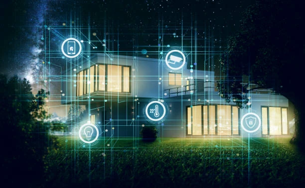

# Biznis koncept

Senzor je navrhnutý primárne ako doplnok do inteligentnej domácnosti, ktorý pomôže zapezbečiť automatické prepínanie osvetlenia. Toto dokáže vďaka tomu, že získava informáciu o tom, či sa osoba v domácnosti nachádza v posteli, alebo nie.

Inteligentná domácnosť teda môže fungovať nasledovne. Uvažujme, že v spálni je rozsvietené a domácnosť je v nočnom režime. Člen domácnosti sa chystá spať, ľahne si do postele a v izbe sa mu automaticky zhasne, nemusí si ničím prisvecovať ani sa po tme presúvať po miestnosti a riskovať tak úraz. Senzor zaznamená, že člen domácnosti si ľahol a chystá zrejme sa chystá spať a jednoducho zhasne zaňho.

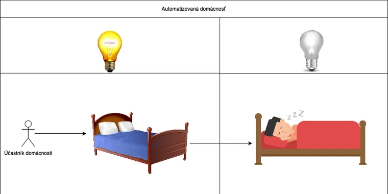

Celý proces je vysvetlený na diagrame a funguje nasledovne. Váhový senzor pod posteľou neustále kontroluje, či na posteli niekto leží. Ak nie, prirodzene nie je potrebná žiadna akcia. V prípade, že niekto na posteli leží, v procese skontrolujeme, či sa domácnosť chystá na spánok, teda či sa nachádza v nočnom režime, ak nie, opäť nie je potrebná žiadna akcia. Ak domácnosť je v nočnom režime je v procese skontrolované osvetlenie. Ak sa nesvietilo samozrejme svetlá zhansúť nepotrebujeme, ak sa však svieti a teda sú splnené všetky podmienky, osvetlenie bude automaticky zhasnuté.

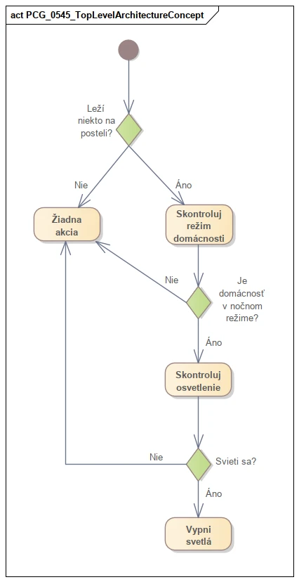

# Top level architektúra

Top level architektúru sme sa rozhodli prezentovať pomocou dvoch druhov diagramov a to komponentoým diagramom a activity diagramom.

Na vyhotovenie nástroja na meranie obsadenosti postele budeme potrebovať štyri váhové senzory, arduino a ESP s wifi modulom. Všetky komponenty sme si vytiahli do diagramu. ESP a arduino sa nám podarilo nájsť v assetoch z roku 2021. Vytvorili sme si vlastný komponent pre arduino a vlastný komponent pre ESP a následne ich spojili s komponentami z assetov za pomoci realizačnej väzby. Tým sme vytvorili z našich komponentov inštancie pôvodných komponentov.

Nájsť sa nám nepodarilo váhový senzor ani žiadny iný senzor, tak sme ho vytvorili do assetov do roku 2021. Následne sme postupovali ako pri predchádzajúcich komponentoch a to vytvorením vlastného komponentu a následným napojením realizačnou väzbou na pôvodný komponent.

Ako môžete vidieť váhové senzory sú napojené na arduino a zároveň na dva susediace váhové senzory. Arduino je potom napojené na ESP.

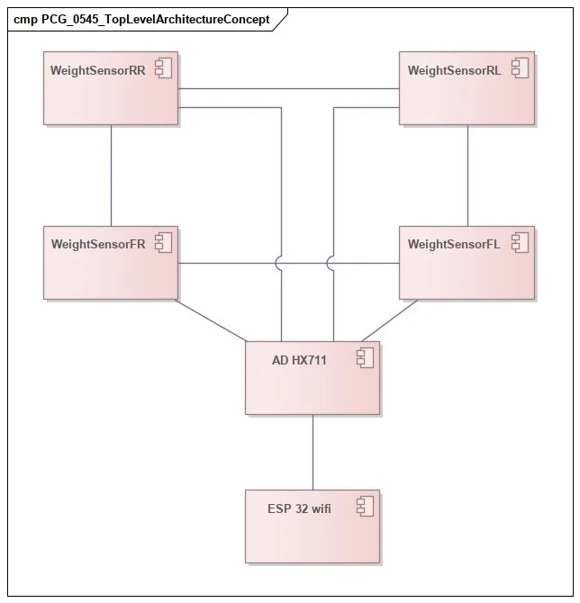

Komponentový diagram nám umožnil predstaviť potrebné komponenty a ich vzájomné relácie. Nakoľko ale chceme vysvetliť aj konkrétnejšie fungovanie nášho projektu rozhodli sme sa použiť diagram aktivít. V tomto diagrame nás nezaujíma o akú automatizáciu domácnosti sa jedná, podstatné je fungovanie samotného merača.

Po vytvorení tlaku na váhové senzory sa zmeria hodnota v podobe napätia. Toto napätie následne prevodník preloží na číselnú hodnotu, ktorá sa odošle na server. Údaje na serveri, respektíve v home assistentovi sú následne používané na vytváranie rôznych automatizácii domácnosti.

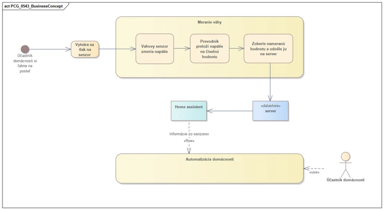

# Technická dokumentácia 

Merač pozostáva z 3 typov súčiastok.

Prvou z nich je váhový senzor. Celý merač používa 4 váhové senzory, každý je umiestnený pod jednou nohou postele.

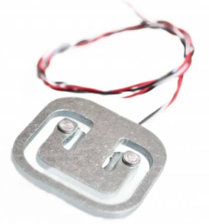

[Váhový senzor 50 Kg | drotik-elektro.sk | drotik-elektro.sk](https://www.drotik-elektro.sk/arduino-platforma/2202-vahovy-senzor-50-kg.html)

Ďalšou súčiastkou v merači je AD prevodník. Tento prevodník preloží namerané napätie z váhového senzora na číslo, teda váhu.

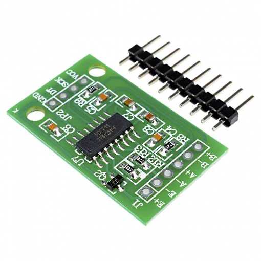

[AD Převodník Modul 24-bit 2 kanály HX711](https://dratek.cz/arduino/998-ad-prevodnik-modul-24-bit-2-kanaly-hx711.html)

Poslednou súčiastkou v merači je ESP. ESP zodpovedá za komunikáciu so serverom, ktorý riadi všetky automatizácie v rámci inteligentnej domácnosti.

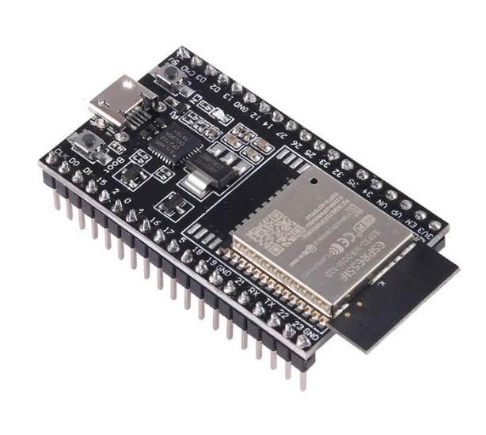

[ESP32-WROOM-32D](https://techfun.sk/produkt/esp32-wroom-32d-vyvojova-doska-wifi-a-bluetooth/)

Zapojenie váhových senzorov je možné vidieť aj na nasledovnej simulácii. https://www.tinkercad.com/things/cXtBXmQlyNS-copy-of-tenzometer-simulacia-01/editel?sharecode=OwcCNjiHLpTByAW0yutwJJMMFzXw6qLS7xyFRkBvZQQ

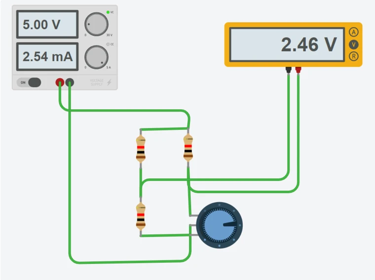

Pomocou BreadBoard sme vizualizovali napojenie jednotlivých súčiastok. Pomocou schémy sme následne vyytvorili technickejšiu verziu vizualizácie.

## Vytvorenie BreadBoardu

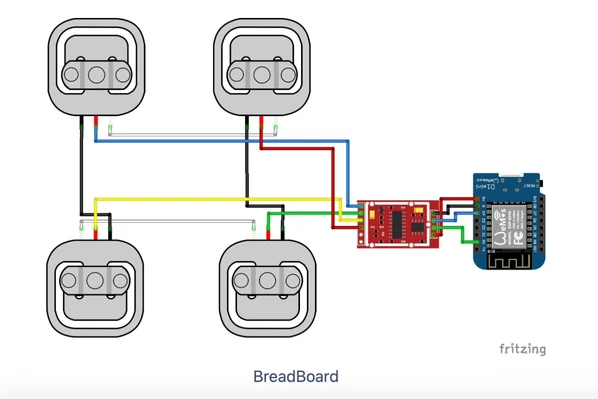 

## Vytvorenie schémy

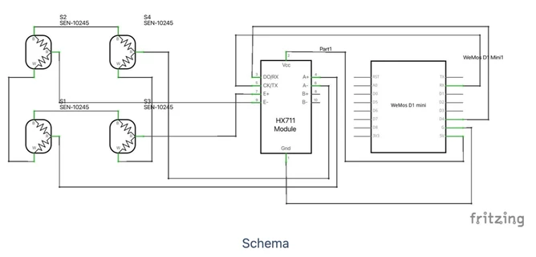 

# 3D tlač
Pre každý váhový senzor sme [vytlačili držiak](https://www.thingiverse.com/thing:4213002), pomocou ktorého je možné váhové senzory primontovať k nohám postele. 

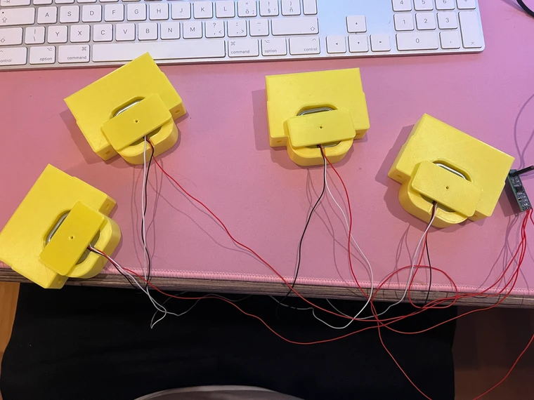 

# Testovanie
## Zaznamenaný výstup po zaťažení merača

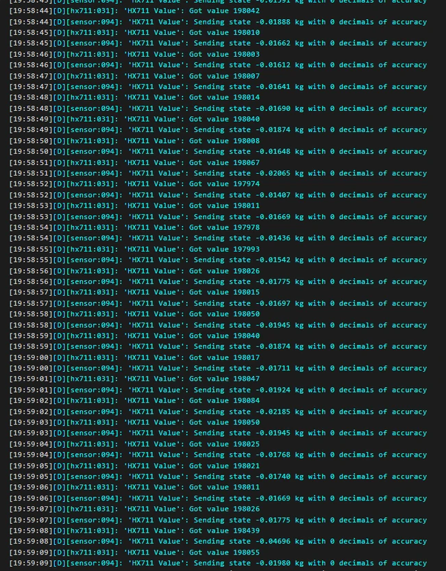 

## Príklad automatizácie

Na automatizáciu sme využili nástroj Node-RED v rámci home assistant, node editor pre automatizácie

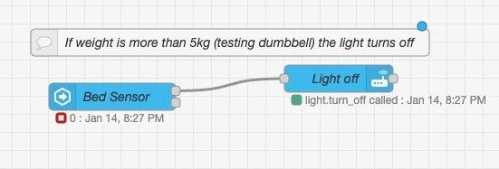 
