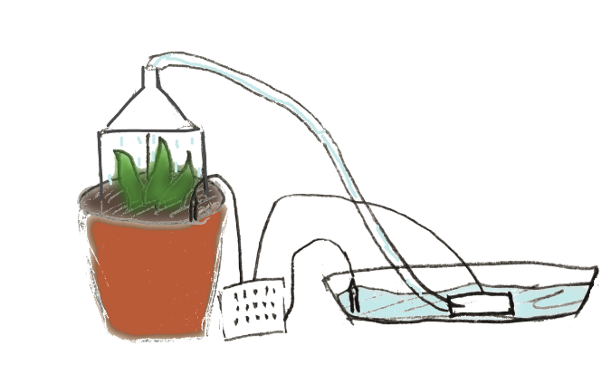
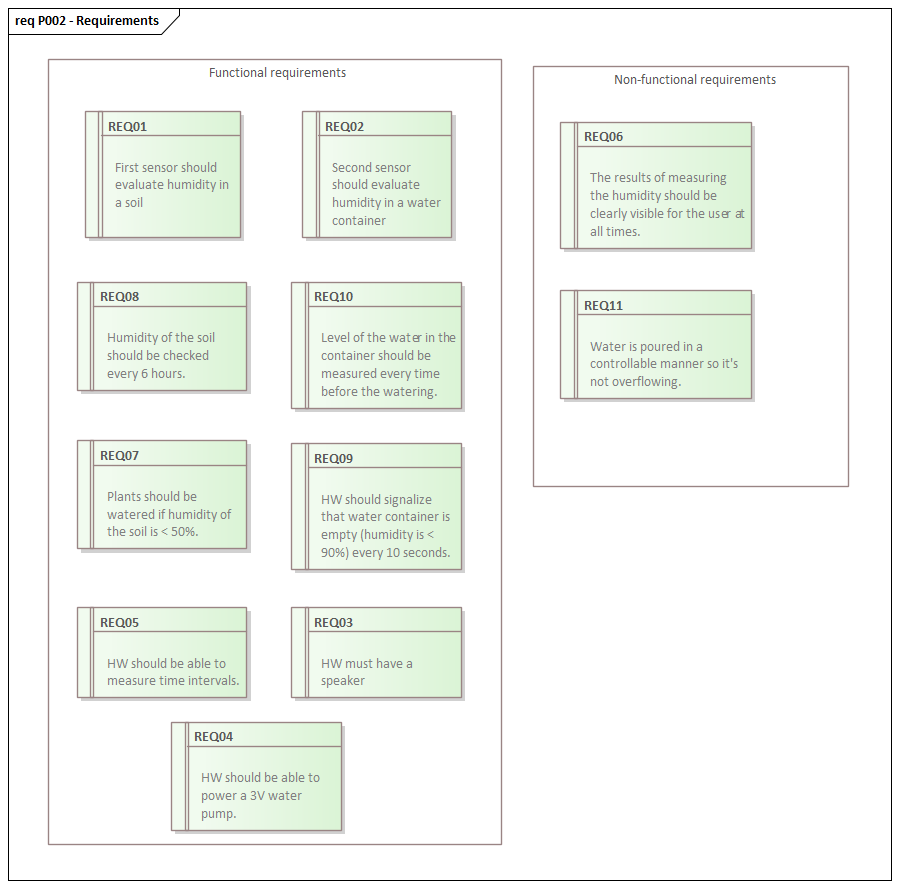
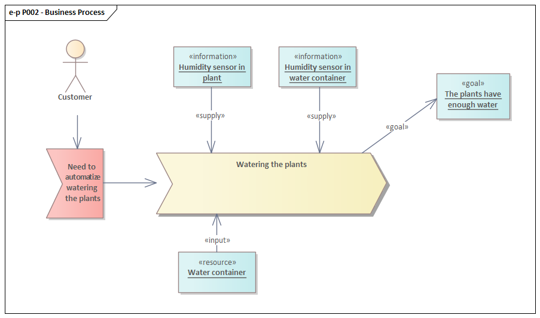

# 02. Business layer (2023-2024-S013-S038)

* * *

## Motivation

In today's world, the demands of daily life often leave little time for the care that plants require. Many people find it challenging to maintain a consistent watering schedule for their plants due to busy schedules, travel commitments, or simply forgetfulness. Consequently, plants suffer from dehydration, impacting their health and vitality.

Developing a plant watering system aims to address this issue by providing a convenient, efficient, and reliable solution. Such a system can offer several benefits: time-saving, consistent care, improved plant health and more.

This project is aimed at those households that have difficulties with consistent watering of plants. This solution can be used for a variety of reasons: when busy at work, when going on vacation, or for no reason at all! The development of a plant watering system combines technology and a commitment to nurturing plant life. By creating such a system, we're solving a common problem of common people.

## Early draft

## Requirements

## Business process

