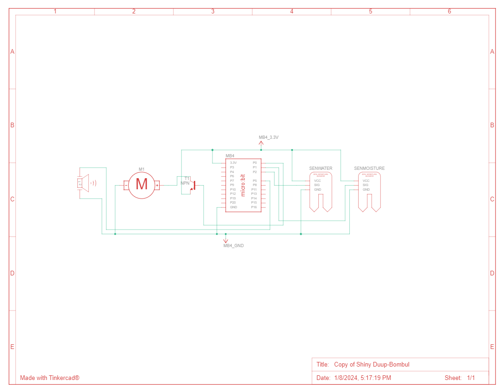

## Navigation
**01. [Project overview](01. Project overview (2023-2024-S013-S038).md)** - project overview .<br/>
**02. [Business layer](02. Business layer (2023-2024-S013-S038).md)** - motivation and requirements.<br/>
**03. [System Layer](03. System Layer (2023-2024-S013-S038).md)** - component diagram, use case diagram, activity diagram.<br/>
**04. [Technical documentation](04. Technical documentation (2023-2024-S013-S038).md)** - circuit and 3D models.<br/>

## Folder structure
#### Folder contains 1 folder with images and 5 files besides READMEs:

1. **waterplant.qea** - EA file with diagrams for the project.
2. **Custom_watering_bell.scad** - 3D model for the watering bell that can be used as an endpiece for the watering tube.
3. **Holder.scad** - 3D model for the watering bell holder.
4. **draft.png** - graphical draft of the solution.
5. **Circuit.png** - schema of the solution. Link on Tinkercad: https://www.tinkercad.com/things/3cc6KGKm7qY-copy-of-shiny-duup-bombul?sharecode=EdoSCYPRnXqAW7ilkaymZm1k1slbnQYI9jjtr23gSAU.


## Code for the circuit
```
moisture = 0
water = 0
unnamed = 0
pins.analog_set_pitch_pin(AnalogPin.P5)

def on_forever():
  global water
  global moisture
  water = Math.map(pins.analog_read_pin(AnalogPin.P2), 0, 813, 0, 100)
  moisture = Math.map(pins.analog_read_pin(AnalogPin.P1), 0, 813, 0, 100)
  basic.show_number(moisture)
  while moisture < 50:
    basic.show_number(moisture)
    if water > 90:
      pins.digital_write_pin(DigitalPin.P0, 1)
      basic.pause(20000)
      pins.digital_write_pin(DigitalPin.P0, 0)
      basic.pause(300000)
    else:
      basic.show_icon(IconNames.No)
      pins.analog_pitch(440, 200)
      basic.pause(10000)
    water = Math.map(pins.analog_read_pin(AnalogPin.P2), 0, 813, 0, 100)
    moisture = Math.map(pins.analog_read_pin(AnalogPin.P1), 0, 813, 0, 100)
  pins.digital_write_pin(DigitalPin.P0, 0)
  basic.pause(21600000)
basic.forever(on_forever)
```