# CarCharm — Learning through play

| 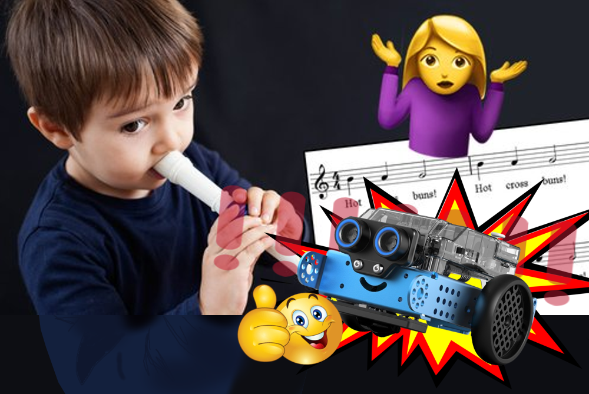 | 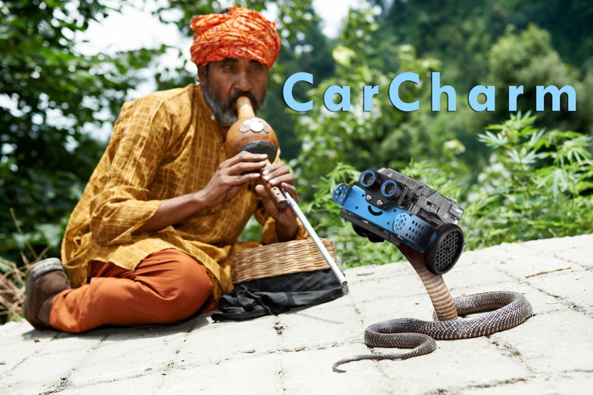 |
| :------------------------------------: | :----------------------------------: |

Authors: Lucia Rapánová, Alica Urbanová, Sofia Shatokhina

Have you ever tried learning a musical instrument? The overwhelming number of notes you need to get used to, the repetitive exercises that seem to suck the soul out of you? Have you been lucky to have a nice and understanding music teacher or did you get stuck with someone who does not understand your musical aspirations nor methods? Worry not, because our project will bring joy to kids and adults alike (although kids might enjoy it *juuust* a little bit more)!

To make learning music even more exciting, we've decided to introduce CarCharm - an engaging way to learn the notes by controlling a little car. Driving forward into the adventure is just one note away!

### Solution description

This project results in a car controlled by recorder sounds. The car can move in four directions, and each direction is represented by one note:
 *• forward = e5
 *• backward = g5
 *• left = b5
 *• right = d6

If the car receives an unfamiliar input (something that does not match the expected notes), it will do nothing. 

### Components
The main components of this system can be seen in the images below:

| 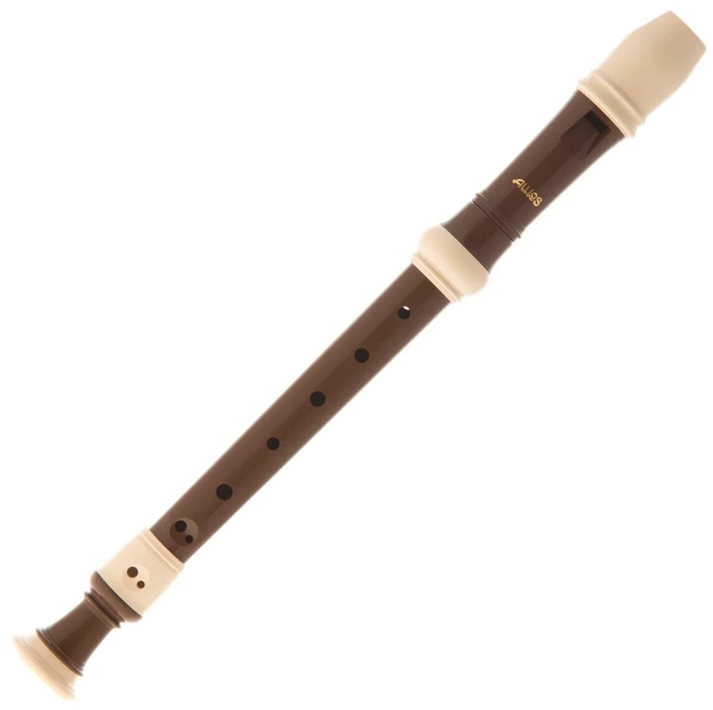 | 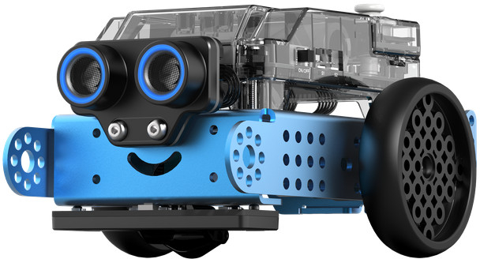 | 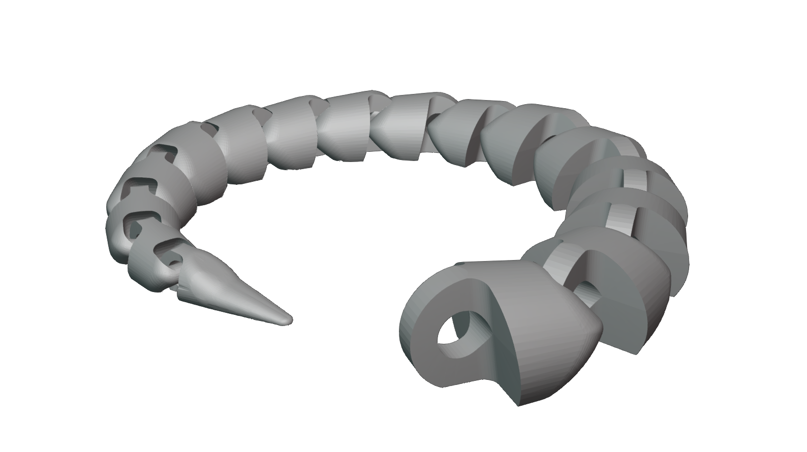 | 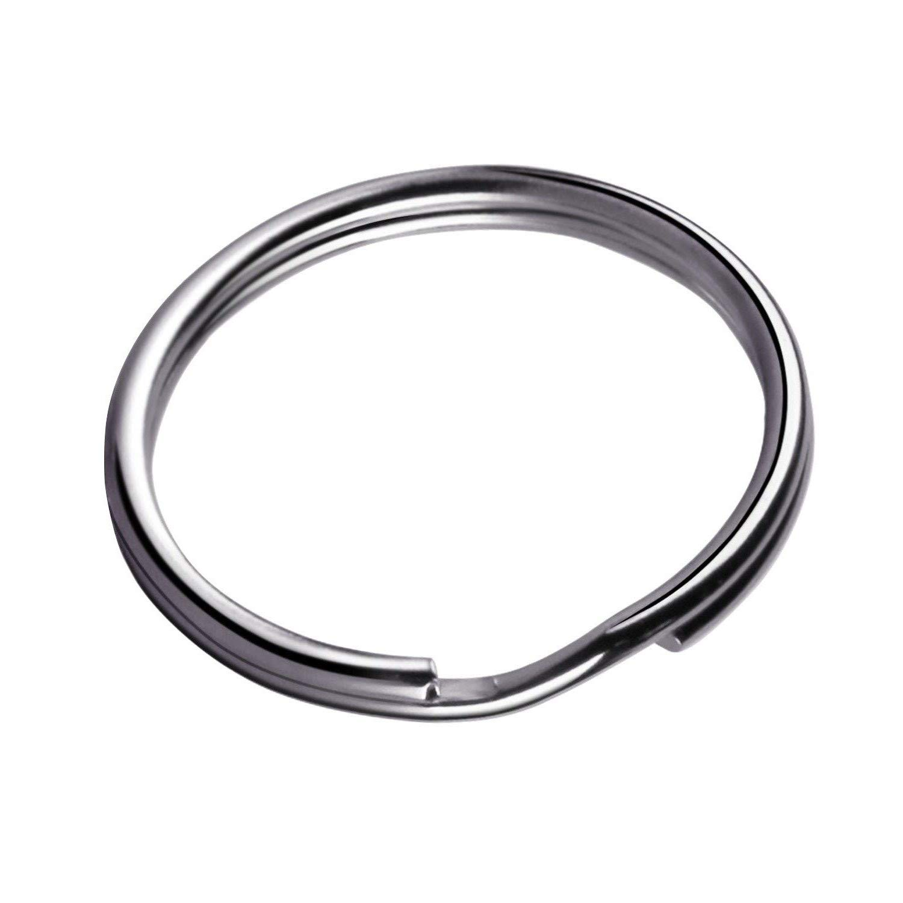 |
| :-------------------------------------------: | :-------------------------------------: | :-----------------------------------: | :-----------------------------------------: |
|                   Recorder                    |                  mBot2                  |         3D printed snake tail         |                  Key ring                   |

Estimated costs:
 *• mBot2 (the cable to connect to the laptop is included in the price) - 127.80€ (can be purchased [here](https://www.makeblock.com/products/buy-mbot2-for-classroom))
 *• recorder - 14.70€ (can be purchased [here](https://www.muziker.sk/aulos-703b-soprano-brown))
 *• 3D printed snake tail - 4.00€ (printed in FabLab)
 *• key ring - 0.50€ (found in any crafts store)

Total cost: 147.00€

This project also needs a functional laptop to run the AI libraries (because they cannot run on CyberPi alone). 

## Analysis and initial design

As our goal was to combine the Teachable Machine and mBot2 technologies, we started out with the software native to mBlock (specifically, with the mBlock block-based editor and the mBlock Python editor as seen in the picture below). 
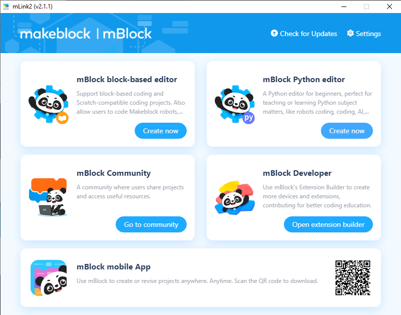
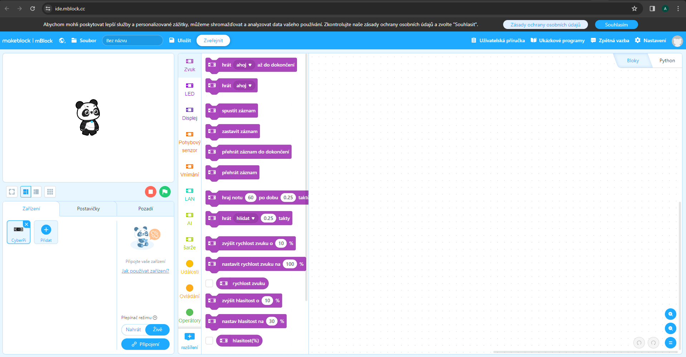
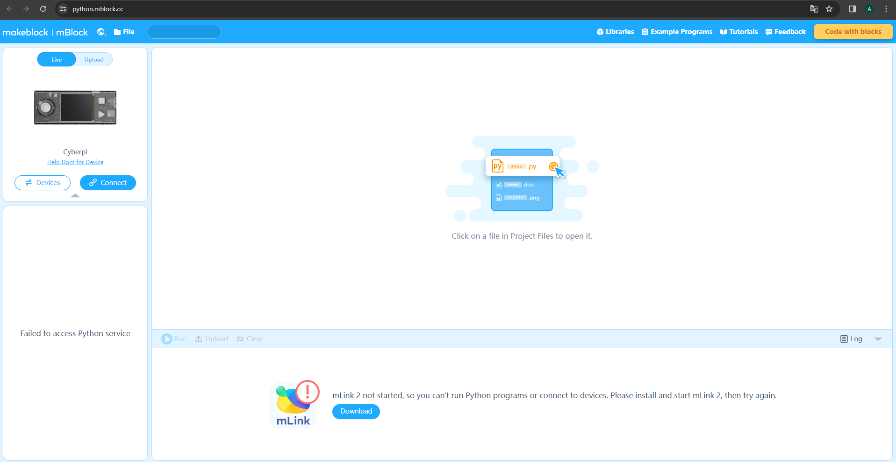

MBlock has a Teachable Machine extension, so that is what we wanted to try out first. However, we found out that this extension is made specifically for images, not for the sounds. The mBlock functionality for sound focuses on speech recognition - it does not allow us to record and then process sound in general. Additionally, while it has an extension for music, it is focused on *playing* music.

When we found out this wouldn't work, our next course of action was to train the [Teachable Machine](https://teachablemachine.withgoogle.com/) model and then to connect that model with the CyberPi component. We had to find out whether we'd be able to export the Teachable Machine model to Python. Teachable Machine has 2 types of export: Tensorflow.js and Tensorflow Lite; the Lite model is the one compatible with Python.

Once we exported our model, we needed to process it using *TensorFlow*. We tried to do so in the native [mBlock Python editor](https://python.mblock.cc/) using its virtual envornment. The Python version in the mBlock interface environment is 3.6, however, TensorFlow does not support that Python version. The Python version compatible both with TensorFlow *and* CyberPi is 3.8. We weren't able to upgrade the Python version in the mBlock virtual environment, so we resorted to working on our own computer with our own virtual environment (in the Python 3.8 version).

In the end this program worked on our computer. However, since we couldn't upload this program directly to CyberPi (due to the versions incompatibilities), we need to connect the mBot2 to the computer. Currently realized with a cable, it also is possible with Bluetooth.

We found out about the Bluetooth connection while trying out the [Makeblock](https://play.google.com/store/apps/details?id=cc.makeblock.makeblock) mobile app for mBot2 and whether it would be possible to control the mBot2 via a phone. In the app, it is possible to connect to the mBot2 and use voice commands to control the car.

| 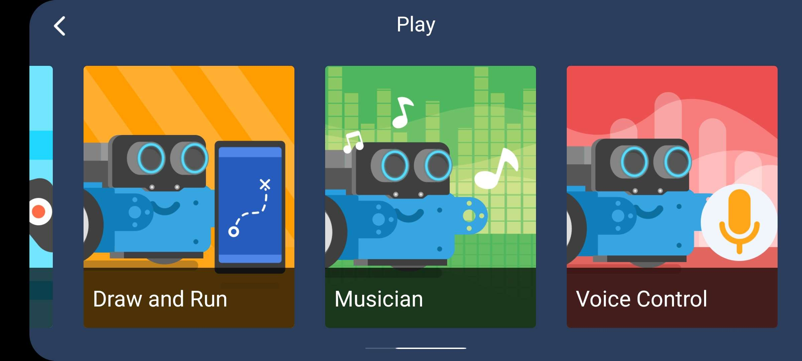 | 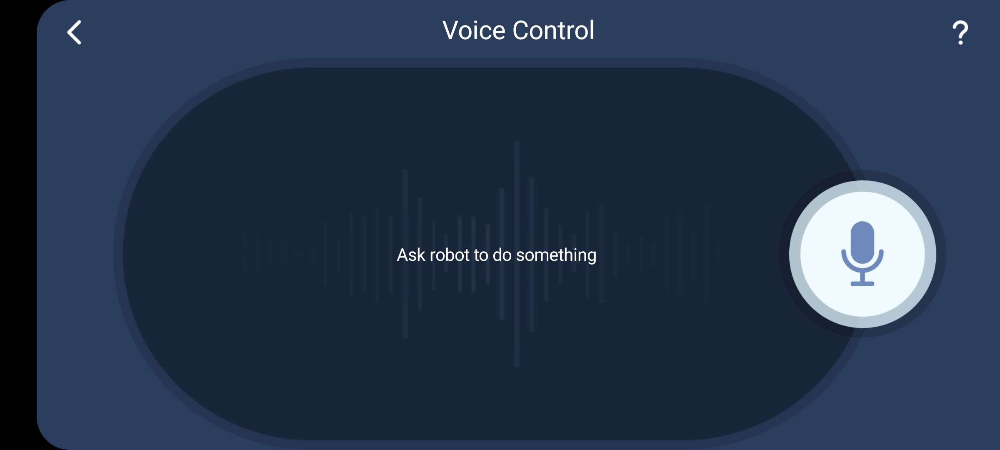 |
| ------------------------------------------------------- | ---------------------------------------------------------- |
| The main menu of the Makeblock app                      | The voice control menu of the Makeblock app                |

### Teachable Machine

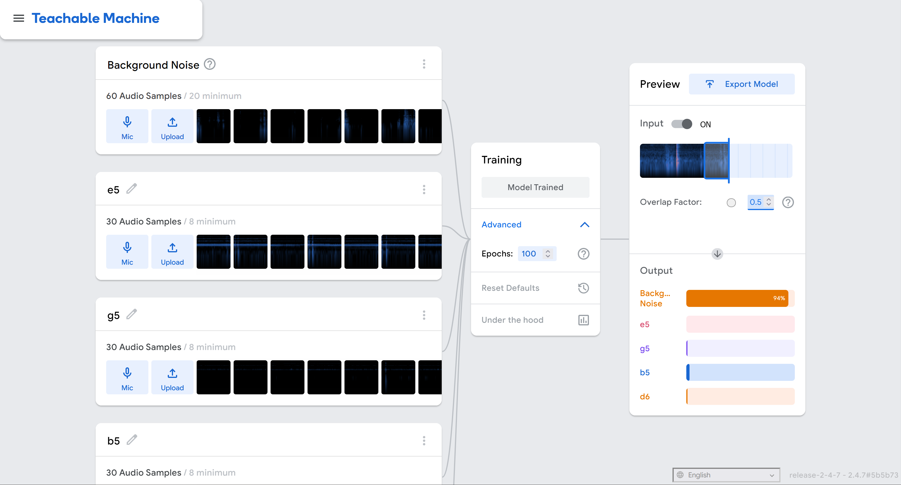

The Teachable Machine tool allows you to train a simple model on either audio or visual data. It is a web platform developed by Google that enables users to train a model without any programming or neural network knowledge, making it suitable for individuals who are just beginning to explore AI. The tool is free and easy to use; users simply need to name the individual classes the model should distinguish and provide data (such as images or audio recordings) for each class that Teachable Machine should learn to differentiate. Training is completed in a few minutes, and the model can be downloaded in two different formats. It's important to note that the model may not be perfect, as neural networks only approximate and may not always yield accurate results—this is how AI often operates, and the performance depends on the quality of the model. However, for our project, we can suffice with a model that performs better than mere randomness.

## Design

In the following sections, we are describing our designed solution using business, architectural and technical diagrams. We also explain our motivation, digital twin and look at the Python code and libraries that we used for implementation.  

### Motivation and business diagram

At first, we had many ideas and couldn't decide among them. Mr. Vaško suggested that some teams could teach a car to respond to commands like "right," "left," and so on. We also considered this idea, but then we came across a video that utilized Teachable Machines to make a snake in the classic game "Snake" respond to movements/images (link: https://www.youtube.com/watch?v=UPgxnGC8oBU). This sparked the idea of trying Teachable Machines for our project and combining it with something useful, such as teaching children to play a musical instrument. In this project, we incorporated the mBot2 car to further enhance the learning experience of playing a musical instrument. We thought that the car could move based on the played tones. We chose the flute/recorder as the musical instrument, making the car our 'snake' in the mentioned game.

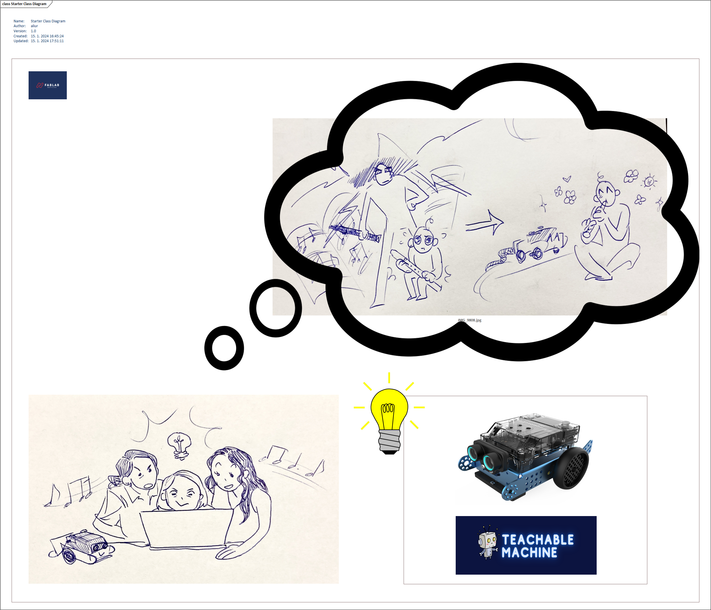

This car won't be just for entertainment, although it may seem that way; it will be intended for young visitors of the FabLab to show them what Teachable Machines can achieve. Additionally, the car can serve as a fun educational material that differs from conventional forms of learning.

Target audience: kids of ages 7-15 (young FabLab visitors)

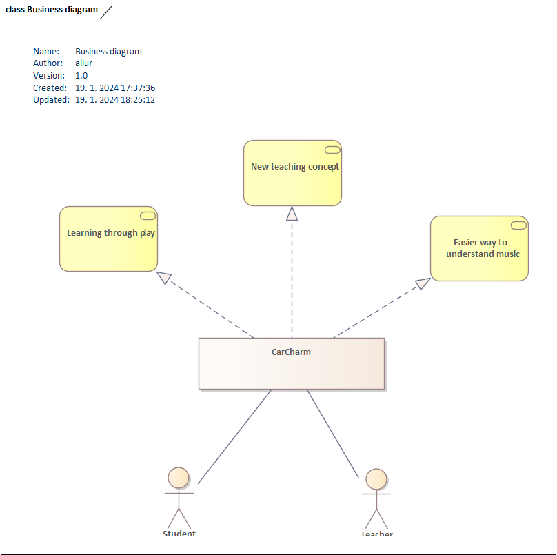

### Digital twin

The physical car (mBot2) sends the data to its digital version that is situated in the computer. The computer evaluates the data and sends a response to the physical car. The digital twin saves the data about the physical car, such as its movement, status, and so on. It works in real time and its behavior is synced with the real physical car.

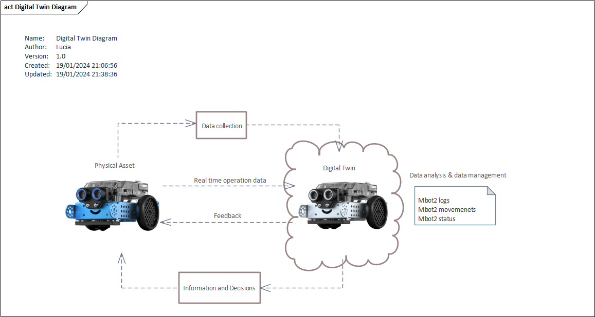

### Technology diagram

The technology diagram shows us the components to the system of this project. It includes the student who creates sound (by playing the recorder). This sound is fed to the Teachable Machine (that trains a model to recognize specific sounds), which runs on a computer. The sound is also fed into the computer, as it receives the sounds and then processes it to decide where to move the car (with the help of several Python libraries). As for the car's movement, the component responsible for it is CyberPi, which is part of the mBot2. This mBot2 is connected to the computer via a cable, and another component connected to the mBot2 is a 3D printed tail, edited in Blender and printed on a Prusa Mini 3D printer with the help of the Prusa Slice application.

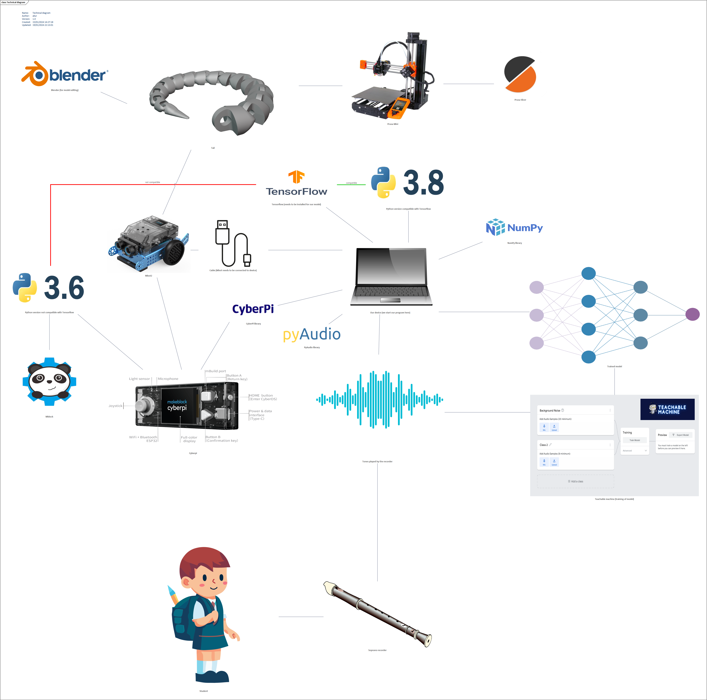

### Architecture diagram

The architecture diagram shows us a deeper understanding of the inner workings of our system. In the following diagrams, we can see the architecture of the Mbot2 device and its components. 

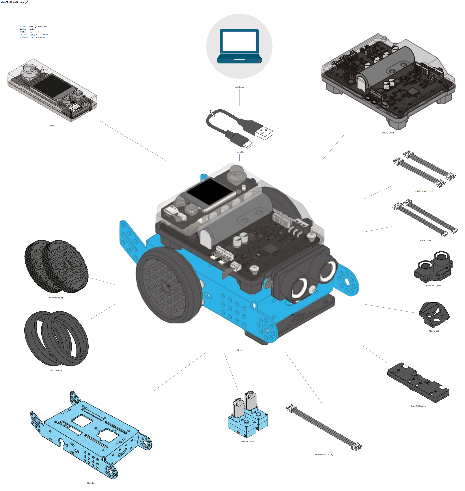

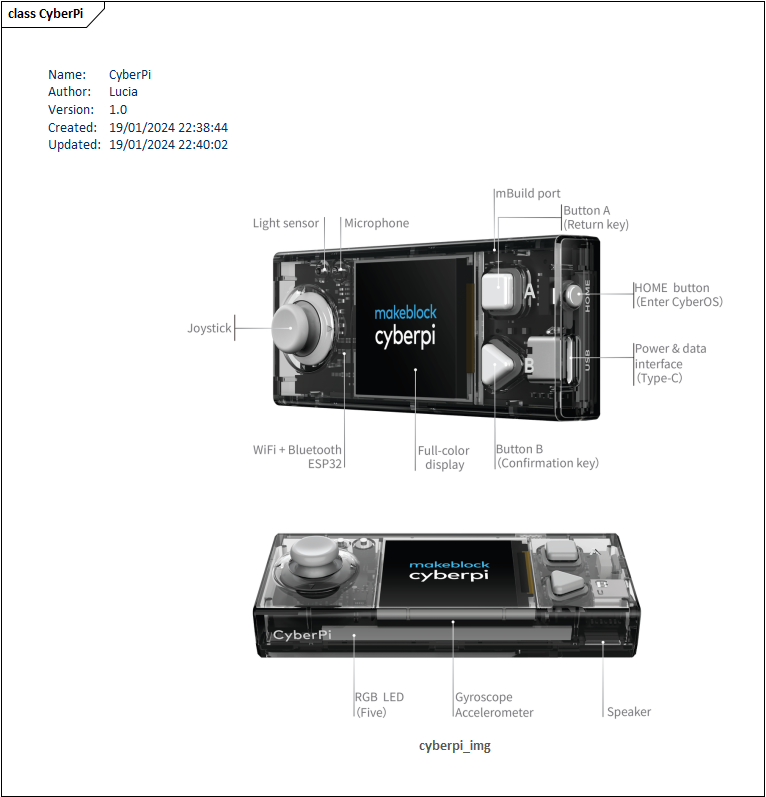

CyberPi is a main control board independently developed by Makeblock. With a compact structure and built-in ports, it can easily be extended. It supports mBlock 5 and mBlock-Python Editor, and it is applicable to multiple education scenarios including large-class teaching, community teaching, and online/offline education and training. It covers multiple teaching fields including coding, makers, and robots, and thus it can meet diversified education needs, such as AI, IoT, data science, and UI design.

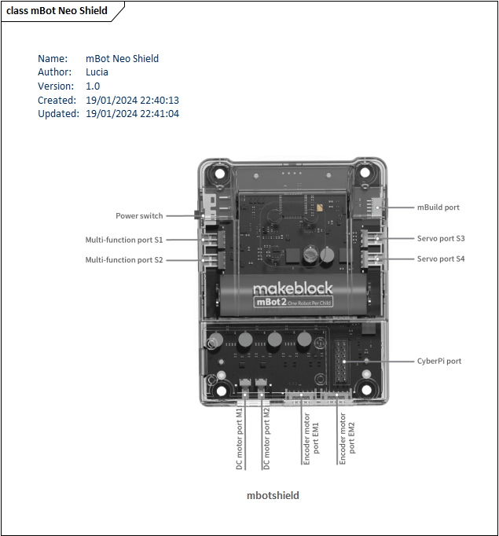

mBot2 Shield is equipped with a built-in rechargeable lithium-ion battery that can supply power for CyberPi. With the multi-function, servo, and motor ports, it can drive motors, servos, and LED strips.

The mBot construction architecture diagrams were taken from the [official Makeblock documentation](https://support.makeblock.com/hc/en-us/articles/12966349331991-A-Beginner-s-Guide-to-mBot-Neo-mBot2).

During the implementation, we've used the following libraries:
 *•library for working with mBot2: `cyberpi` - CyberPi library is the key library to work with the Mbot2. It requires the Mbot2 car to be connected to the laptop in order to work. 
 *•machine learning libraries: `tensorflow`, `numpy` - We used tensorflow library to work with the tflite model that was provided as an output from the Teachable Machine. TensorFlow Lite uses TensorFlow models converted into a smaller, more efficient machine learning (ML) model format. TensorFlow Lite models can perform almost any task a regular TensorFlow model can do: object detection, natural language processing, pattern recognition, and more using a wide range of input data including images, video, audio, and text.
 *•library for audio processing:  `pyaudio` -  We are using pyaudio to record the sound from laptop microphone. The audio is streamed continuously, until there's a request from the user to end the program. 

We trained our model in the teachable machine for 100 epochs, and we used 30 samples for each note and 60 samples for the background noise. 
Below we can see the neural network architecture. The full image is available [here](assets/diagrams/model-arch.png). However the most interesting and useful for us is the knowledge of the layers and functions used. We can see the use of Conv2D layers, which is a convolutional layer. It uses ReLU activation function, as well as max pooling. At the end it uses fully connected layers and softmax function. The softmax function is often used as the last activation function of a neural network to normalize the output of a network to a probability distribution. In our case, the softmax function returns the probability distribution for each note (or background noise) that was played. 

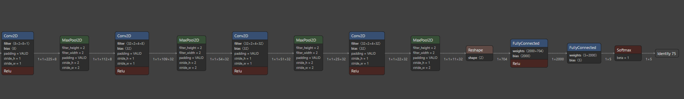

We extracted the neural network architecture using a program called [Netron](https://github.com/lutzroeder/netron). Netron is a viewer for neural network, deep learning and machine learning models.

### Construction

To create the car's snake tail we've adapted a model by TechnicaL50 ([uploaded to Thingiverse](https://www.thingiverse.com/thing:4972644)). As we only need the tail of the snake to attach to mBot2, we've cut off the snake's head (leaving the appropriate length) in *Blender* and then prepared it for 3D printing in *PrusaSlicer*. The files for the tail model are available in the **/construction** folder of this repository.

| 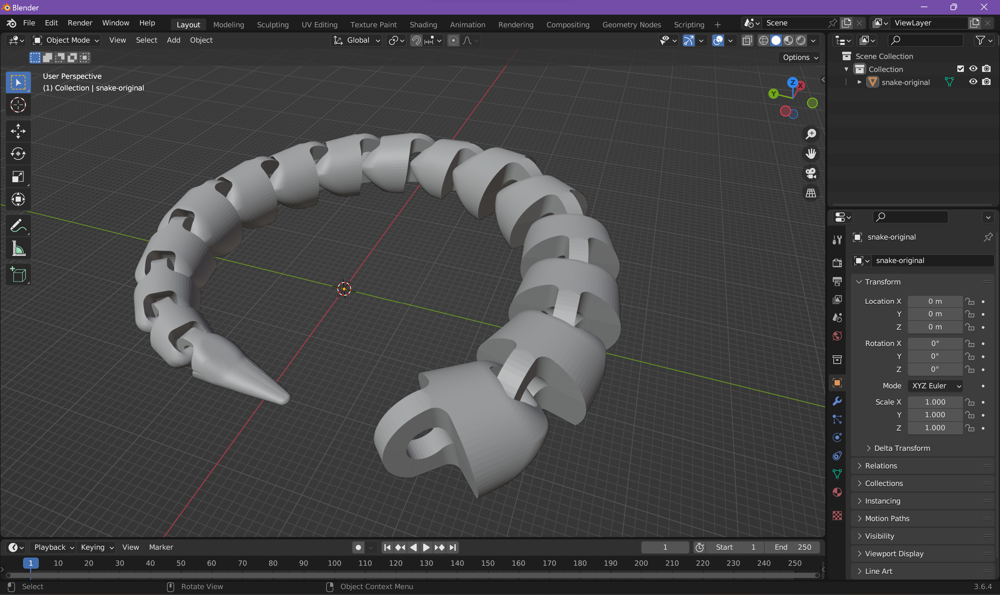 | 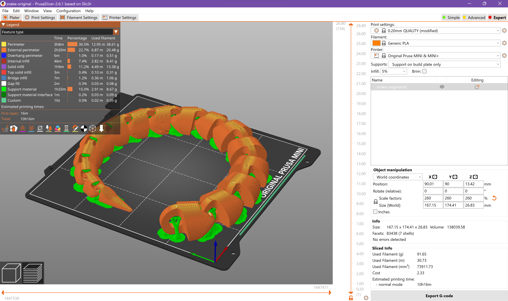 |
| :------------------------------------------------: | :--------------------------------------------------: |
|          The snake tail edited in Blender          |         The snake tail sliced in PrusaSlicer         |

After updating the model and slicing it, we've printed it on the *Prusa Mini* printer in FabLab. 
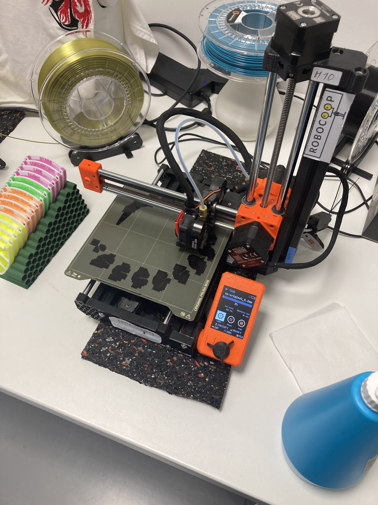

## Versioning and workflow

While working on this project, we used the BitBucket technology for easier file editing, organization, and synchronization. We also utilized the Lemontree application for parallel work in Enterprise Architecture, allowing us to collaborate on the same EA file.

### BitBucket

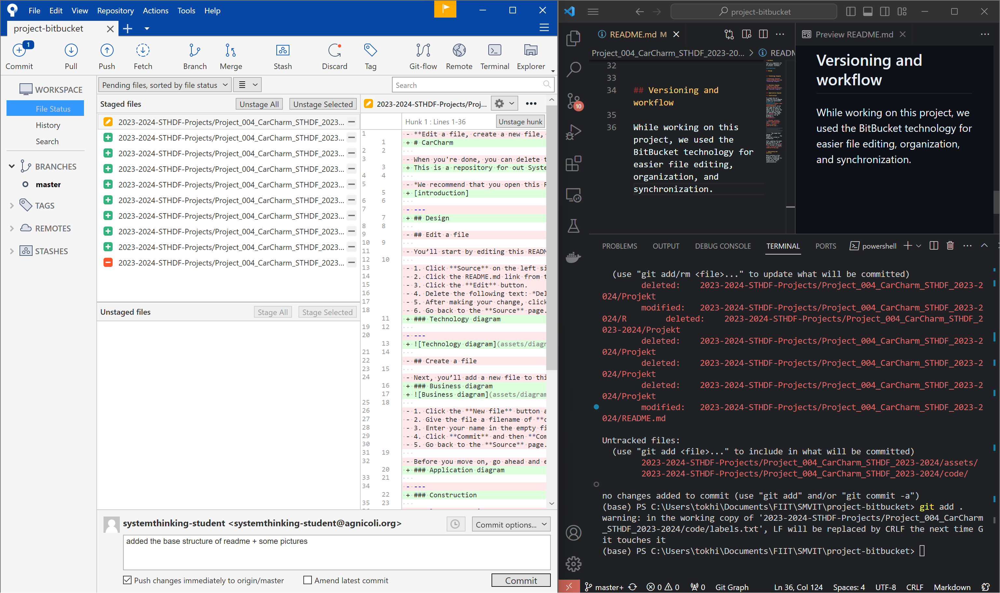

If we wanted to add new folders to Bitbucket, we had to first pull all the content from the main repository. Bitbucket text files use the Markdown language, so the simplest approach was to open our local Integrated Development Environment (IDE), specifically Visual Studio, and install a Markdown extension (named "Markdown Preview Github Styling"). This allowed us to automatically see the resulting document directly during editing.

### LemonTree

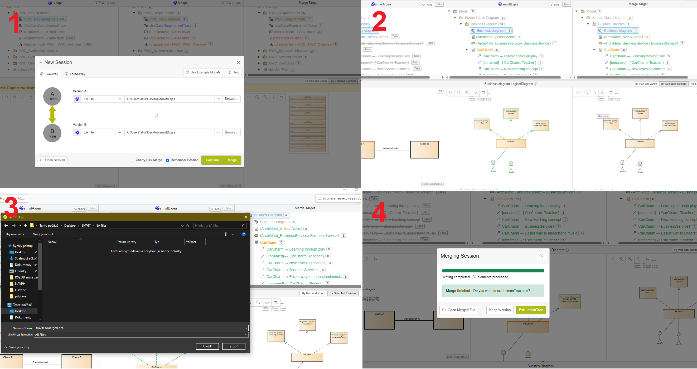

While Lemontree enabled us to merge EA files, allowing us to work in parallel on our diagrams, its user-friendly GUI allowed us to preview the merged diagram. We could also choose which files to keep and which ones to discard in the resulting merged file.

## User manual

1. Connect mBot2 to your laptop with the provided cable.
2. Open the [python code](code/controller.py) in an editor of your choice (we recommend using Visual Studio Code) or use a terminal (command prompt) in your computer.
   * If you're using VSCode like us, open the terminal to see the program's outputs by clicking *Terminal* → *New Terminal* in the top menu) 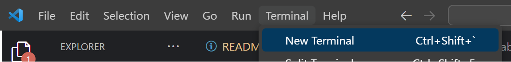
   * It is recommended to use a *virtual environment* (for example, conda), however, it's not mandatory.
3. Install the libraries used in this project.
   *  Use the command `pip install -r requirements.txt` (while located in the `Project_004_CarCharm_STHDF_2023-2024\code` folder)
4. Start playing the notes when the program output prompts you to do so.
   * It takes a moment to process the audio input, so it is recommended to hold the note for a bit longer than just half a second. The car will update its movement after a brief delay (to process the movement)

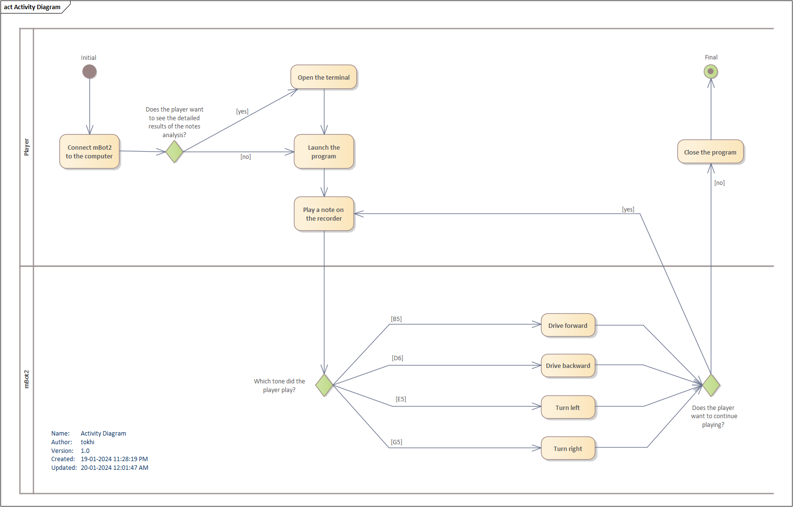
The depiction of the steps above can be summarized by the activity diagram above.

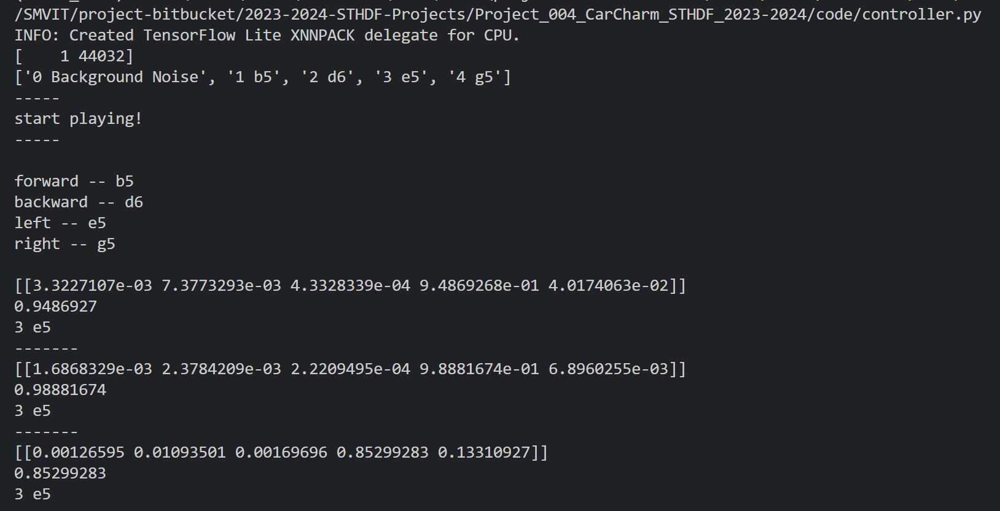

The image above depicts the logs from the terminal after launching the program. At first the program shows the classes (the notes the model was trained on), then prompts the player to start playing and shows the probabilities of the notes being played, the highest probable note and its probability.

The recording of the first prototype of this project can be found [here](https://drive.google.com/file/d/1GJEV9ec5mX4Vjn0dQoSR86k4HzJavHZx/view?usp=sharing).

## Final prototype

| 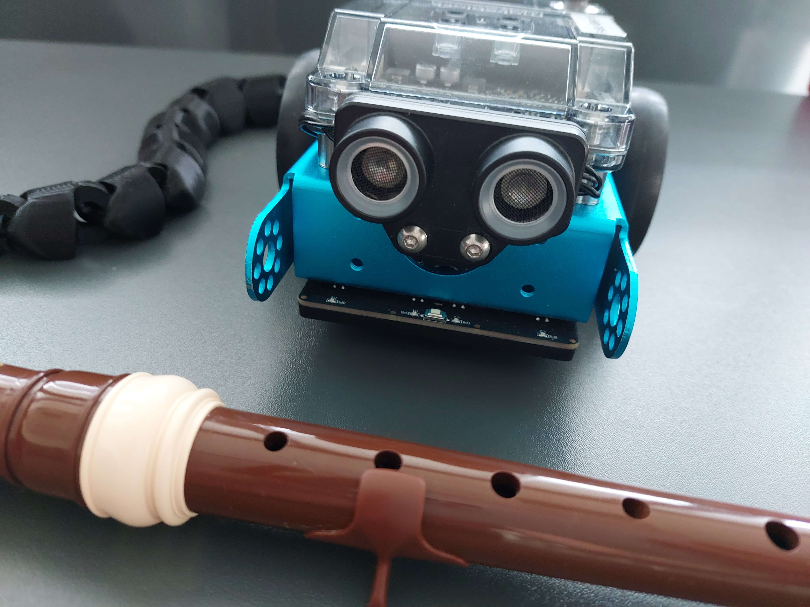 | 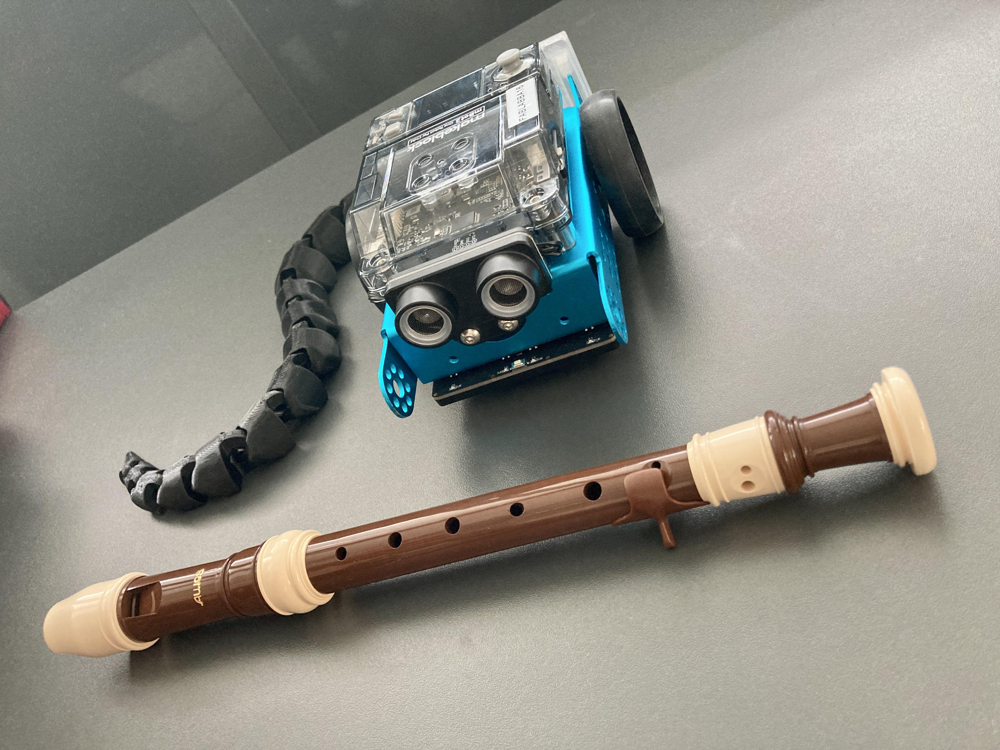 |
| :-----------------------------------------: | :-----------------------------------------: |

## Conclusions and future work

As this is only a prototype, there's many directions this project could go:

* **Additional instruments** - we could train the model to recognize not only the sounds of the recorder, but also other instruments (like the guitar, violin, and many more).
* **PvP** - instead of one person guiding the car, we could introduce a "battle mode" or "player vs player"; two players going against each other. The competitiveness of this mode would change the landscape - instead of just practicing the notes, two players would push each other to the heights they wouldn't dream of achieving on their own.
* **Wireless connection** - currently, the car is attached to the laptop, limiting its movement. In its next iteration, the mBot2 would have a wireless Bluetooth connection.
* **Melody recognition** - after the player successfully plays an entire melody, the car would reward the player with a little lightshow dance.
* **Labyrinth** - instead of the player wandering aimlessly, a labyrinth would be created, by completing which the player would've played a specific melody.
* **GUI** - instead of running the code through the terminal (or a programming interface) as it is done right now, a graphical user interface could be introduced for easier launch and parameter editing. This GUI could be for the laptop that runs the model as well as for the CyberPi component (via which the player would then be able to select the mode they wanna play in - whether they just wanna try out the notes, play a specific melody, or fight against another player).
* **Further model training** - while the current prototype can distinguish the notes pretty reliably, to improve the results we would do more extensive training.

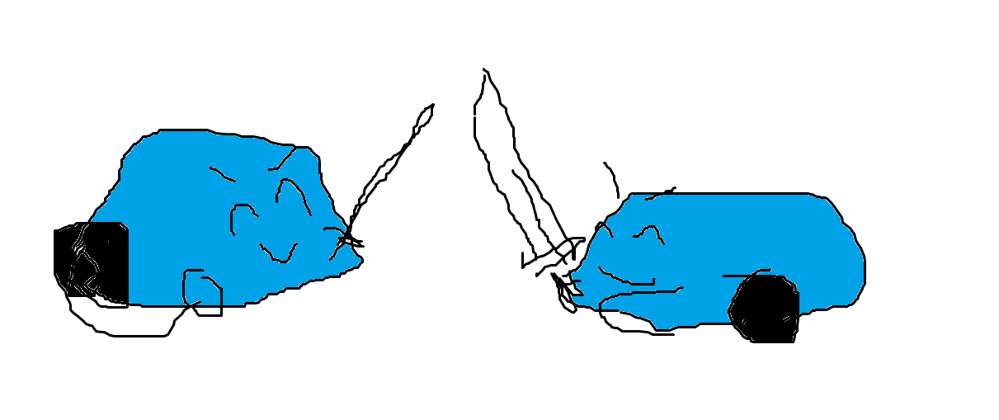