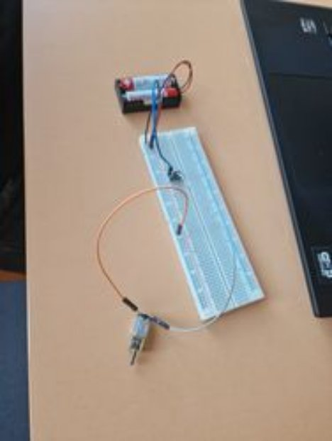
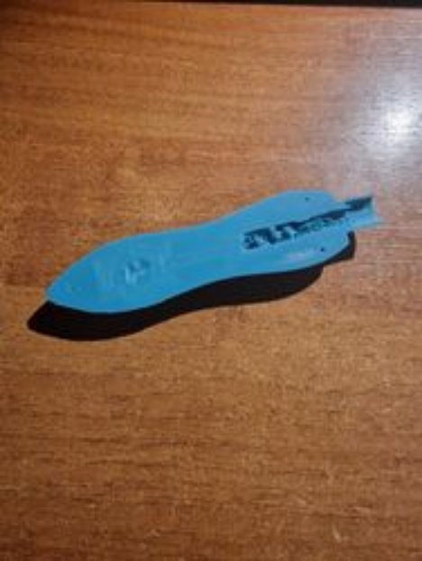
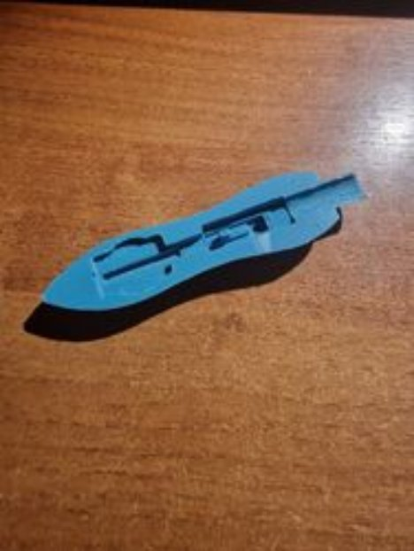
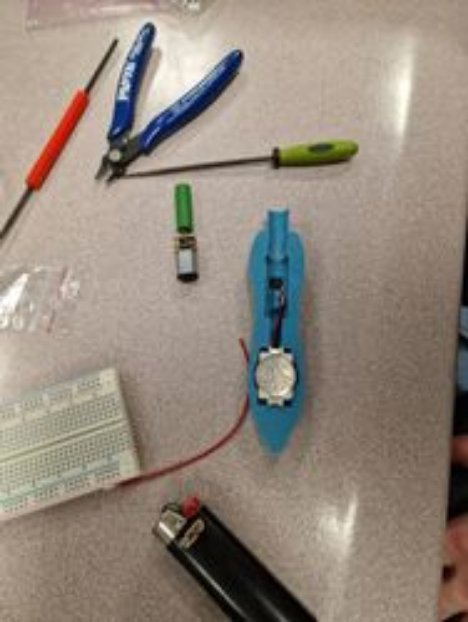
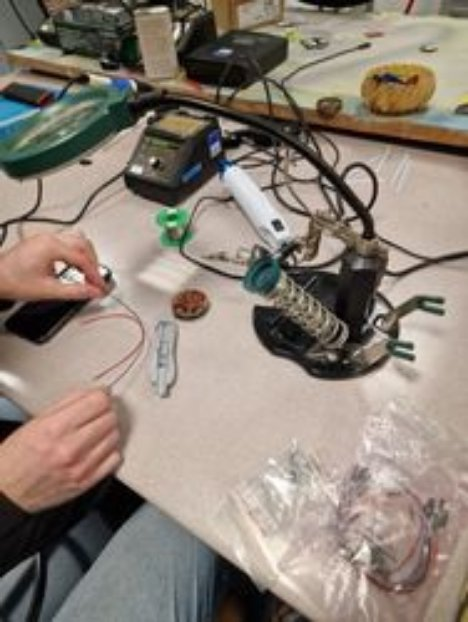
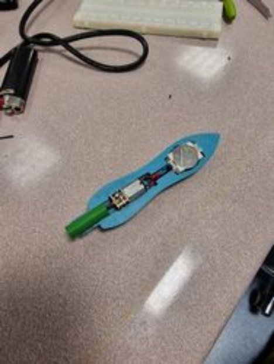
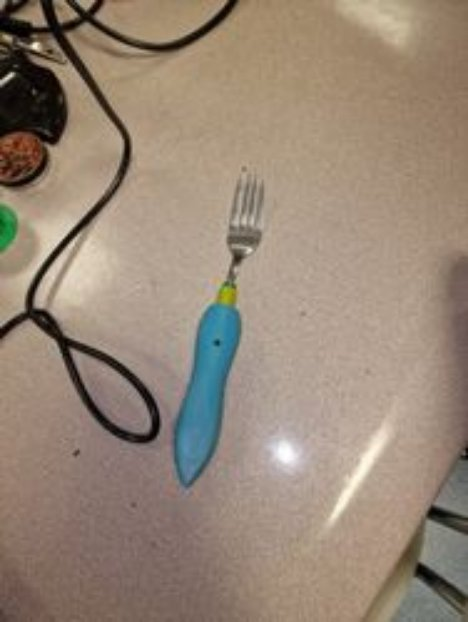

# **project 005**
# **PROJECT OVERVIEW** 
# **SpinFork: Automatická vidlička na špagetti**
*Autor: Adam Baran-Tomik & Lukáš Čižmárik*

**Cieľ projektu:**

Navrhnúť, vyvinúť automatickú vidličku na špagety, SmartFork, ktorá zjednoduší konzumáciu špaget a iných dlhých cestovín. Automatické navíjanie cestovín, čo zaisťuje pohodlné a elegantné jedlo bez nutnosti manuálneho otáčania vidličky.

 

**Predpokladané výstupy projektu:**

Prototyp vidličky: Funkčný prototyp demonštrujúci automatické navíjanie cestovín.
Výrobný plán: Detailný výrobný plán vrátane nákladov.
Testovanie: Výsledky testov pre ďalšie vylepšenia.

**Kľúčové vlastnosti:**

- Automatické navíjanie aktivované tlačidlom.
- Batéria s dlhou výdržou (CR2032 3V).
- Demontovateľný a čistiteľný dizajn.
- Ergonomická rukoväť na pohodlné držanie pre rôzne veľkostí rúk.

 

**Cieľová skupina:**

- Jednotlivci s obmedzenou motorikou.
- Milovníci cestovín hľadajúci nové gastronomické zážitky.
- Zákazníci so záujmom o technologické novinky v kuchyni.
- Deti pre spríjemnenie konzumácie cestovín hravou formou.
- Reštaurácie a cateringové služby hľadajúce spôsob, ako zvýšiť efektivitu a zároveň udržať eleganciu pri podávaní jedál.
- [Business layer](file:///C:/wiki/spaces/STHOutcomes/pages/50069506)

 

**Predpokladaný vplyv projektu:**

Zlepšenie užívateľského zážitok pri jedle špaget a podobných jedál.
Poskytovanie pomoci tým, ktorí majú problémy s konzumáciou týchto jedál.
Zaujímavá príležitosť pre reštaurácie na zdokonalenie ich servisu a zážitku pre zákazníka.

**Predpokladaný rozpočet:**

Vývoj a dizajn: 5 EUR
Výroba prototypu: 10 EUR
Testovanie: 5 EUR
Marketing a distribúcia: 0 EUR
Rezerva na nepredvídateľné výdavky: 5 EUR
Celkom: 25 EUR

 

# **KNOWLEDGE CONTRIBUTION AND RESOURCES**
Prehľad procesu od návrhu až po výrobu a zoznam použitých komponentov:

Tento kombinovaný prístup k vývoju a výrobe umožňuje nielen efektívne prototypovanie, ale taktiež poskytuje cenné informácie pre budúce výrobné procesy. Vďaka týmto technológiám a komponentom ste schopní vyvinúť produkt, ktorý je inovatívny, funkčný a pripravený na ďalšie testovanie a vylepšenie.

 

**Modelovanie v Programe Fusion 360:**

Fusion 360 je pokročilý nástroj pre CAD (počítačom podporovaný design), ktorý vám umožnil presne navrhnúť jednotlivé súčasti vidličky. Vďaka tomu ste mohli vytvoriť detailný a funkčný dizajn pred samotnou tlačou.

[clideo_editor_2136ceaa3deb48c893ae43f384e02789.mp4](file:///C:/wiki/download/attachments/60556181/clideo_editor_2136ceaa3deb48c893ae43f384e02789.mp4?version=1&modificationDate=1702897211828&cacheVersion=1&api=v2) 

**Príprava pre Tlač (Slicing) Pomocou Prusa Slicer:**

Prusa Slicer je softvér, ktorý prevádza 3D modely na inštrukcie pre 3D tlačiareň. Použitie tohto slicera zaisťuje, že výsledná tlač bude zodpovedať navrhnutému modelu s potrebnou presnosťou a kvalitou.

Čas tlače 3:40 hod.

![ref1] 

**3D Tlač:**

Použitie 3D tlače umožnilo rýchly a efektívny vývoj prototypu. Táto technológia je ideálna na experimentovanie s dizajnom a funkciami, pretože umožňuje rýchle iterácie a zmeny. Použitá 3D tlačiareň bola Prusha i3 vo FabLabe.

**Komponenty:**

- Motor s prevodom na 30RPM: Tento motor poskytuje optimálnu rýchlosť a silu pre navíjanie cestovín, čo je kľúčová funkcia SpinFork.

 

- Tlačidlo: Umožňuje užívateľom aktivovať mechanizmus točenia.

 

- Batéria: Poskytuje 3V napätie pre motor. Výber správneho typu a veľkosti batérie je dôležitý na dosiahnutie požadovanej výdrže, ktorá je odhadovaná na 3,5 hodiny.

 

- Kryt na Batériu: Zaisťuje bezpečné a jednoduché umiestnenie batérie vo vnútri vidličky.

 

Upevnenie vidličky pomocou prepojovacieho komektora, ktorý prepája motor a vidličku

 

 

Príprava vidličky pre použitie v projekte

 

Po zakúpení komponentov sme začali skúšať funkčnosť riešenia na základe návrhu:

![ref2] 

` `

[2 - arduino_odvod_2.mp4](file:///C:/wiki/download/attachments/60556181/2%20-%20arduino_odvod_2.mp4?version=1&modificationDate=1702897211929&cacheVersion=1&api=v2) 

Vytlačili sme viacero veľkostí prepojovacích komektorov (9mm a 9,5mm) aby sme zistili, ktorý vyhovuje najviac.

Čas tlače: 20 min.

 

Prvý neúspešný pokus o 3D tlač, vnútorný povrch bol veľmi drsný a komponenty sa nezmestili

 

 

Druhý neúspešný pokus o 3D tlač, vnútro pre komponenty bolo hladké s presnými rozmermi, avšak vonkajší povrch bol veľmi drsný. Pri pokuse o úpravu vonkajšieho povrchu sme použili teplovzdušnú pištoľ s myšlienkou uhladiť povrch, avšak výtlačok sme nahriali až tak, že sa zmrštil.

![ref1] 

 

Finálny výtlačok III. kde sme model tlačili rovnou plochou dole (tak ako výtlačok I.) avšak so zväčšenými rozmermi.

Skladanie modelu vo FabLab z výtlačku III:

[5 - assembly_7.mp4](file:///C:/wiki/download/attachments/60556181/5%20-%20assembly_7.mp4?version=1&modificationDate=1702897212049&cacheVersion=1&api=v2) 

## **SpinFork v akcii**
[20231209_163144.mp4](file:///C:/wiki/download/attachments/60556181/20231209_163144.mp4?version=1&modificationDate=1702897212060&cacheVersion=1&api=v2) 

**Budúce možné vylepšenia:**

- vyššia rýchlosť otáčania (60 RPM),
- kryt na batériu bez nutnosti odskrutkovania,
- efektívnejšie vysúvanie vidličky pre možnosť použitia v umývačke,
- väčšia kapacita batéria, prípadne použiť AKU batériu,
- variant ergonomického dizajnu pre deti,
- plne vodeodolná SpinFork.
# **BUSINESS LAYER**
Prípady využitia nášho riešenia sú trojaké:

- Spinfork môže slúžiť ako spôsob na zlepšenie zážitku jedenia pre malé deti. Pokiaľ by dieťa malo problém s pozornosťou počas jedenia alebo by jednoducho nechcelo jesť, SpinFork môže svojou intuitívnosťou a nemonotónnosťou pomôcť dieťaťu jesť.
- SpinFork môže pomôcť ľudom s obmedzenou motorikou v rukách. SpinFork odstraňuje určitý faktor zložitosti pri konzumácii niektorých jedál.
- Ďalšie využitie SpinFork-u je jednoducho ako zábavná technologická vychytávka.

 
# **SYSTEM LAYER**
Pri vytváraní SpinFork sme využili modelovací nástroj Fusion360, kde sme prototyp modelovali vo verziách V1 a V2 ktoré sa líšia vo vnútorných rozmeroch pre komponenty. Model automatickej vidličky sme následne slicovali v programe od Prusha, následne sme využili 3D tlačiarne vo FabLab kde sme vytlačili viacero modelov automatickej vidličky. Ako technologické komponenty tejto automatickej vidličky sme použili motor s prevodom o rýchlosti 30RPM, tlačidlo, batériu a púdrzo batérie pre typ CR2032 s napätím 3V. Hotový 3D výtlačok (vo finálnej verzí V3) spolu s komponentami sme podľa navrhnutej schémy pájkovali vo FabLabe.

 

# **TECHNICAL DOCUMENTATION**
Prvotný návrh obvodu pre projekt SpinFork. Obvod bol pomerne jednoduchý, jediné, čo sme potrebovali bolo motor, batéria a tlačidlo.

 

Následne sme tento návrh preniesli do simulátora obvodu [Tinkercad](https://www.tinkercad.com/), kde sme otestovali funkčnost nášho obvodu po zapojení do komponentu breadboard.

[Circuit design SMARTFORK](https://www.tinkercad.com/things/hzMs0H9f4GC?sharecode=gJKus8IYw0Agm5rzK1IHAycXjC5o_1-VWo9saV-VB3E)

![ref2] 
# **Výpočet doby prevádzky**
kapacita\_baterie (CR2032) = 210 # mAh
prud (motor) = 60 # mA

doba\_prevadzky = kapacita\_baterie / prud # hodiny
doba\_prevadzky = 3,5 hod.

Motor s parametrami 3V a 60mA by mal vydržať bežať na batérii s kapacitou 3V a 210mAh približne 3.5 hodiny.
## **Technologická vrstva**
 

## **Cenník komponentov:**

|**Komponent**|**Počet kusov**|**Zdroj / Kúpa**|**Cena 1 ks (€)**|
| :-: | :-: | :-: | :-: |

|**Komponent**|**Počet kusov**|**Zdroj / Kúpa**|**Cena 1 ks (€)**|
| :-: | :-: | :-: | :-: |
|Motor s prevodom na 30RPM|1|[Techfun](https://techfun.sk/produkt/dc-motorcek-s-prevodom-rozne-typy/?attribute_pa_motor=3v-30rpm)|5\.50|
|Tlačidlo|1|[GME](https://www.gme.sk/v/1496914/wealthmetal-tc-0108-t-mikrospinac)|0,12|
|Batéria|1|[GME](https://www.gme.sk/v/1506606/panasonic-cr2032-bn-gombikova-bateria)|0,69|
|Kryt na Batériu:|1|[GME](https://www.gme.sk/v/1506117/ch29-2032lf-drziak-baterie-cr2032)|0,57|
|Skrútka|3|[GME](https://www.gme.sk/v/1511807/wurth-sb812265-samorezna-skrutka-do-plechu-22x65)|0,08|
|Kábel|2|[GME](https://www.gme.sk/v/1512402/elektrokabel-cy-1x05-cerveny-h05v-u-izolovany-vodic-drot)|0,11|
|Tlač 3D modelu|1|[Fablab](https://www.fablab.sk/)|1,20|
|Vidlčka|1|-|~0.50|

|**Cena SPOLU (€)**|**9,04**|
| :-: | :-: |

[ref1]: Aspose.Words.2d6e3911-b5fa-4530-a0ed-a8a418000f41.009.png
[ref2]: Aspose.Words.2d6e3911-b5fa-4530-a0ed-a8a418000f41.020.png
