# **Automatický rolovač žalúzií**
# 006.Biznisová vrstva

Automatický rolovač žalúzií je zariadenie, ktoré dokáže čiastočne alebo úplne vyrolovať/zrolovať žalúzie bez potreby fyzickej aktivity človeka.

Našim cieľom je zpríjemniť každodenné vstávanie automatickým odrolovaním žalúzií, čo umožní preniknutiu slnečného svetla do miestnosti a dodá človeku potrebnú energiu na štart do úspešného dňa.

**Podrobnejší biznisový pohľad:**

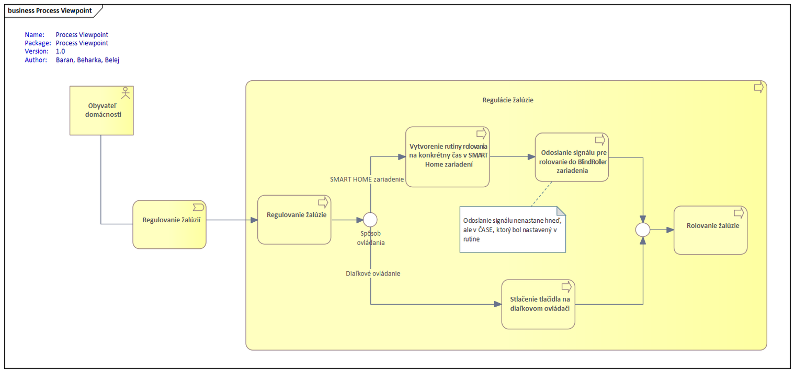

Diagram zjednodušene zachytáva celkový proces regulovania žalúzií prostredníctvom nášho riešenia. Obyvateľ domácnosti môže pristúpiť k spôsobu ovládaniu žalúzií, či už prostredníctvom jednoduchého stlačenia tlačidla na diaľkovom ovládači, alebo automatizovanejším spôsobom, a to vytvorením rutiny rolovania žalúzií na konkrétny čas. Pre druhú alternatívu je potrebné, aby obyvateľ domácnosti disponoval SMART HOME zariadením, a teda aby bolo možné vytvoriť preferovanú rutinu pre rolovanie žalúzie.

Celkový pohľad a zachytený biznisový aspekt nášho riešenia poskytuje diagram nižšie. Tento diagram je v podstate obohatený o motiváciu a ciele nášho projektu. Motiváciou je zpríjemniť každodenné vstávanie automatickým odrolovaním žalúzií, a teda celkové zefektívnenie tohto každodenného rutinného procesu. Zároveň to predstavuje pre obyvateľa domácnosti skrátenie času, ktorý musí za iných okolností vynaložiť pre rolovanie žalúzií vo svojom príbytku. Ďalší aspekt motivácie nášho riešenia vidíme v budovaní návyku vstávania v pravidelný čas. Automatické odrolovanie žalúzie dá obyvateľovi domácnosti jasný signál, že je čas vstať z postele a pustiť sa do nového dňa.

Diagram teda jasne popisuje ciele, ktoré už indikuje samotná motivácia, a to:

- Automatizácia regulovania žalúzií
- Vybudovanie návyku vstávania

Jedinou požiadavkou na aplikáciu nášho riešenia je vlastniť v domácnosti SMART HOME zariadenie a samozrejme zabezpečiť montáž kontroléra k žalúzií.

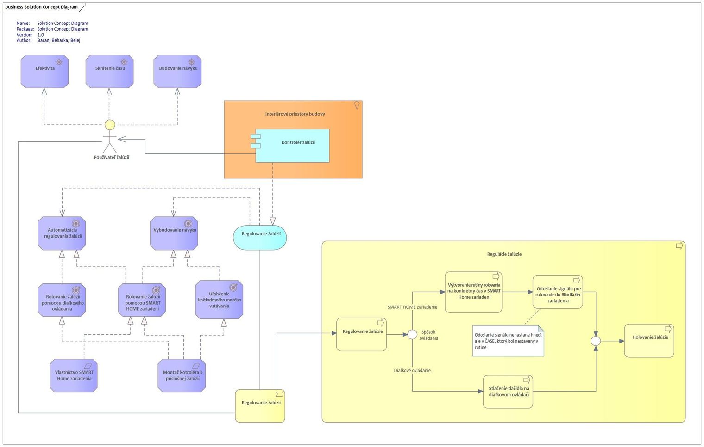

# 006.Systémová vrstva

### **Systémový pohľad na riešenie**

Ak by sme si naše riešenie priblížili na úrovni systémového konceptu, kde si definujeme komponenty, ktoré sú pre riešenie podstatné, tak môžeme uvažovať o nasledujúcom priloženom diagrame. Diagram zachytáva komponenty na najvyššej úrovni, bez iných implementačných alebo hardvérových detailov a špecifikácií. Diagram využíva grafické pomôcky v podobe nahradenia komponentov obrázkami pre lepšie predstavenie si fungovania navrhovaného systému. Jedná sa tiež o mierne zjednodušenú verziu originálneho diagramu komponentov.

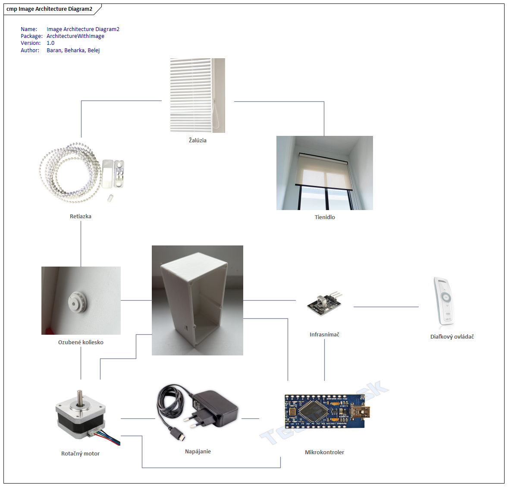

V hornej časti diagramu sa nachádza žalúzia a tiež tienidlo vo všeobecnosti. Žalúzia reprezentuje určitý typ tienidla a ich prepojenie znázorňuje ich vzťah, kedy namiesto žalúzii je možné dosadiť iný typ tienidla. Retiazka reprezentuje ručný mechanický spôsob ako manipulovať s tienidlom. Tento komponent je využívaný taktiež na manipuláciu s tienidlom pomocou automatického rolovača. Fyzické prepojenie retiazky a zariadenia vykonáva ozubené koliesko, ktoré je prispôsobené rozmerom retiazky.

Dôležitým komponentom je samozrejme telo krabičky, ktoré slúži na uskladnenie všetkých potrebných komponentov, ktorom je tiež integrované ozubené koliesko, ktoré slúži na vykonanie pohybu retiazky žalúzie. Na pohyb ozubeného kolieska je samozrejme potrebný rotačný motor, ktorý je taktiež umiestnený v tele krabičky a vykonáva fyzickú prácu potrebnú na otáčanie kolieska. Rotačný motor musí spĺňať funkcionalitu obojsmerného pohybu, nakoľko žalúzie je potrebné rolovať nahor aj nadol. Rotačný motor potrebuje zdroj energie, ktorý prijíma prostredníctvom napájania.

Príkazy rotačnému motoru posiela mikrokontrolér, ktorý predstavuje logickú jednotku v zariadení. Mikrokontrolér je prepojený s infrasnímačom, od ktorého prijíma signály. Jedná sa teda o vzdialenú bezdrôtovú komunikáciu. Na odosielanie signálov je dostačujúci obyčajný diaľkový ovládač na princípe infračervených signálov.

Diagram vyššie vieme znázorniť a preklopiť aj do diagramu komponentov, ktorý sa môže na prvý pohľad zdať komplexnejší, avšak je dostatočne čitateľný a zrozumiteľný aj pre bežného laika. Diagram využíva iba element komponentu (ružovo sfarbený obdĺžnik) a element rozhrania (obdĺžnik s indikátorom/stereotypom <<interface>>). Tento diagram len bližšie znázorní všetky komponenty na úrovni systému nášho riešenia.

Diagram komponentov je dostatočne abstraktný na to aby reprezentoval koncept navrhovaného riešenia na systémovej úrovni. Jednotlivé komponenty je možné nahradiť konkrétnymi zariadeniami, čím by sa zo systémového diagramu stal technologický diagram, alebo je možné komponenty zameniť za iné abstraktné systémové prvky, čím by došlo k zmene len na úrovni komponentu a celkový koncept systému by sa zachoval. Napríklad namiesto retiazky je možné do systému dosadiť šnúrku, ktorou sú ovládané závesy. Ak teda dôjde k zmene v komponente Retiazka, diagram pomocou prepojení znázorňuje závislosti komponentov, ktoré je taktiež potrebné upraviť v závislosti od tejto zmeny.

Oproti verzii s obrázkami znázorňuje tento diagram aj niektoré nové komponenty, ktoré boli z dôvodu prehľadnosti vynechané. Napríklad na komunikáciu mikrokontroléra s rotačným je potrebné rozhranie, ktoré je bežne reprezentované driver-om. Taktiež odosielanie infračervených signálov je možné nielen diaľkovým ovládačom, ale taktiež SMART HOME zariadením. Vo všeobecnosti je tento komponent označený ako Infra vysielač.

# 006.Technologická vrstva

Technologická vrstva predstavuje detailné informácie o riešení. Teda na úrovni tejto vrstvy sú definované komponenty aj so svojimi konkrétnymi špecifikáciami. Keďže sme sa dostali na spodnú úroveň konceptu, tak technologický diagram svojou prirodzenou povahou poskytnutých informácií pôsobí komplexnejšie. Avšak po iteratívnom prejdení si biznisovej a systémovej vrstvy by mal byť každý čitateľ zorientovaný v pojmoch projektu, pričom technologická vrstva ich iba bližšie vyšpecifikuje.

**Technologický diagram:**

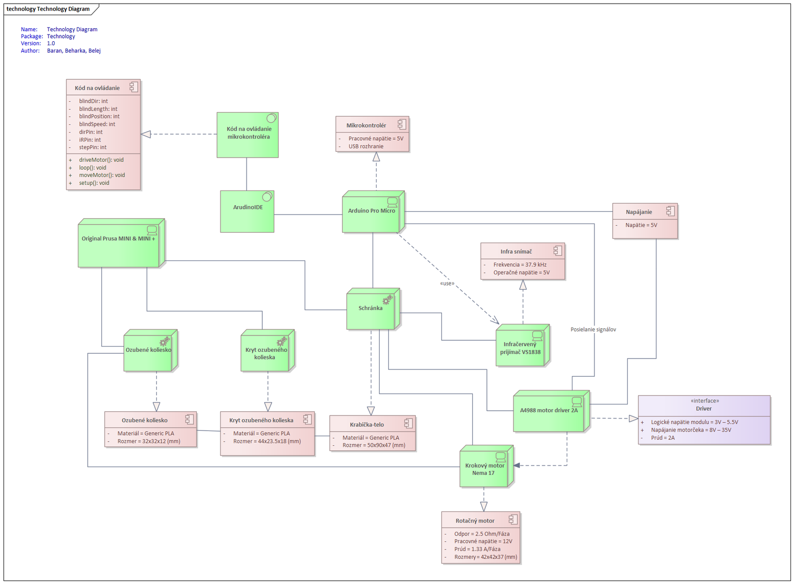

Na diagrame sú priblížené komponenty a ich vzájomné vzťahy. Technologické komponenty sú znázornené zelenými krabičkami, pričom je naznačený aj ich vzťah ku komponentom zo systémového diagramu. Systémové komponenty v tomto diagrame obsahujú aj technické špecifikaćie komponentov ako sú napríklad prevádzkové napätie, rozmery a podobne.

Technický diagram znázorňuje taktiež nehmotné súčasti systému ako je napríklad zdrojový kód alebo vývojové prostredie ArduinoIDE, ktoré slúži na nahratie zdrojového kódu do mikrokontroléra. Komponent zdrojového kódu znázorňuje príklad funkcií, ktoré slúžia na riadenie mikrokontroléra. Okrem funkcií znázorňuje aj možnú konfiguráciu pinov mikrokontroléra, ktoré budú prijímať signál z infračerveného prijímača a tiež riadiť rotačný motor.

Na výrobu 3D súčiastok bola použitá 3D tlačiareň Prusa MINI & MINI+. Súčiastky, ktoré bolo potrebné vytlačiť sú: Ozubené koliesko, Kryt ozubeného kolieska, a Schránka, ktorá pozostáva aj z dvoch súčiastok a to z tela schránky a zadného krytu.

Mikrokontrolér Arduino Pro Micro bol zvolený pre jeho jednoduchosť, a pretože spĺňal potrebné požiadavky na ovládanie rotačného motora a tiež na prímanie signálu z infračerveného prijímača.

**Zoznam komponentov a ich stručná charakteristika:**

**Arduino Pro Micro:**

Vývojová doska s procesorom ATMega32U4. Na doske sa nachádza 9 kanálový 10-bitový ADC prevodník, 5 PWM pinov, 12 digitálnych IO pinov a hardvérový serial interface RX/TX.

Čip: ATmega32u4

Pracovné napätie: 5V

Frekvencia procesora: 16 MHz

**Infračervený prijímač VS1838:**

Prijímač VS1838 je spoľahlivý nakoľko obsahuje aj ochranu proti elektrostatickým výbojom a šumu z prostredia.

Operačné napätie: 5 V

Frekvencia: 37.9 kHz

**Krokový motor Nema 17:**

Spoľahlivý krokový motor s využitím v robotike alebo 3D tlači.

Pracovné napätie: 12V

Prúd: 1.33 A/Fáza

Odpor: 2.5 Ohm/Fáza

**A4988 motor driver 2A:**

Bipolárny motor driver A4988 je veľmi výkonný modul schopný výstupného prúdu až 2A a napätia 35V vhodný aj pre 3D tlačiarne vďaka vysokej presnosti.

Logické napätie modulu (3 V – 5.5 V ) napájanie motorčeka (8 V – 35V).

Výstup: 2A, 8V – 35V

**Original Prusa MINI & MINI+:**

Kompaktná a rýchla 3D tlačiareň. Disponuje automatickou kalibráciou a používateľsky prívetivou LCD obrazovkou.

**Dizajn krabičky, krytu, príchytky a ozubeného kolieska:**

Dizajn krabičky bol inšpirovaný existujúcimi riešeniami a nápadmi na internete, voľne dostupné na pre to určených stránkach.

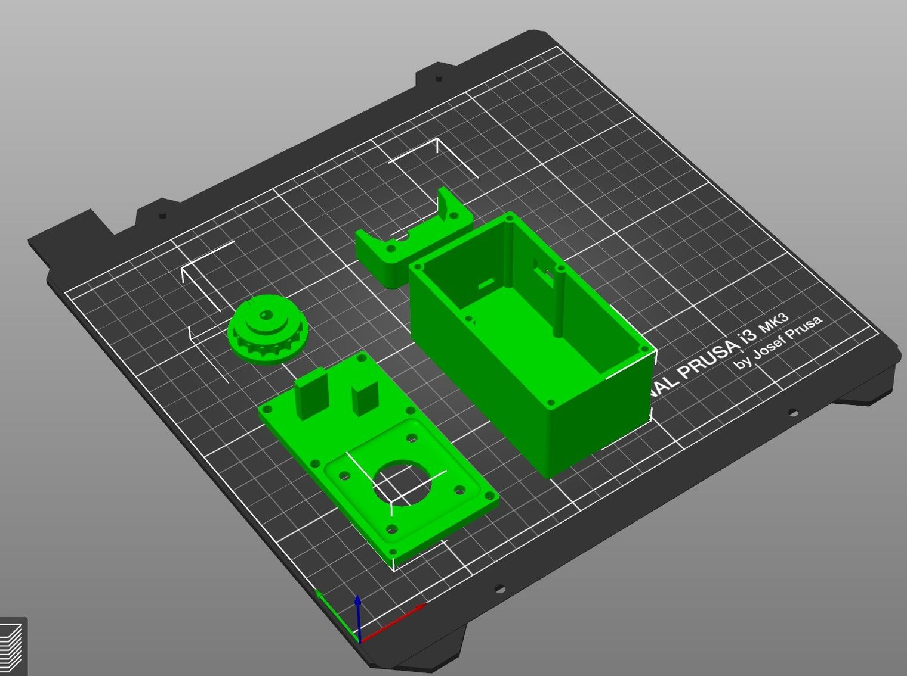

**Súbory:**

[abc_gear.stl](stl/abc_gear.stl)
[abc_gear_cover.stl](stl/abc_gear_cover.stl)
[abc_case_front.stl](stl/abc_case_front.stl)
[abc_case_back.stl](stl/abc_case_back.stl)

**Náhľad prepojenia komponentov v Circuit.io:**

Na obrázku je zobrazená schéma zapojenia komponentov za použitia tzv. breadboardu. Najväčším komponetom je rotačný motor (sivočierna súčiastka), ktorý je napojený na driver (červený čip). Driver je následne napojený na mikrokontrolér (zeleno-modrý čip), ktorý je zodpovedný za riadenie. Posledným funkčným komponentom je senzor infračerveného signálu, pripojený taktiež na mikrokontrolér. Infra senzor je taktiež jediným funkčným komponentom, ktorý nepotrebuje priame napájanie, keďže jeho prevádzku zabezpečuje samotný mikrokontrolér. Rotačný motor, driver motora aj mikrokontrolér sú napájané z batérie, čo v schéme znázorňujú spojenia žltej a čiernej farby. Konektor pripojený na mikrokontrolér v ľavej časti schémy, znázorňuje USB pripojenie slúžiace ovládanie mikrokontroléra pomocou
počítača, hlavne teda na nahrávanie zdrojového kódu.

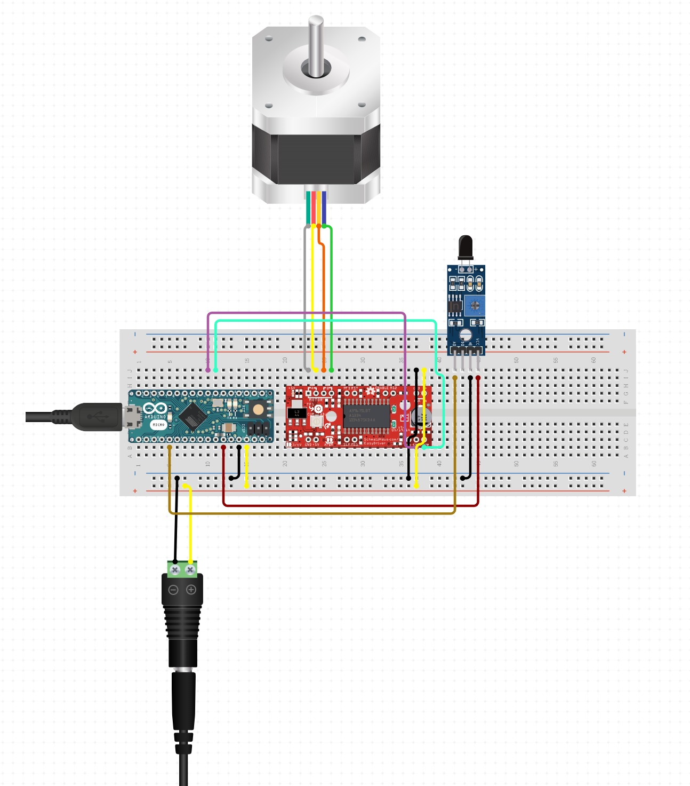

**Vytlačené časti na 3D tlačiarni:**

Použitý materiál na tlač: *Generic PLA*

*Ozubene koliesko*
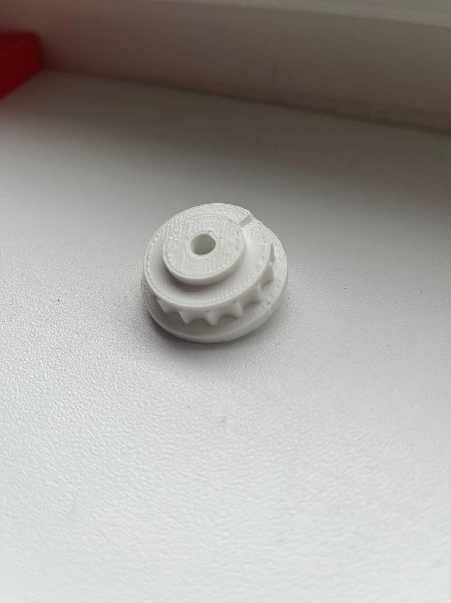

*Prichytka*
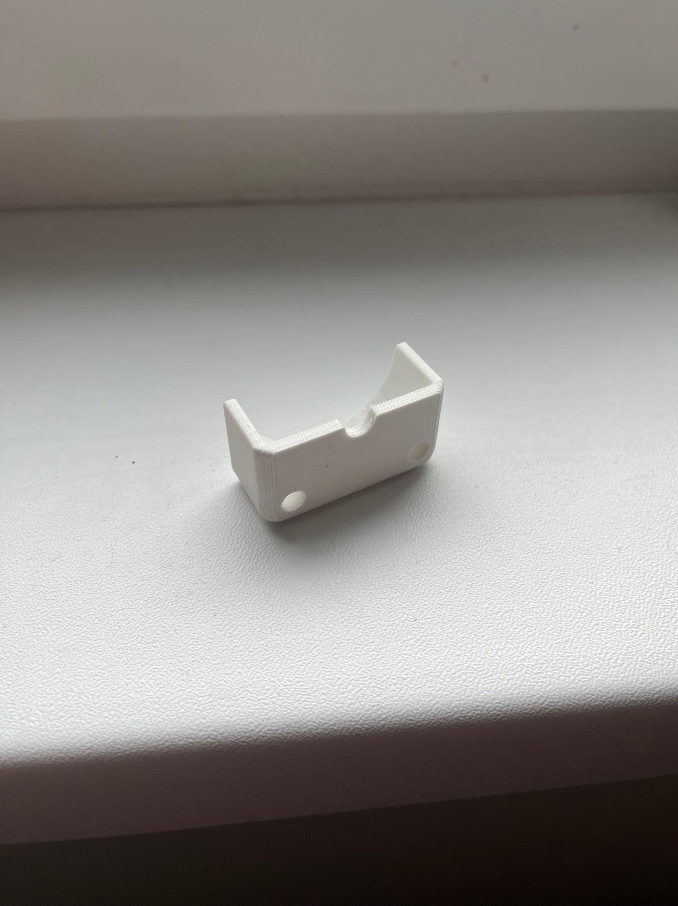

*Telo/krabička*
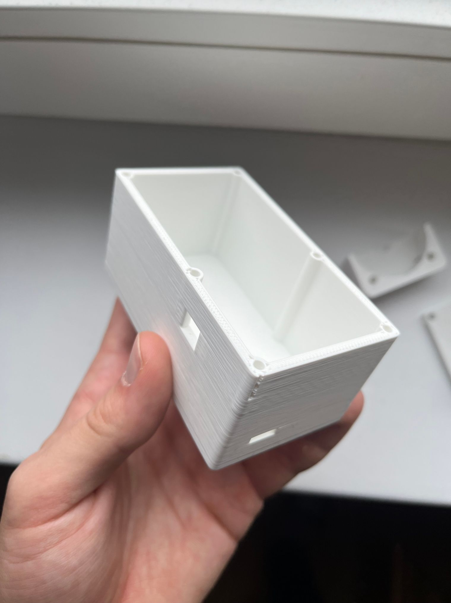

*Kryt krabičky*
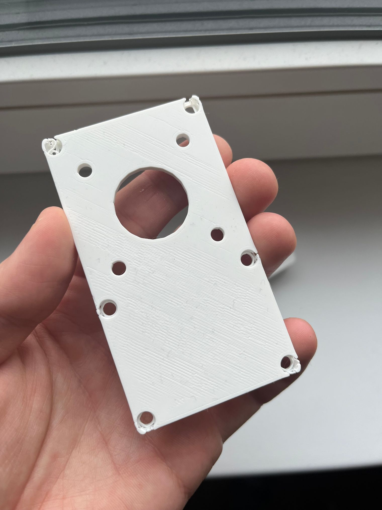

*Všetky súčiastky v celku*

*Umiestnenie rolovača na okne 1.*
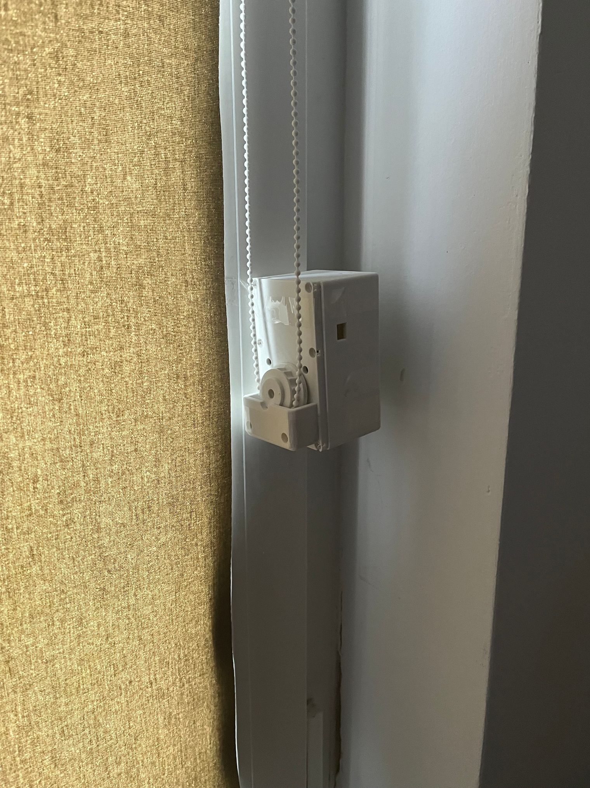

*Umiestnenie rolovača na okne 2.*
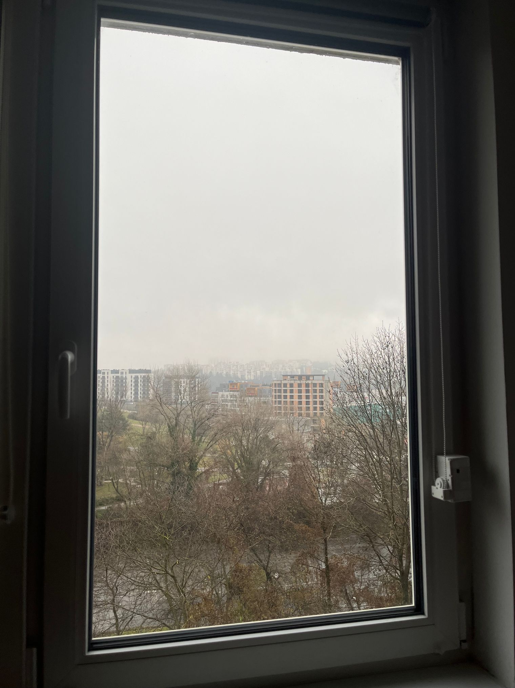

# 006.Návrh a prototypovanie

Na tejto stránke popisujeme proces návrhu nášho riešenia pre projekt automatizovaného ovládania žalúzií ABC - Automated Blinds Control. Rovnako sme tu zachytili prototypy vzniknuté počas navrhovacieho procesu a náčrty prvotného dizajnu.

## Top-level návrh

*Prvotný návrh a motivácia*
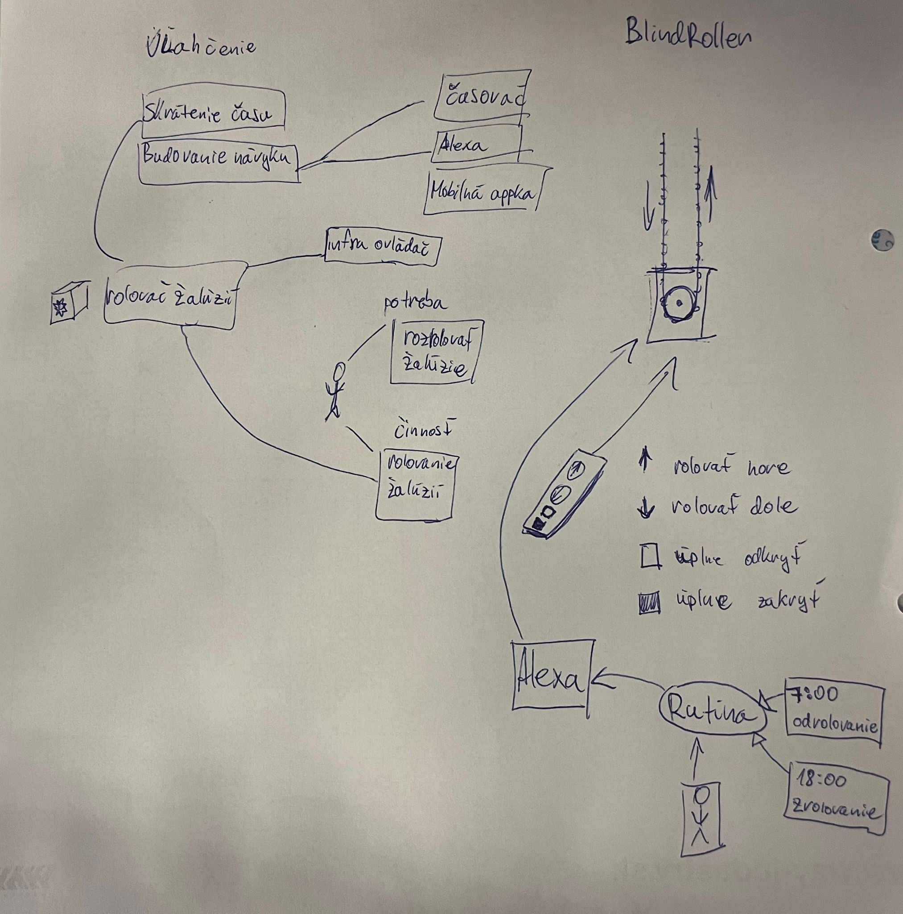

*Návrh riešnie z perspektívy biznisu*
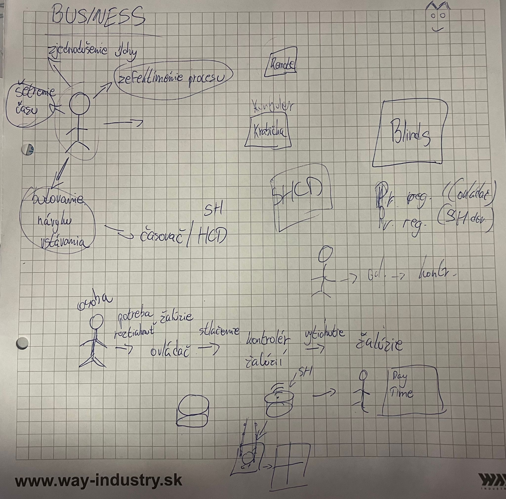

## Návrh architektúry

**Potrebné komponenty**

- Mikročip/mikrokontrolér - jadro riešenia, ovládanie motora + komunikácia s ovládacími prvkami (ovládač, Alexa alebo iného Smart Home zariadenie),
- Motor - pravdepodobne krokový, dostatočne silný na to, aby automatizácia rolovania žalúzií reálne predstavovala zefektívnenie (pomalý motor nechceme),
- Rozhranie pre motor, ovládač motora - prepojenie s mikrokontrolérom, ovládanie motora,
- Prijímač signálu - na princípe infrasignálu alebo iného signálu. Ideálne schopný prijímať signály aj z ovládača aj Smart Home zariadenia (tuto bude potrebné preskúmať možnosti),
- Schránka (“Case“) - 3D tlačou vytlačená krabička, v ktorej sa budú nachádzať zvyšné časti. Kompaktný no zároveň robustný dizajn preferovaný, záleží od veľkosti komponentov a spôsobe zapojenia,
- Závesný systém alebo uchytenie - možností je viacero, napr. úchytný systém na princípe skrutky,
- Iné/ostatné mechanické a elektrické súčiastky potrebné na sprevádzkovanie - môže zahŕňať kábliky, a pod.

**Ostatné prvky**

Medzi komponenty, ktoré nie sú súčasťou zariadenia samotného (nenachádzajú sa v “krabičke“) patria:

- samotné žalúzie - predpokladajú sa také, ktoré majú guličkovú retiazku,
- ovládač - univerzálny by mal postačovať, podľa použitej technológie,
- Smart Home zariadenie - minimálne na testovanie funkcionality ovládania,
- napájanie.

*Návrh architektúry*
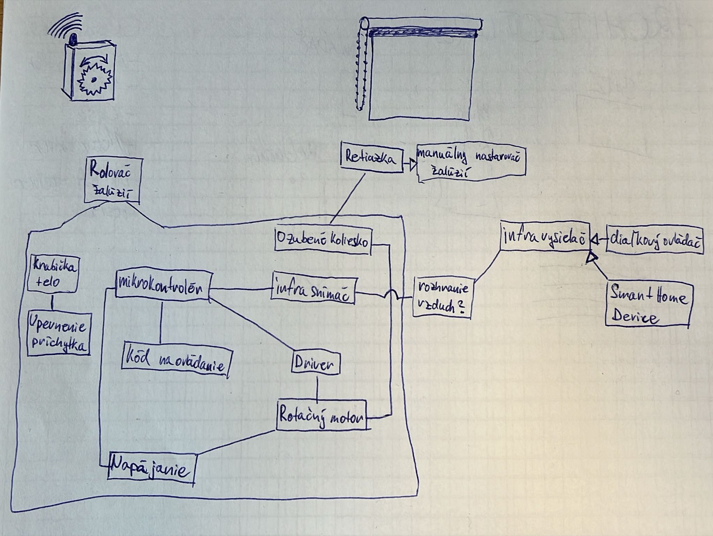

## Dizajnový návrh

Prvotná myšlienka návrhu obsahuje v rámci komponentov samotného zariadenia aj displej, zobrazujúci aktuálny čas, rovnako ako aj nastavený čas rolovania žalúzií ako súčasť akejsi rutiny. Rovnako by v blízkosti displeja mohli byť aj ovládacie prvky, tlačidlá na nastavenie už spomínanej rutiny.

*Návrh displeja zariadenia*
