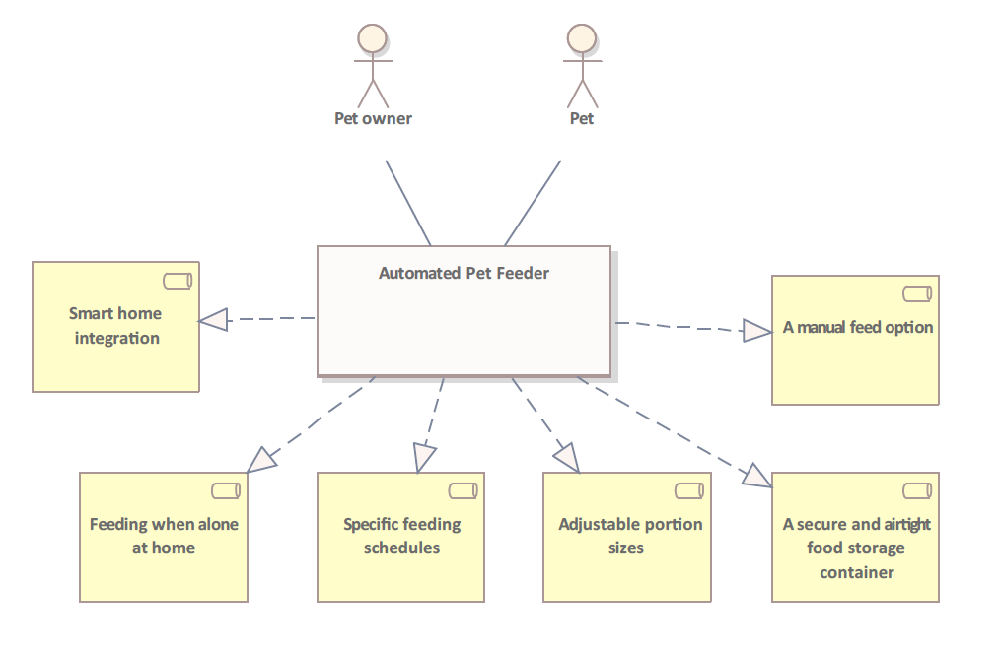
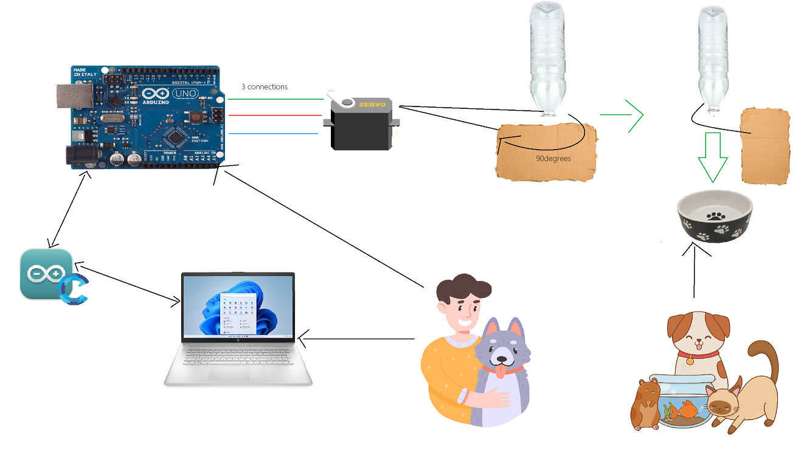

  
# Automatic Arduino Pet Feeder

## Authors
- Anna Yuová (S045)
- Tomáš Rafaj (S036)

## Introduction

Have you ever faced the dilemma of leaving your pet home alone when you went to work or away for an extended period of time? Finding a reliable caregiver can be challenging, which is why we present our solution - the Automated Pet Feeder. Thanks to this system, we can leave the house with peace of mind, because thanks to this simple system, we will ensure that our furry friend will be fed regularly at certain intervals. 

Using common and simple items, such as an Arduino Uno board, a plastic bottle, and a servo motor, we offer simple pet care. Say goodbye to the worry of feeding your pets with a hassle-free solution that will keep your pet happy and fed even when you're not at home.

## Solution Description

1. **Assembly:** Connecting the servomotor to the Arduino Uno and attaching it to a small piece of cardboard. Attaching the cardboard to the mouth of the plastic bottle, creating a simple dispenser mechanism.

2. **Programming:** Coding the Arduino to control the servo motor at specified time intervals, dispensing a predefined amount of pet food. Adjusting the programming to allow for customizable feeding schedules.

3. **Pet Food Loading:** Filling the plastic bottle with pet food, ensuring it securely fits into the dispenser. The servo motor will rotate to release the food as per the programmed schedule.

## Used Technologies and Components

We used these components for our project: *(detailed photos can be found in assets)*
Arduino Uno (with cables)
Servo Motor
Plastic Bottle
A Small Piece of Cardboard

**Estimated cost of necessary components: 15€ + 3€ (shipping)**

*Source: Drotik-Elektro e-shop*

## HW and SW Preparation

As our goal is to connect the Arduino Uno technology with the servo motor, our first step is to connect the hardware, as we can see in the image in assets.

### HW Setup

First step is to establish a connection by wiring the signal pin of the servo motor to pin #9 on the Arduino board, facilitating precise control over the servo's movements (the green color). Second step is to power the servo by linking its VCC (Voltage Common Collector) and GND (Ground) pins to the respective 5V VCC and GND terminals on the Arduino, ensuring a reliable and stable electrical connection (the red and blue colors). In the final step, we can enable the servo to actuate the pet food dispensing mechanism by affixing it to one end of the plastic bottle. Employ the servo's rotational motion to manipulate a strategically positioned piece of cardboard, effectively obstructing the bottle's opening and regulating the flow of dry pet food.

After we have connected the hardware components, we can move on to the software. As the first step we need to download and install the Arduino Integrated Development Environment (IDE) by navigating to the official link https://www.arduino.cc/en/main/software. Then we proceed according to these steps:

Opt for the Windows installer option on the downloaded IDE file.

Initiate the download process by selecting "JUST DOWNLOAD."

Execute the installation by clicking on the "RUN" button once the download is finished.

Agree to the software terms by clicking the "I Agree" button; note that Arduino IDE is open-source.

Customize the installation by selecting all components in the list and proceed by clicking "Next."

Choose the preferred installation location and proceed with the installation.

Install the "Adafruit Industries LLC Ports" driver by clicking on the "Install" button.

Install the "Arduino USB Driver" by clicking on the respective "Install" button.

Install the "Linino Ports (COM&LPT)" driver by clicking on "Install."

Close the installation process by pressing the "CLOSE" button once all drivers are installed.

If the hardware set-up is correctly connected, compile and upload the software to the Arduino board to enable seamless functioning of the pet feeder system.

After our code is ready, we can select type of board from Arduino IDE menu: Tools\Board: “Arduino/Genuino Uno” Then we can dentify the communication port on which the Arduino board will communicate, by accessing Device Manager. Finally we can set communication port, from Arduino IDE menu: Tools\Port : COM7.
## Practical Part and Code

PetFeeder.ino
```
#include <Servo.h>

#define FEED_INTERVAL   1   // minutes between feeding time

const byte servoPin = 9;      // pin used to command the servo motor
const int ledPin = 13;
const int waitingTime = FEED_INTERVAL;

Servo servo;

volatile unsigned long sec;
const unsigned long feedInterval = (unsigned long) FEED_INTERVAL * (unsigned long) 15;  // expressed in seconds

/**
   stop the food from flowing
*/
void feederClose() {
  servo.write(180);
  delay(175);
  servo.write(90);
}

/**
   release a ration of food
*/
void feederOpen() {
  digitalWrite(ledPin, LOW);
  servo.write(0);
  delay(175);
  servo.write(90);
}

// Interrupt is called once a millisecond,
SIGNAL(TIMER0_COMPA_vect)
{
  if (millis() % 1000 == 0) { // if a second has passed
    sec++;  // increment the seconds counter
    Serial.print("Second: ");
    Serial.print(sec);
    Serial.print(" of ");
    Serial.println(feedInterval);
  }
}

void setup() {
  Serial.begin(9600);
  OCR0A = 0xAF; // set the timer interrupt
  TIMSK0 |= _BV(OCIE0A);
  servo.attach(servoPin);
  Serial.println("System initialized");

  // Nastavení pinu LED jako výstupní
  pinMode(ledPin, OUTPUT);
}

void loop() {
  Serial.println("Waiting...");
  sec = 0;  // reset the counter
  
  // Blinking effect before opening the feeder
  for (int i = 0; i < 5; i++) {
    digitalWrite(ledPin, HIGH);
    delay(500);
    digitalWrite(ledPin, LOW);
    delay(500);
  }
  
  delay(5000);
  while (feedInterval > sec);   // wait until the time interval is elapsed
  Serial.println("Feeding the pet :)");
  feederOpen();
  delay(150);
  feederClose();
}
```

## Business Diagram

When designing a pet feeder for times when the owner is away, several features can enhance its effectiveness and address various needs. Here are some key features for a pet feeder intended for use when the pet is alone at home, which you can see in the picture below. These features collectively enhance the pet owner's ability to ensure their pet is well-fed, healthy, and happy even when they are not at home.



## Technology Diagram




## Architecture Diagram

### User Manual

**Introduction:**

Automated Pet Feeder is an automated pet feeding system designed to provide convenience and peace of mind for pet owners. This user manual will guide you through the setup, operation, and maintenance of the PetPal Feeder, ensuring a seamless and enjoyable experience for both you and your pet.

**Setting Up the Pet Feeder:**

 - a. Open the Arduino IDE on your computer.
   
  - b. Load the provided application file "PetFeeder.ino."
   
   - c. Adjust the code to set your preferred feeding schedule.
   
   - d. Compile the code and upload it to the Arduino board.

**Operation:**

 - Slide the carton so that the bottle opening is open.
   
  - Turn the bottle over and fill it with pet food.
   
  - Slide the cardboard back to close the opening of the bottle.
   
 - Turn the bottle upside down again.

**Maintenance:
Cleaning and Care:**

Regularly clean the food storage container and dispenser components. Use mild soap and water for cleaning. Do not immerse in water. Ensure all components are thoroughly dry before use.

## Conclusion and Future Work

In conclusion, the development of the pet feeder system has addressed the challenge of ensuring pets are well-fed and cared for when their owners are away. The integration of an Arduino-based mechanism, servo motor, and customizable scheduling provides a simple yet effective solution for pet owners. The project not only emphasizes convenience but also leverages commonly available household items, making it accessible to a broad audience.

As pet ownership continues to rise, this pet feeder serves as a testament to the potential of combining technology and practical design to meet the evolving needs of pet owners. The successful implementation of this project demonstrates its viability in providing a reliable and automated feeding solution.

### Future Work:

Moving forward, there are several avenues for future work and enhancements to explore:

**Smart Connectivity:** Integrate the pet feeder with IoT capabilities for enhanced connectivity, allowing owners to monitor and control the device remotely through dedicated mobile apps or voice-activated assistants.

**Machine Learning Integration:** Implement machine learning algorithms to analyze and adapt feeding schedules based on the pet's behavior and health indicators, providing a more personalized and dynamic feeding experience.

**Advanced Sensor Systems:** Incorporate advanced sensors for real-time monitoring of food levels, ensuring timely notifications to owners when the food supply is running low.

**User-Friendly Interface:** Develop an intuitive and user-friendly mobile application with additional features such as health tracking, feeding history, and personalized notifications.

**Energy Efficiency:** Explore energy-efficient solutions, such as low-power modes and solar-powered options, to reduce the environmental impact and increase sustainability.

**Collaboration with Veterinarians:** Collaborate with veterinary professionals to incorporate features that promote pet health, including specialized diet recommendations and integration with health monitoring devices.

Continued innovation and refinement of the pet feeder system can contribute to the well-being of pets and offer owners a reliable and technologically advanced solution for their caregiving needs.