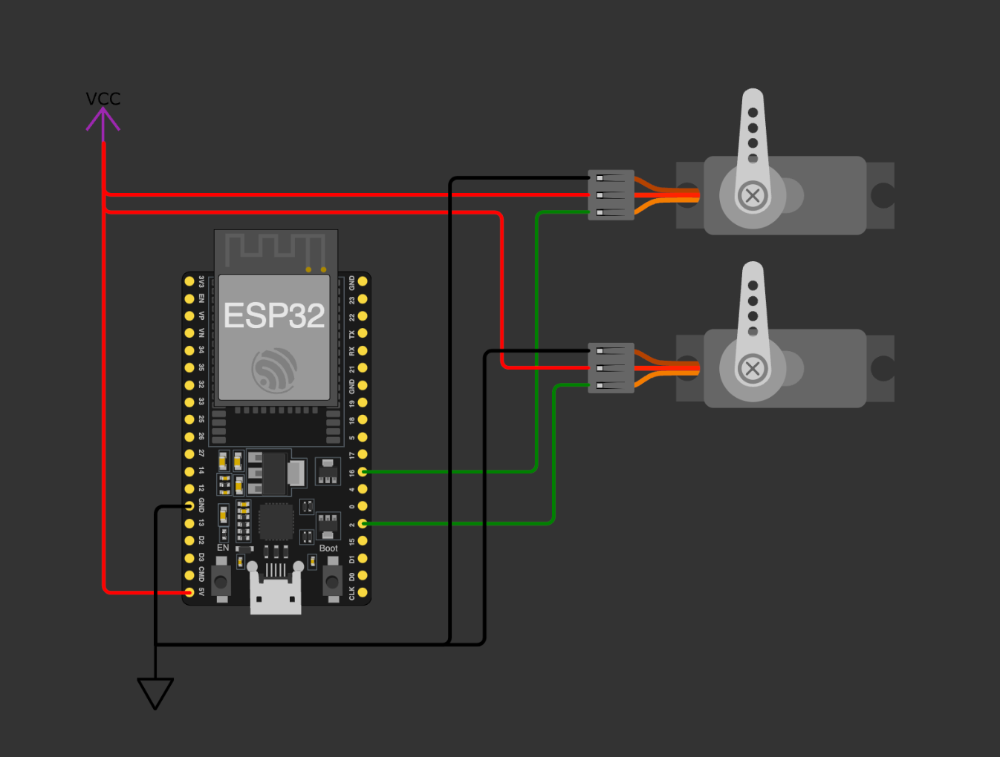
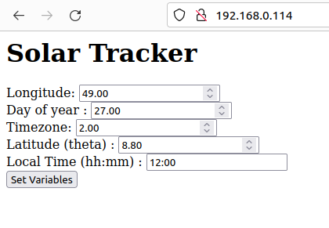
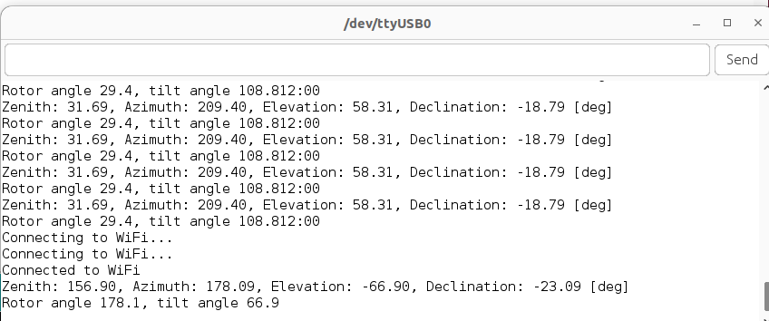

## Solar tracker

The project aims to provide solution for efficient solar energy gathering by maximizing efficient surface of a solar panel by moving a platform towards sunlight. Folder `solar_tracker` contains firmware for ESP32 development module (WiFi capable). Firmware controls two servo motors enabling two-axis movements of platform.

Built-in web server provides an interface for easy configuration.

### To run this code you need:

* ESP32 development module (WiFi capable)
* available WiFi connection
* in code: setup your WiFi `SSID` and `PASSWORD` constants to enable web-server

### Dependencies:

* ESP32Servo library
* ESPAsyncWebServer library

### Hardware setup:

Whole assembly (with platform) should be oriented to the north in its initial stages (rotation servo should be at 0 degrees). 

### Software setup:

To setup desired location a web interface is provided with form containing:

* latitude (number)
* longitude (number)
* timezone (number)
* timestamp (hh:mm)
* time of day [1 - 365]

> Pay attention to the correct format of form inputs

### Debug output

By accessing serial monitor you can see applied values in real time.

