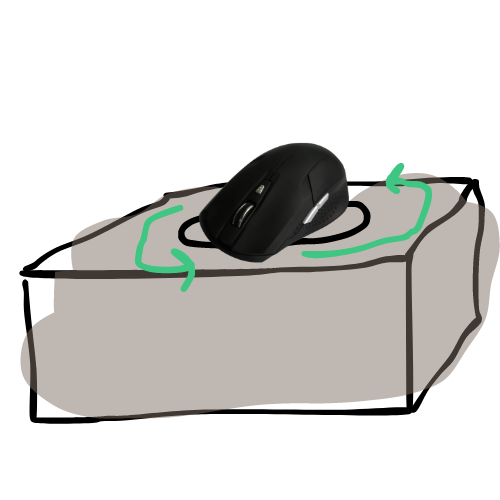
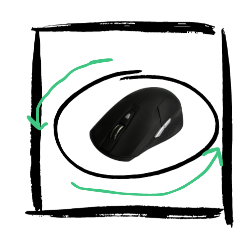
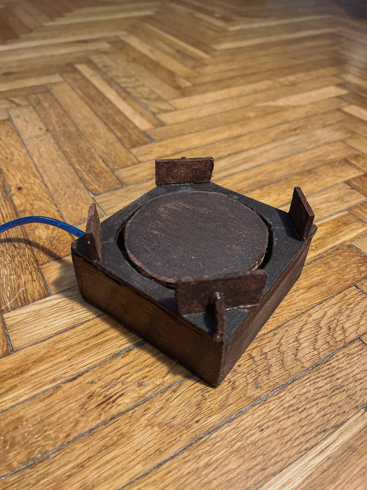
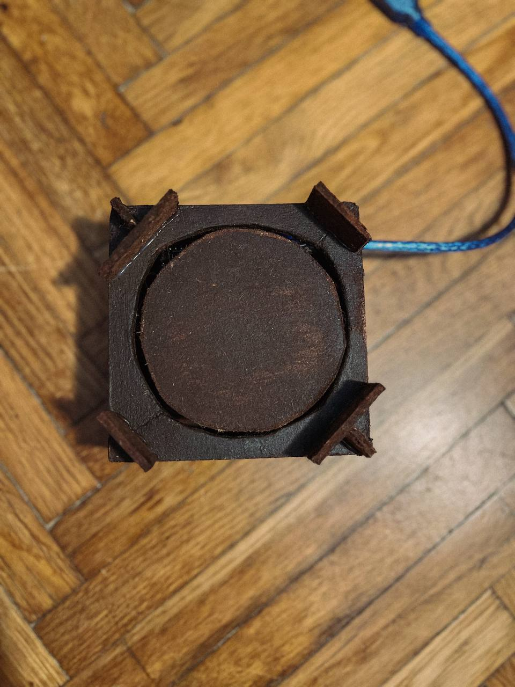
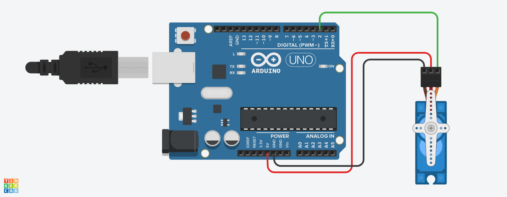

# MouseMover

In today's busy world of working from home, dominated by flexibility, personal time may seem like a distant memory. The boundaries between work life and personal life are disappearing, and the constant need to be <span style="color:green">available</span> can gradually consume our well-being.

---
At the beginning of the project we made an analysis and a business scenario was written.

> Within a fast-moving corporate reality where every second counts, Emily found herself caught up in a micro-management net. She was always productive and always strived to meet deadlines and exceed expectations. Although she often took short coffee breaks to take a break from her desk, she was unaware that the virtual eye of her supervisor was constantly watching her.

> One day, when Emily risked a quick coffee break <span style="color:orange">away</span> from her home office, the notifications and messages were still following her. Her supervisor's watchful eye caught a period of inactivity, and her work status changed to <span style="color:orange">away</span>. Upon returning back home, a stream of urgent emails and missed calls from her supervisor awaited her.

> A similar case occurred to Alexander, another gifted individual. He, too, was a master of productivity, meeting deadlines and devoting a lot of time to work. On one hectic day, filled with emails and online meetings, a bell rang demanding his attention, and Alex was forced to leave his desk. After a while, his work status changed to <span style="color:orange">away</span>. Upon his return, he was met with a similar stream of emails from his supervisor.

> These are among the few examples that illustrate a current problem in the corporate environment where supervisors micromanage and do not always respect the personal time of their employees.

---
<div style="background-color: rgb(245, 226, 57);">
According to a study conducted by Trinity Solutions, **79% of employees have experienced micromanagement**, with **71% reporting that micromanagement interfered with their job performance**. Of those, **69% have considered changing jobs due to micromanagement** and **36% have actually changed jobs** [1, 2].
</div>

<div style="background-color: rgb(180, 39, 202);">
Further studies from 2020, published by Thomas Alsop on 1 February 2022 [3], show the following results:
</div>

<p align="center">

</p>
---

# <span style="color:red">?!</span> Is micromanagement a problem?
Micromanagement is a **leadership style in which the manager is overly controlling of his subordinates** [4]. This may include monitoring their work, constantly giving them instructions or getting too involved in their work [1,2,4].

- Reduced employee motivation and engagement
- Reduced productivity
- Increased stress and burnout
- Deteriorated relationships between employees and supervisors

---

# How can MouseMover be a good way to solve micromanagement problems?

**MouseMover is a device that mimics human mouse movement**. It can be used to keep the computer in an active state even when the user is not physically at the computer. MouseMover can be a good way to solve micromanagement problems because **it allows employees to walk away from their computers without worrying about looking like they're lazy or unproductive**. This can help employees feel more trusted and respected by their supervisors.

--- 

## What functional and non-functional requirements are required?

**Functional requirements**:

- MouseMover should be **able to mimic human mouse movement accurately** enough to keep the computer in an active state.
- MouseMover should be **able to work with different types of computers and operating systems**.
- MouseMover should be **easy to use** and set up.

**Non-functional requirements**:


- MouseMover should be **reliable** and should **work continuously**.
- MouseMover should be **energy efficient**.
- MouseMover should be **affordable**.

---

# Proposed solution design

#### The initial proposal
The box was designed by us in SketchUp and also Canva, which is freely available on the internet.





#### The solution (box)

In the final product a barrier was added, because when testing the tool the mouse sometimes 'ran away', so it was necessary to prevent this.

The box was made at home with our own hands, using a 3 mm thick raw HDF board. We used tools such as a ruler, a wood frame saw and a compass to shape it. The finishing touches were were achieved using sandpaper. A glue gun was used to connect the parts.

{height=320 width=240}

{height=320 width=240}

#### The solution (circuit and implementation)
The circuit was designed in Tinkercad, and for the solution of the problem Arduino Nano and continuous Servo motor were used. In addition, a cable had to be added to make the connection to the computer possible (USB to Micro USB). The code for the motion simulation was written in C++.

{height=299 width=768}

The code for the motion simulation was written in C++.  The code essentially creates a simple random servo motor movement, making the servo move to a random angle with a random speed, pause for a random duration, and then return to the starting position. The randomness is introduced using the random() function, and the Servo library is used to control the servo motor.

```c
#include <Servo.h>

Servo myservo;  // A Servo object named "myservo" to control the servo motor
int pos = 0;    // Variable to store the current position of the servo

long randomAngle;  // Variable to store randomly generated angle
long randomSpeed;  // Variable to store randomly generated speed

void setup() {
  myservo.attach(2);  // Attach the servo to pin 2
  randomSeed(analogRead(A0));  // Initialize the random seed using analog reading from pin A0
}

void loop() {
  randomAngle = random(0, 181);  // Generate a random angle between 0 and 180 degrees
  randomSpeed = random(2, 20);   // Generate a random speed between 2 and 19 (milliseconds)

  // Move the servo from 0 to the randomly generated angle
  for (pos = 0; pos <= randomAngle; pos += 1) {
    myservo.write(pos);  // Set the servo position
    delay(randomSpeed);   // Introduce a delay based on the randomly generated speed
  }

  delay(random(500, 2000));  // Introduce a random pause between movements (500 to 2000 milliseconds)

  // Move the servo back from the randomly generated angle to 0
  for (pos = randomAngle; pos >= 0; pos -= 1) {
    myservo.write(pos);  // Set the servo position
    delay(randomSpeed);   // Introduce a delay based on the randomly generated speed
  }
}
```

--- 

# Future work
The box could have a better shape, better colouring. Other movements could be included in the code to simulate more human movement.

---
# References :

- [1] Is Micromanaging A Form Of Bullying? Here Are 3 Things You Should Know
- [2] Micromanagement destroys teams — here's how to nip it in the bud
- [3] Employees micromanaged when remote working by country 2020 | Statista
- [4] What Is a Micromanager? Impact, Signs, and Ways to Reform 

