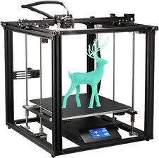
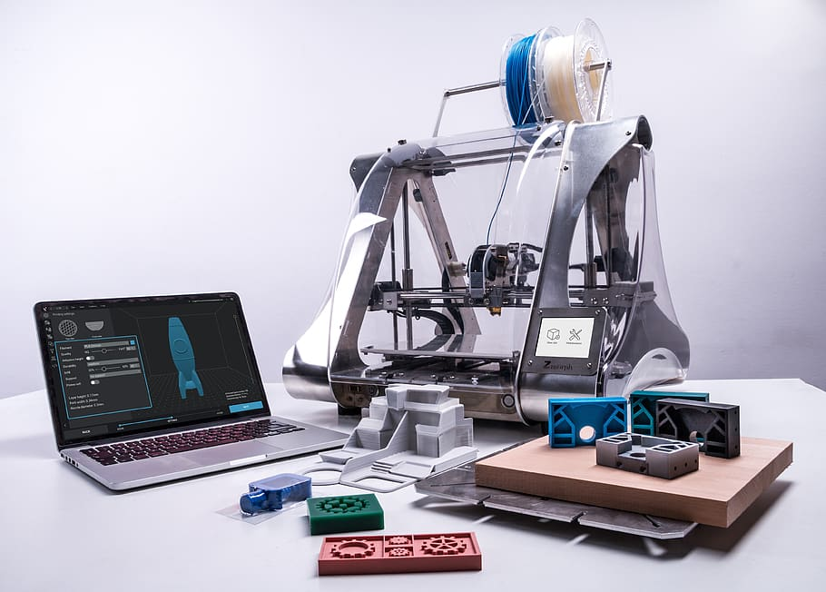

# 3D tlač

### Čo je to 3D tlač?

3D tlač je aditívny spôsob výroby, pri ktorom sa trojrozmerný objekt vytvára postupným nanášaním a spájaním materiálu vo vrstvách. Tento proces je opakom tradičnej výroby, ktorá sa nazýva subtraktívna výroba a pri ktorej sa materiál odstraňuje z polotovaru, aby sa vytvoril požadovaný tvar.

### Vznik prvej 3D tlačiarne

Prvá 3D tlačiareň bola vynájdená v roku 1984 spoločnosťou 3D Systems. Išlo o zariadenie s názvom SLA (Stereolithography Apparatus), ktoré využívalo laser na vytvrdzovanie vrstiev tekutého fotopolymeru. Odvtedy sa technológia 3D tlače značne rozvinula a dnes existuje množstvo rôznych typov 3D tlačiarní, ktoré využívajú rôzne materiály a technológie.

### Výhody 3D tlačiarne

3D tlačiareň má množstvo výhod, ktoré ju robia cenným nástrojom v mnohých oblastiach. Medzi jej výhody patria:

-   **Flexibilita:** 3D tlač umožňuje vytvárať objekty s komplexnými tvarmi, ktoré by nebolo možné vyrobiť tradičnými výrobnými metódami.
    
-   **Rýchlosť:** 3D tlač môže byť oveľa rýchlejšia ako tradičné výrobné metódy, najmä pri výrobe malých sérií.
    
-   **Nízke náklady:** 3D tlač sa stáva čoraz dostupnejšou, čo ju robí atraktívnou aj pre malé firmy a jednotlivcov.
    

### Využitie 3D tlače

Využitie 3D tlače je veľmi široké, používa sa v priemysle, medicíne, stavebníctve, dizajne, vzdelávaní a mnohých ďalších oblastiach. Medzi konkrétne príklady využitia 3D tlače patria:

-   **Výroba prototypov**
    
-   **Výroba náhradných dielov**
    
-   **Výroba osobných pomôcok**
    
-   **Výroba stavebných prvkov**
    
-   **Výroba umeleckých diel**
    

### Ako funguje 3D tlač?

3D tlač funguje na princípe postupného nanášania a spájania materiálu vo vrstvách. Existuje množstvo rôznych technológií 3D tlače, ktoré využívajú rôzne materiály a princípy.

Niektoré z najbežnejších technológií 3D tlače sú:

-   **Fused Deposition Modeling (FDM)**: Táto technológia využíva tlačovú hlavu, ktorá roztaví plastový filament a nanáša ho na podložku vrstvu po vrstve.
    
-   **Stereolithography (SLA)**: Táto technológia využíva laser, ktorý vytvrdzuje tekutý fotopolymer vrstvu po vrstve.
    
-   **Selective Laser Sintering (SLS)**: Táto technológia využíva laser, ktorý speňuje práškový materiál vrstvu po vrstve.
    

Výber vhodnej technológie 3D tlače závisí od konkrétnych požiadaviek na výrobu.

