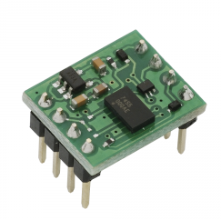
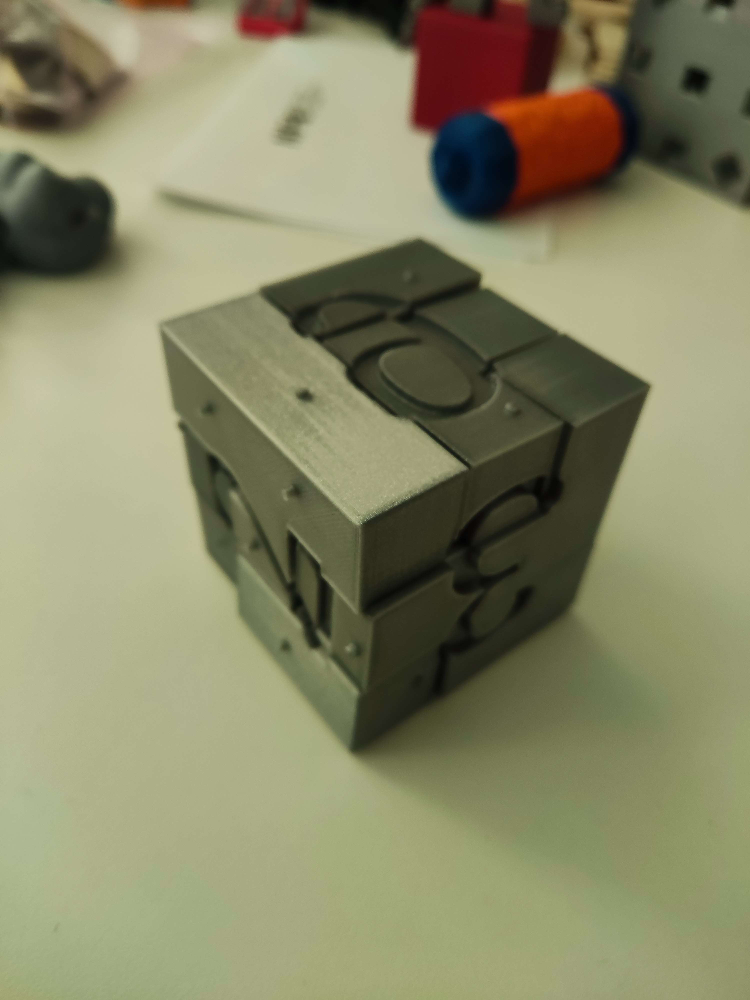

## Akcelerometer

### Čo to je?

Akcelerometre sa používajú pri meraniach statického gravitačného zrýchlenia, ktoré vám umožňujú určiť uhol odchýlky meraného objektu od vertikály, ako aj pri meraniach dynamického zrýchlenia v dôsledku otrasov, pohybu, nárazu alebo vibrácií, t. j. nízkych amplitúd a nízkofrekvenčných vibrácií, ktoré dosahujú niekoľko desiatok Hz. To znamená, že akcelerometer nie je nič iné ako prevodník zrýchlenia, ktorý meria svoj vlastný pohyb v priestore.

### Ako funguje?

Princíp fungovania akcelerometrov nie je príliš komplikovaný. Meria zrýchľovaciu silu v jednotke g a môže merať v jednej, dvoch alebo troch rovinách. V súčasnosti sú najbežnejšie používané 3-osové akcelerometre, ktorých konštrukcia sa skladá zo systému troch akcelerometrov, z ktorých každý meria zrýchlenie iným smerom - v rovinách **X, Y a Z**.

Ak zrýchlenie v ktorejkoľvek rovine pôsobí opačným smerom, ako v ktorom bol senzor nasmerovaný, akcelerometer zmeria zrýchlenie so zápornou hodnotou. Inak sa zrýchlenie meria kladnou hodnotou.

Ak akcelerometer nie je ovplyvnený žiadnym vonkajším zrýchlením, zariadenie bude merať iba gravitačné zrýchlenie, t.j. gravitačnú silu. Za predpokladu, že 3-osový akcelerometer je umiestnený tak, že senzor v osi X je nasmerovaný doľava, senzor v osi Y je dole a senzor v osi Z je nasmerovaný vpred a nepôsobia naň žiadne sily, potom akcelerometer vráti hodnoty: **X = 0 g**, **Y = 1 g**, **Z = 0 g**. Ak je ten istý akcelerometer naklonený doľava, jeho merania zobrazia: **X = 1 g**, **Y = 0 g**, **Z = 0 g**. Podobne, keď dôjde k odchýlke doprava, rovina X vráti výsledok **X = -1 g**. Uvedené závislosti merania zrýchlenia sa používajú v algoritmoch systémov, ktoré dohliadajú na akcelerátor.

### Aké typy poznáme?

#### Piezoelektrické akcelerometre:

Generujú elektrický náboj v reakcii na aplikovanú silu. Seizmická hmota je pripevnená k piezoelektrickému materiálu, ktorý generuje náboj, keď je vystavený vibráciám.

#### Kapacitné akcelerometre:

Využívajú zmeny kapacity na meranie zrýchlenia. Pozostávajú z malého, presne rozmiestneného snímacieho kondenzátora a skúšobnej hmoty. Keď akcelerometer zaznamená zrýchlenie, dôkazová hmota sa pohne a zmení kapacitu.

#### Piezorezistívne akcelerometre:

Menia svoj elektrický odpor pri mechanickom namáhaní. Keď akcelerometer zaznamená zrýchlenie, seizmická hmota spôsobí napätie na piezorezistívnom materiáli a zmení jeho odpor.

## Zdroje

[Zdroj1](https://www.tme.eu/sk/news/library-articles/page/22568/Ako-to-funguje-a-naco-sluzi-akcelerometer/ "https://www.tme.eu/sk/news/library-articles/page/22568/Ako-to-funguje-a-naco-sluzi-akcelerometer/")

[Zdroj2](https://sk.theastrologypage.com/accelerometer "https://sk.theastrologypage.com/accelerometer")

[Zdroj3](https://i.electricianexp.com/sk/device/1597-chto-takoe-giroskop-i-akselerometr.html "https://i.electricianexp.com/sk/device/1597-chto-takoe-giroskop-i-akselerometr.html")

## Dobrovoľná aktivita

