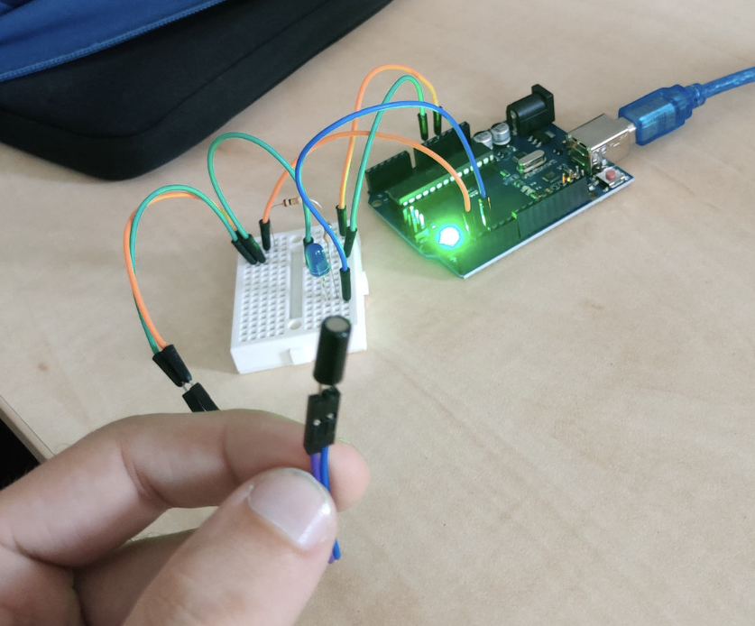
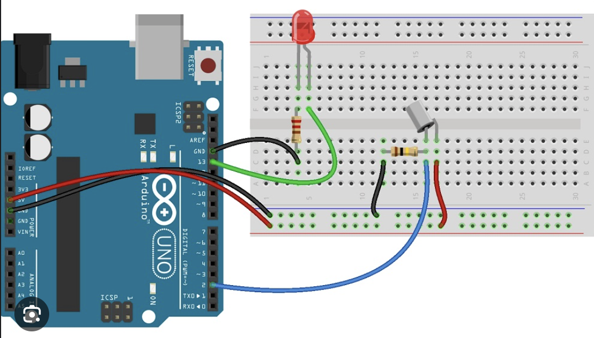
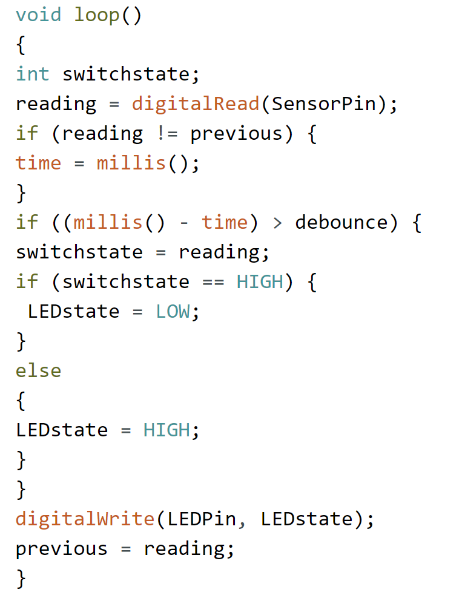

ESP8266 je všestranný mikrokontrolér, ktorý získal popularitu vďaka svojej širokej škále aplikácií v oblasti IoT (Internet vecí) a embedded systémov. Sám disponuje vstavaným Wi-Fi a Bluetooth modulom, čo ho robí vhodným pre rôzne projekty, ktoré vyžadujú bezdrôtovú komunikáciu.

Teraz sa pozrime na integráciu naklonného snímača (tilt sensor) s arduino UNO. Naklonný snímač, tiež známy ako inklinometer, je zariadenie, ktoré meria náklon alebo sklon objektu voči gravitačnému vektoru. Môže byť obzvlášť užitočný v projektoch, kde je potrebné monitorovať orientáciu alebo pohyb objektu. Na tento prototyp bola použitá jednoduchšia varianta náklonného senzoru SW-520. Na úkážku to ale plne postačuje.

Pre integrovanie naklonného snímača s arduino UNO postupujeme podľa týchto krokov:

1.  **Pripojenie hardvéru:**
    
    -   Pripojenie náklonného sensoru k arduino UNO. Konkrétne pripojenia závisia od typu naklonného snímača, a zaraidenia ktoré používame. Limitácia senzoru spočíva v tom, že vie detegovať naklonenei iba v bool forme, čo znamená či senzor je alebo nie je naklonený.
        

Arduino UNO s náklonným sensorom (prototyp 1)

Schéma zapojenia

2.  **Napájanie:**
    
    -   Senzor SW-520 je možné napájať priano z arduina pomocou 3-5V.
        
3.  **Programovanie:**
    

Pomocou nasledovného kódu vieme čítať hodnoty zo senzoru.

-   
    

4.  **Spracovanie údajov:**
    
    -   Spracovanie údajov získané z naklonného snímača realizujeme podla potreby. V závislosti od senzora budeme mať k dispozicií presné alebo menej presné údaje.
        
5.  **Komunikácia:**
    
    -   Na komunikáciu využijeme Wifi ak to naša doska umožnuje, alebo pripojenie pomocou usb ako pri už spomínanom arduino UNO.
        
6.  **Aplikácia:**
    
    -   Takto pripojený sensor možeme použiť na rôzne projekty podľa potreby.
        

Týmto postupom vieme jednoduch pripojiť a použiť náklonný senzor, ktorý po naklonení zopne ledku. Podobný prístup sa da zreplikovať aj v iných komplexnejších projektoch.