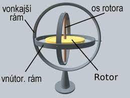
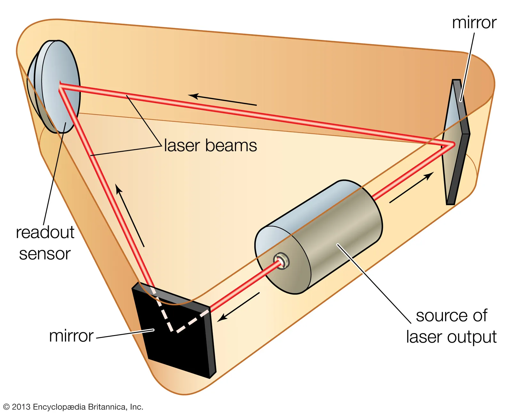
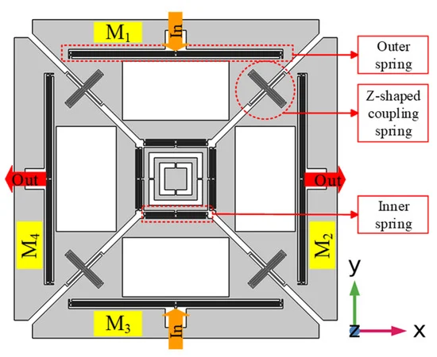
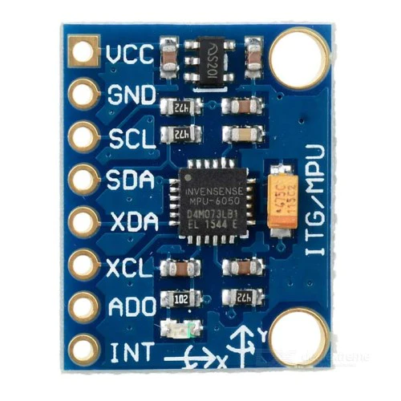
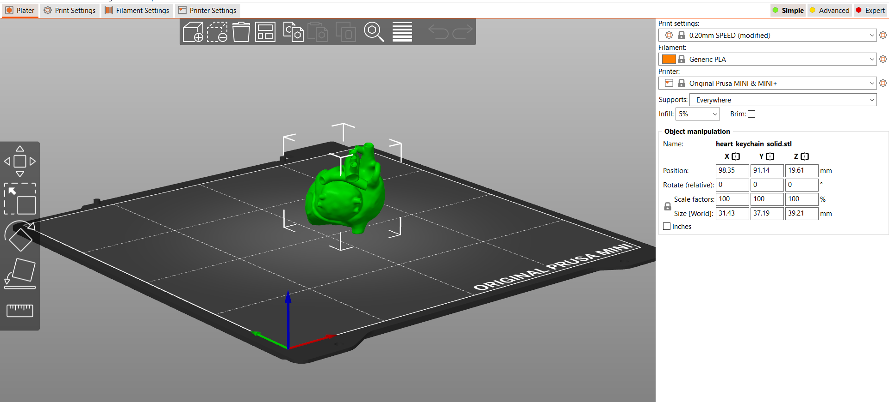

# **GYROSKOP**

Gyroskopy slúžia ako zariadenia na meranie alebo udržiavanie konzistentnej orientácie alebo smeru. Tieto prístroje fungujú na základe princípu zachovania uhlového **momentu hybnosti**. Hlavnou súčasťou gyroskopu je gyroskopické koleso alebo rotor, často vo forme disku, umiestneného na osi, ktorá je ďalej upevnená v sade otočných spojov v vonkajšom ráme.

Inerciálna hmotnosť gyroskopu sa môže voľne pohybovať okolo svojej osi vo všetkých smeroch. Keď je gyroskopické koleso roztočené, prejavuje jedinečnú vlastnosť a to udržanie konštantného smeru bez ohľadu na ľubovoľné preorientovanie obalu, v ktorom sa gyroskopické koleso nachádza. Tento jav sa volá **gyroskopická zotrvačnosť** alebo **moment zotrvačnosti**.

-   Ak zotrvačník nerotuje veľkou rýchlosťou, uvedená vlastnosť sa neprejaví.
    
-   Ak zotrvačník nastavíme do zvislej polohy (jeho os prechádza vodorovne) tak, že jeden koniec smeruje na sever a druhý na juh a následne zotrvačník roztočíme, po dlhšom čase sa nám smer zotrvačníka začne vychyľovať voči pôvodnému smeru sever – juh. V skutočnosti sa neodchýlilo smerovanie zotrvačníka ale otočenie Zeme. Ak tento pokus uskutočníme na rovníku, odchýlka bude presne 360 stupňov za 24 hodín. Na severnom póle by nebola žiadna odchýlka.
    
-   Ak je gyroskopické koleso nastavené vertikálne (jeho os je vodorovná), pričom jeden koniec smeruje na sever a druhý na juh, a následne sa roztočí, s plynúcim časom sa jeho smer odchýli od pôvodnej severojužnej osi. Táto odchýlka nie je spôsobená zmenou smeru gyroskopu, ale je výsledkom rotácie Zeme.
    

### 1. Klasický mechanický gyroskop:

Tieto gyroskopy fungujú na princípe zachovania momentu hybnosti rotujúceho telesa. Majú rotujúce telo, ako napríklad disk alebo rotor, ktoré rotuje okolo osi. Keď sa táto os rotácie snaží zmeniť, gyroskopická akcia vytvára silu, ktorá ju bráni. Táto vlastnosť sa využíva na udržiavanie stabilnej orientácie voči určitému referenčnému bodu. Mechanické gyroskopy boli historicky využívané v navigačných systémoch lietadiel alebo lode.

### 2. Laserový gyroskop:

Laserový gyroskop využíva interferenciu svetelných lúčov na meranie rotácie. Svetelné lúče sú vysielané proti sebe v opačných smeroch a následne sa opäť stretávajú. Rotácia zariadenia zmení čas, ktorý svetelný lúč trvá na prejdenie tejto dráhy. Táto zmena sa meria a používa sa na určenie rotácie. Sú presnejšie a menej náchylné na opotrebenie ako mechanické gyroskopy.

### 3. MEMS gyroskop (Micro-Electro-Mechanical Systems):

Tieto sú založené na mikročipoch a využívajú mikroskopické mechanické štruktúry. Tieto štruktúry sú schopné reagovať na zmenu smeru alebo rotácie, čo umožňuje meranie pohybu zariadenia. MEMS gyroskopy sú často menšie, lacnejšie a energeticky efektívnejšie ako ich mechanické alebo laserové prototypy. Preto sa často využívajú v mobilných zariadeniach, ako sú smartfóny, kde pomáhajú určovať orientáciu obrazovky alebo podporujú funkcie, ako je otáčanie obrazovky v závislosti na polohe zariadenia.

### Aplikácie gyroskopov:

-   **Navigačné systémy:** Gyroskopy sa využívajú v leteckých navigačných systémoch, kde sú nevyhnutné na udržanie stability a presnosti letu. Používajú sa tiež v morských navigačných systémoch na stabilizáciu plavby a určovanie smeru.
    
-   **Robotika:** Sú kľúčovými súčasťami v robotike, kde pomáhajú robotom udržiavať rovnováhu a presne riadiť pohyby.
    
-   **Mobilné zariadenia:** Používajú sa v senzorových systémoch smartfónov a tabletov, aby určili orientáciu obrazovky, podporili gestá alebo prispeli k automatickému otáčaniu obrazovky.
    
-   **Vojenské aplikácie:** Gyroskopy majú kľúčový význam vo vojenských lietadlách, tankoch a iných zbraniach na presné cielenie, navigáciu a udržiavanie stability.
    

### Gyroskop MPU6050

V našom projekte používame všestranný gyroskop a senzorový modul akcelerometra, ktorý kombinuje 3-osový gyroskop a 3-osový akcelerometer na jednom čipe, čím poskytuje presné možnosti sledovania pohybu. MPU6050 komunikuje s mikrokontrolérmi alebo inými zariadeniami pomocou komunikačného protokolu I2C (Inter-Integrated Circuit), čo umožňuje relatívne jednoduché prepojenie s populárnymi vývojovými doskami - Arduino.

Zdroje

## **Dobrovoľná aktivita**

3D Tlač kľúčenky v tvare srdca.

