### **Analysis and knowledge contribution**

In the first part, we focused on aggregating knowledge about the concepts and components we would need to implement our project idea. We also set team and individual goals that we would like to potentially achieve in the implementation of the project.

**Project Intent:**

**Knowledge concepts:**

[Acelerometer](Akcelerometer.md)

[Gyroskop](Gyroskop.md)

[3D Tlač](3D_printing.md)

[Arduino](Arduino.md)

### **ArchiMate modeling framework (Togaf)**

ArchiMate is an enterprise architecture modeling language that uniquely supports the description, analysis, and visualization of architecture in the business domain.

**Source code:**

SitStraight.qea

11 Dec 2023, 12:32 pm

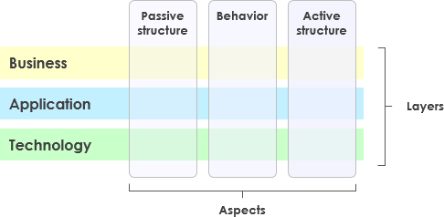

The layered view provides a natural way to look at service-oriented models. Higher layers use the services provided by lower layers. ArchiMate distinguishes three main layers:

-   [**The business layer**](Business_Layer.md) offers products and services to external customers, which are realized in the organization by business processes performed by business actors and roles.
    
-   [**The system layer**](System_Layer.md) supports the business layer with application services that are realized by (software) application components.
    
-   [**The technology layer**](Technology_Layer.md) offers the infrastructure services (e.g. processing, storage and communication services) needed to run the applications, implemented by the computing and communication hardware and system software.
    

Three important aspects of this model are:

-   **The passive structure aspect** represents the objects on which the behaviour is performed. Typically, these are information objects in the business layer and data objects in the application vrs
    
    tion, but they can also be used to represent physical objects
    
-   **The behavioural aspect** represents behaviours as processes, functions, events and services performed by actors. Behavioural concepts are mapped to structural concepts to show who or what displays the behaviour.
    
-   **The active structure aspect** represents the structural concepts (business actors, application components, and devices that depict actual behavior; i.e., the "objects" of the activity).
    

### **Bitbucket**

While working on this project, we used **BitBucket** technology, which allowed us to collaborate efficiently and modify intermediate versions of the different parts of the project.

Bitbucket is our Git repository management solution designed for professional teams. It provides us with a central place to manage repositories, collaborate on source code, and guide the project workflow.

It provides features such as:

-   Controlling restrictions on access to your source code.
    
-   Managing the workflow of a project or team.
    
-   Pull requests with the ability to comment directly on the collaboration and subsequent code review.
    
-   Jira integration for full development traceability.
    
-   Full Rest API to create customized workflow features not yet available in the market.
    

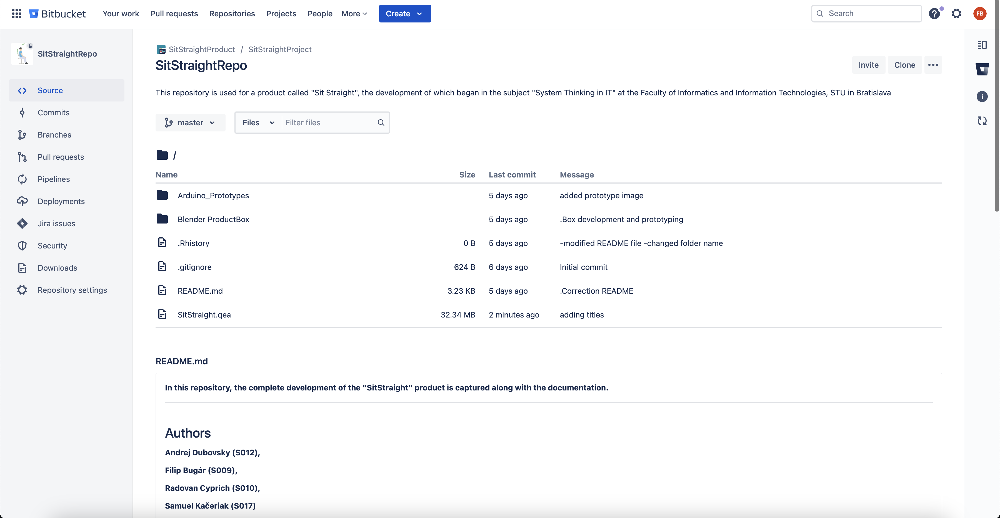

Project repository in Bitbucket

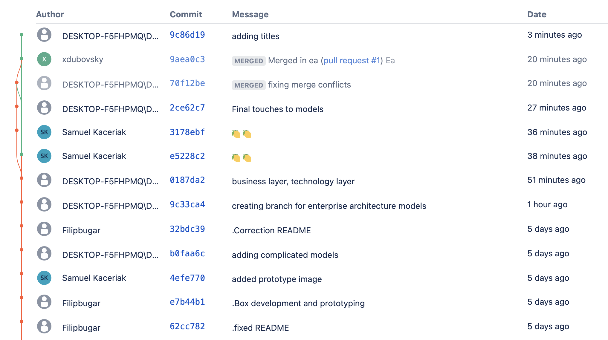

Branches in Bitbucket via web interface

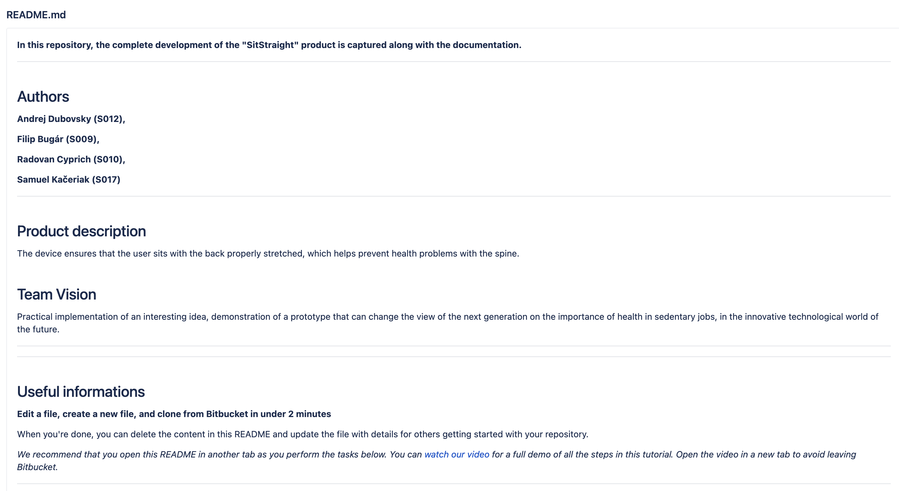

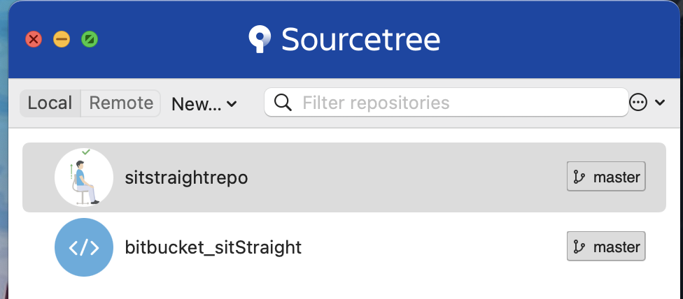

Client Sourcetree

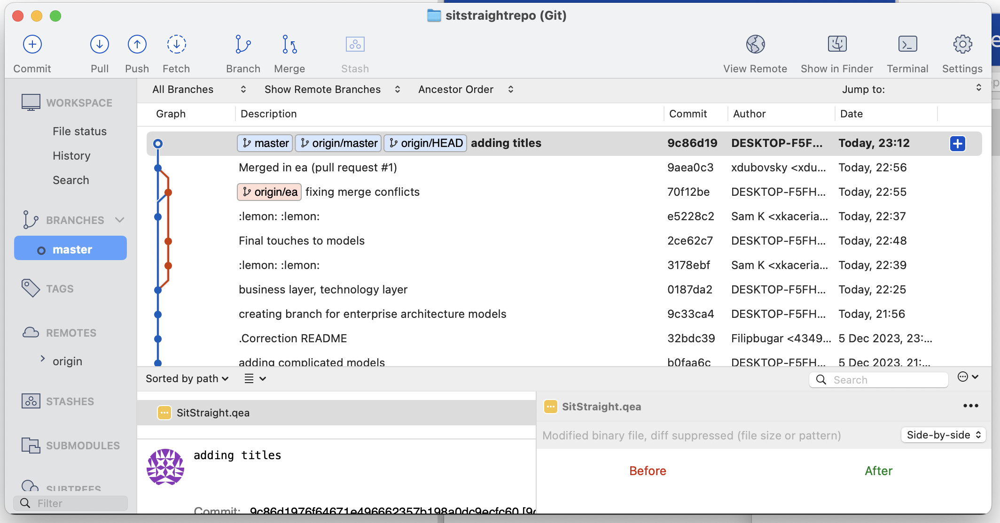

View Branches in the Sourcetree client

### **LemonTree diagram merging**

Lemontree automates processes that enable users to increase the efficiency of change, reliability and quality of their digital services.

-   It automates processes that help our customers increase the speed of change and quality of their digital services.
    
-   It helps deliver results by simplifying what's hard and eliminating what takes time.
    
-   Creates turnkey solutions based on leading products from partners.
    

#### The process of using LemonTree in our project

During the development of our diagrams, we got to a stage where we wanted to test the functionality of LemonTree in merging two ea diagrams. As there are often a large number of problems in solving this problem, the modelling process is very difficult to parallelize.

**Steps:**

1.  After opening the lemontree, we select the documents we want to compare. With the compare option we can compare the documents. With the merge button we can merge two documents into one.
    

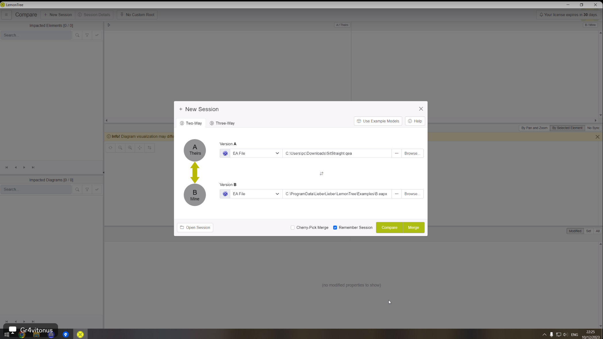

2.  [compare]After opening the model, we can expand it and see which parts match and which are different.
    

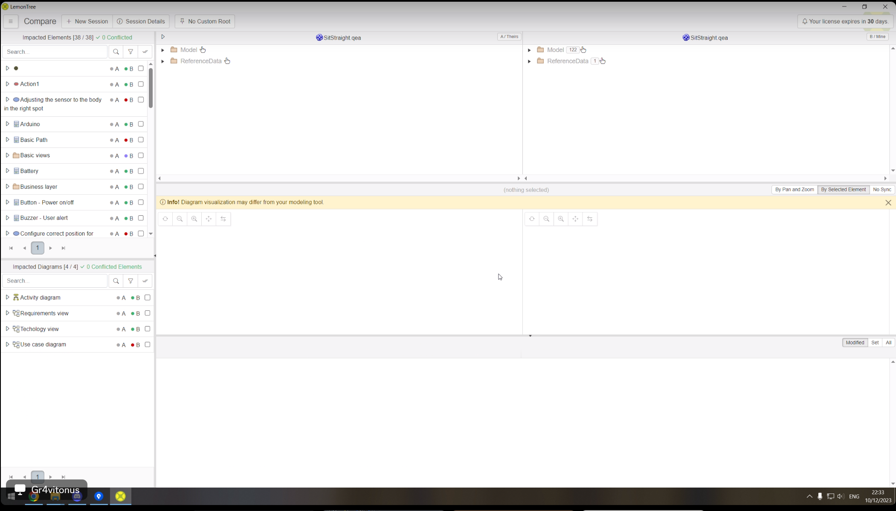

3.  Preview of diagrams
    

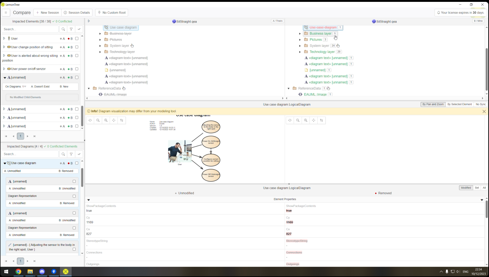

4.  [merge] Select the parts of the two documents that should be in the merged final document. Click "take" to select but remove the parts from the final merge.
    

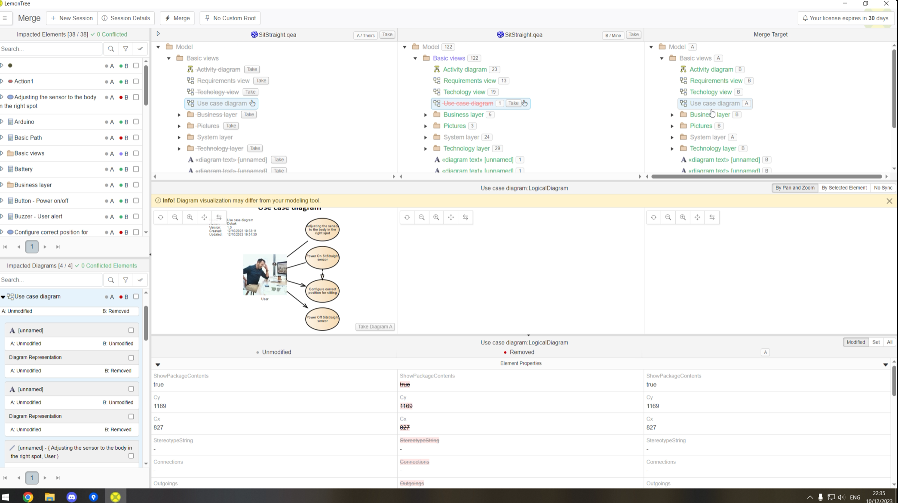

5.  After clicking on the "merge" button, select the path where the merged document should be saved.
    

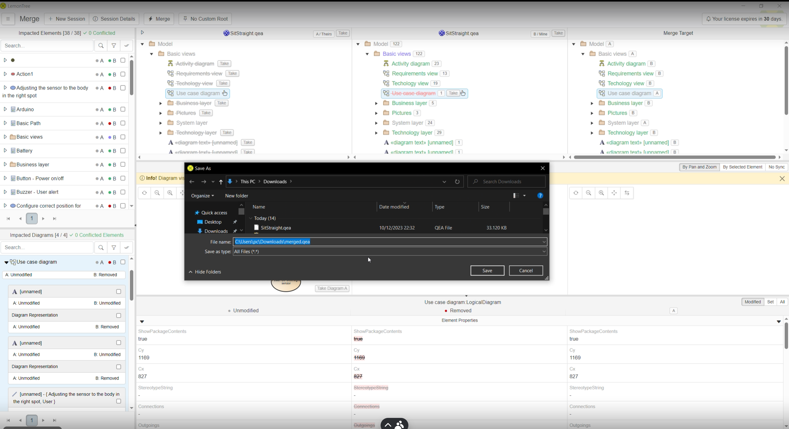

6.  After a successful connection we will see the following message.
    

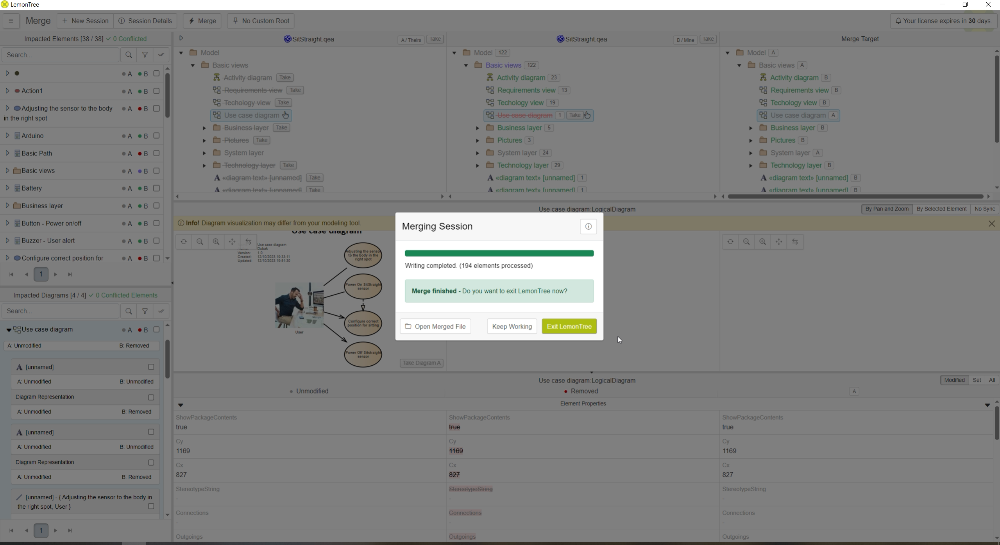

7.  We upload the linked document to BitBucket using SourceTree.
    

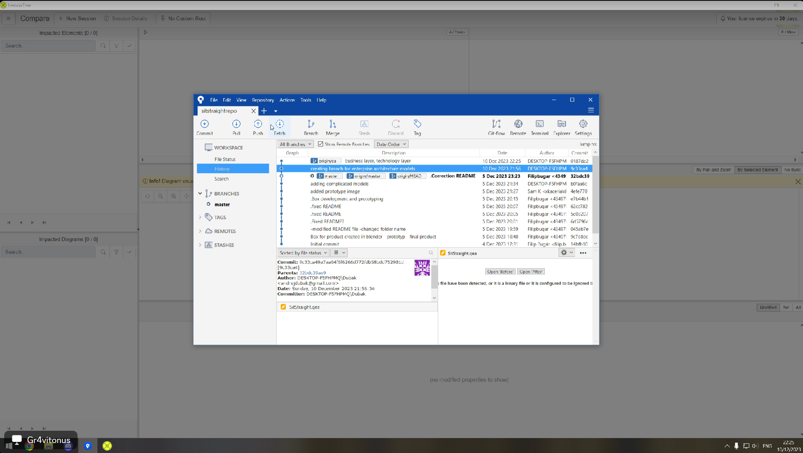

ALT. Alternative option of merging three documents.

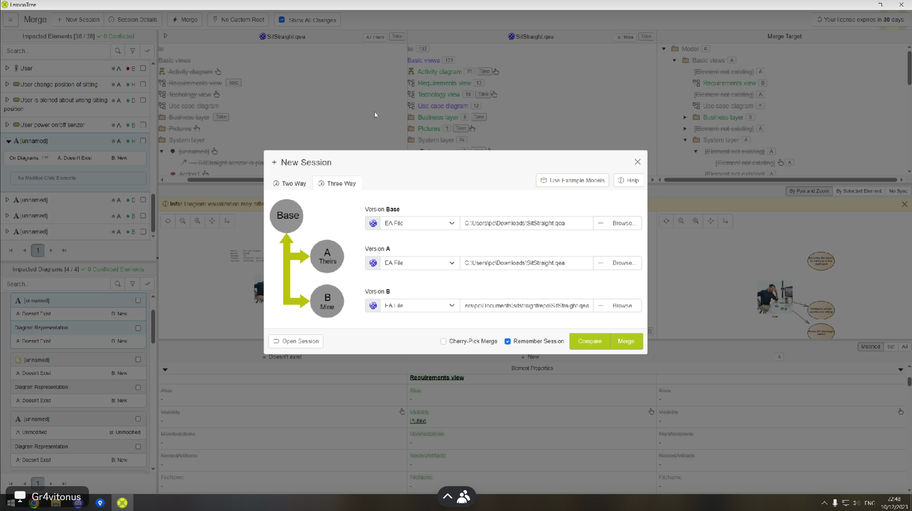

### **Final form of the prototype:**

[Technická dokumentácia prototypu](Technical_Documentation.md)

## **Future work**

In realizing the construction of a prototype device that has the purpose of alerting about incorrect sitting posture, we found that a higher quality hardware could improve the accuracy of the measurements and the overall results obtained.

### Hardware

-   More accurate tilt sensor
    
-   Smaller arduino
    
-   Arduino with external connection like bluetooth or wifi
    
-   External battery
    
-   Plastic box for the whole device
    

### The overall system

-   Creating a database for storing customer data
    
-   Expand the customer spectrum to include orthopedic/physiotherapist roles and chair manufacturers
    
-   Creation of a progressive web application that will display the data collected from SitStraight sensors according to the roles mentioned (patient, orthopedist/physiotherapist, chair manufacturer)
    
-   Adding functionality to measure sitting time and prompting for customer repositioning
    
-   Creation of manuals and online webinars to increase awareness of proper sitting posture
