We have used a number of interesting technologies in the implementation of this project. Some of them we have already encountered in the past and others were our first time. In this section of the paper we will discuss the individual components of our physical device as well as the functions of each component, along with the integrated executable software.

### **Description of the device**

----------

Our equipment is designed for all people who spend a lot of time in a sitting position. With improper posture, the spine can be gradually deformed and other, not only physical health problems or defects can occur.

The device, mounted on the chest in a horizontal position, measures the deviation - (the angle of inclination in all directions) from the correct body extension. This means that if we bend, bow or stoop too far, the device will alert us to the incorrect posture with an audible signal.

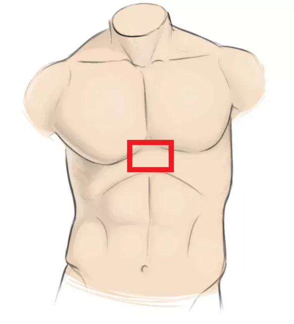

The device should be fixed directly in the centre of the chest under the breast, in the best possible fixation position.

### **Equipment parts**

----------

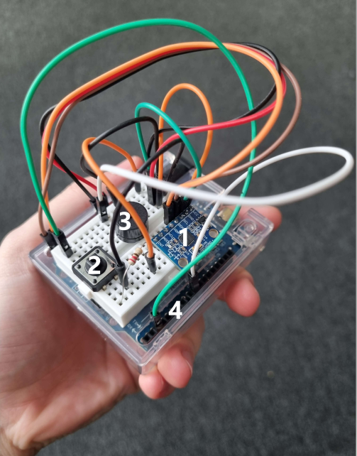

Equipment with individual components

1.  **Sensor MPU-6050**
    

The MPU-6050 sensor includes both a gyroscope and accelerometer sensing in three axes in a single chip. It achieves high accuracy and reliability thanks to its 16-bit analogue converter. The module senses all 3 axes at the same time, at the same instant and uses an I2C interface to communicate with the microcomputer.

The module also incorporates a DMP unit (Digtal Motion Processor) which can be independently programmed to perform complex operations on the measured values. Thanks to the DMP it is not necessary to load the Arduino chip and do the calculations directly on the board, thanks to the I2C interface it can even calculate values from another chip (for example another magnetometer, etc.).

2.  **Microswitch**
    

Classic 12mm x 12mm x 4.3mm button.

3.  **Buzzer**
    

Active buzzer for alarm or signaling. When powered, the buzzer "beeps" at a frequency of approximately 2300 Hz.

4.  **Arduino UNO board**
    

The Arduino UNO, offers internet connectivity options using a built-in WiFi module, while the board is similar in form factor to the UNO. This means that the pin layout is the same and thus the board is also compatible with different shields.

The ATmega4809 is used as the main chip on the board, which also supports the designed code for the ATmega328, thanks to the Arduino IDE core. There are 14 digital inputs/outputs on the board, including 5 PWM, 6 analog pins, ICSP header, USB and DC005 connectors.

### **Disign**

----------

First prototype

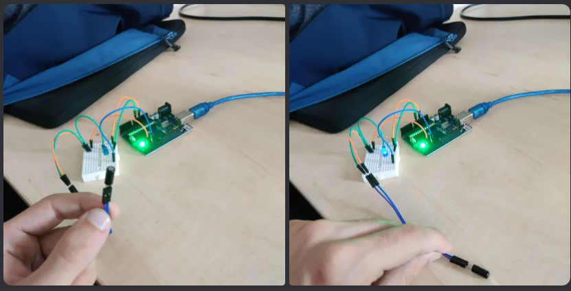

----------

Boost konvertor 3.7v->5v

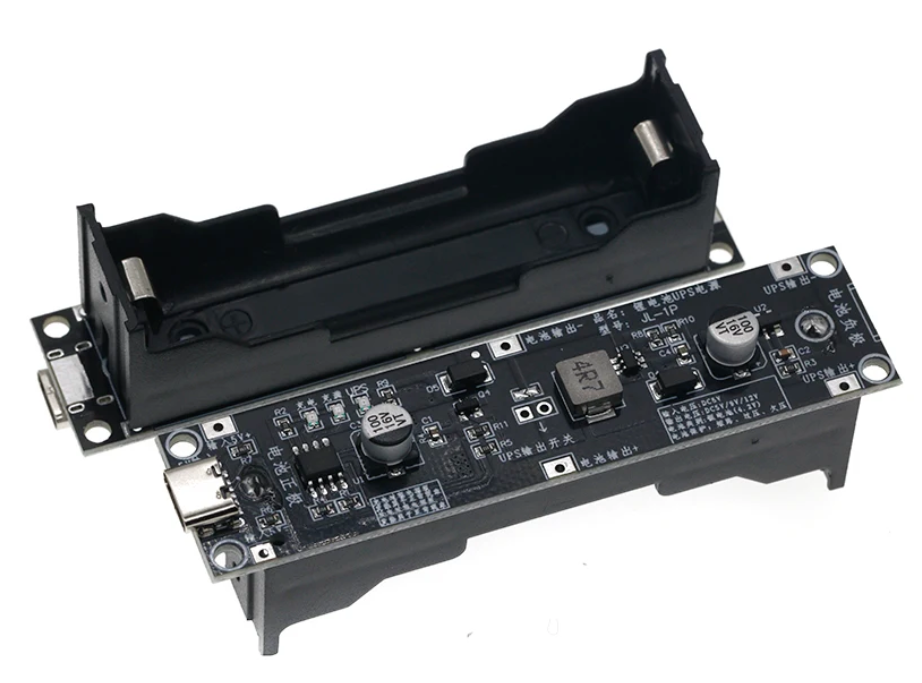

18650 bateries

----------

Necessary modifications to the box

Case_Model.zip

10 Dec 2023, 08:10 pm

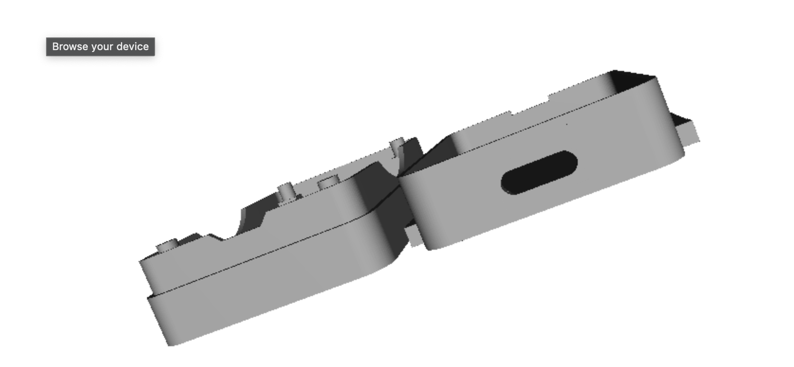

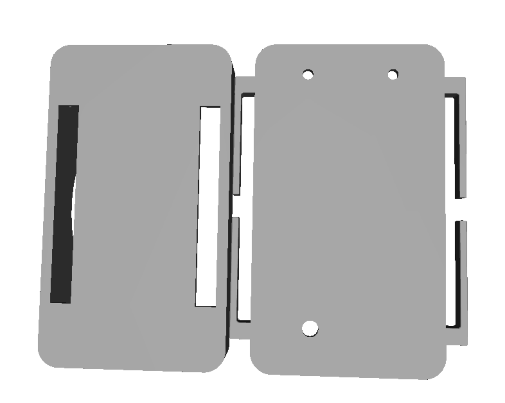

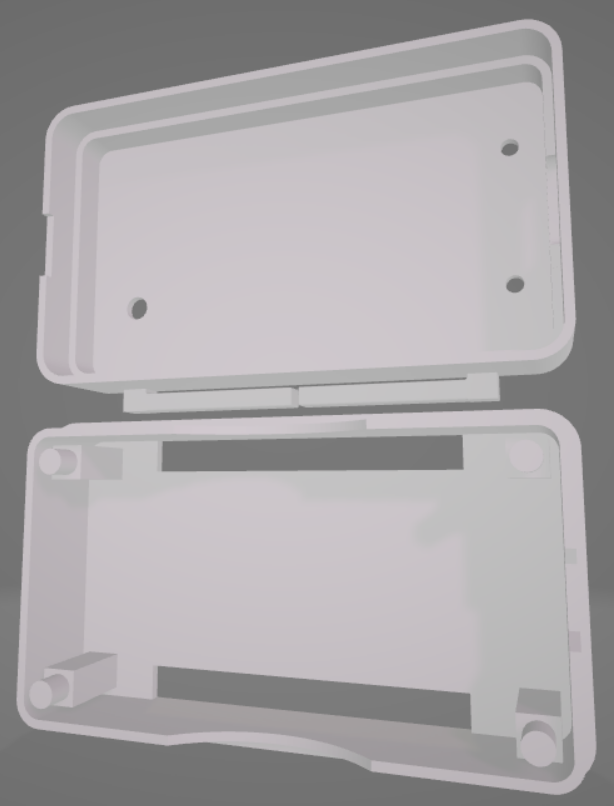

----------

Prototype 2

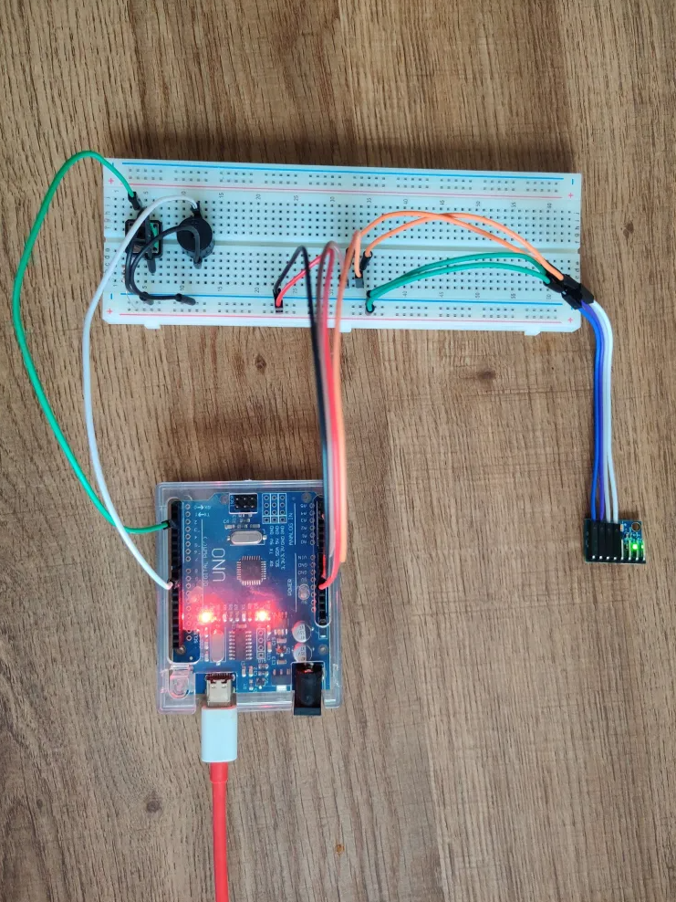

Modification of gyroscope pins

----------

Smaller breadboard

----------

Arduino with external power bank

----------

Final form

----------

### **Diagram**

----------

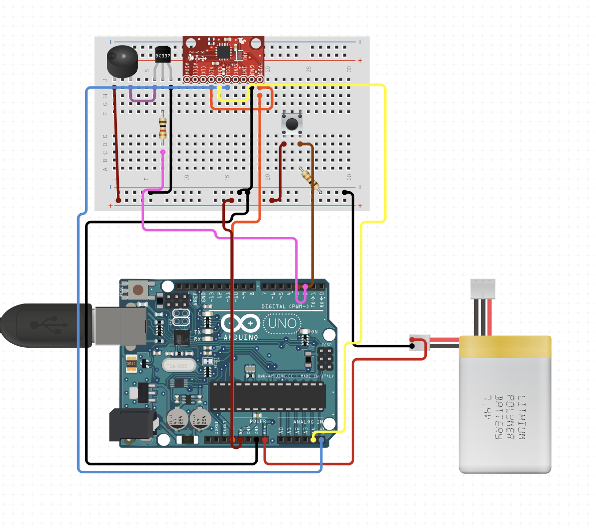

### **Implementation**

----------

The software part was created in the Arduino IDE programming framework, which allows us to directly and quickly upload code to the Arduino.

Visualization of the program outputs:

To validate the results, we created scripts that visualize the sniffed data, of each inclination.

Code and visualization scripts:

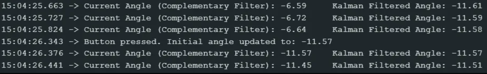

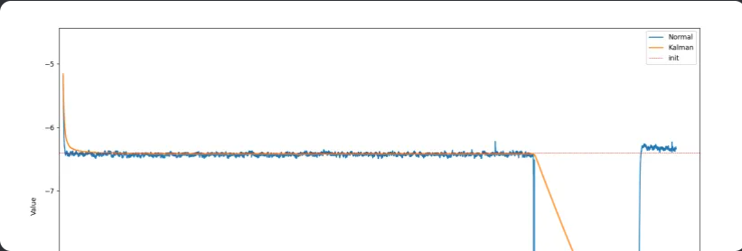

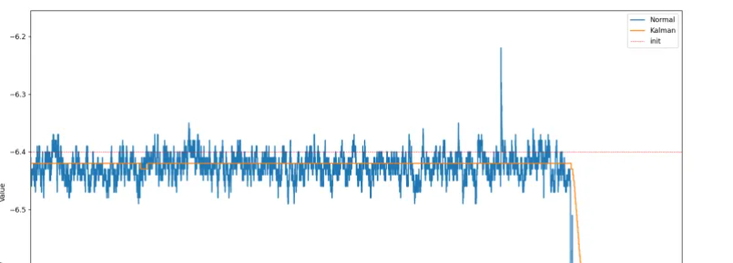