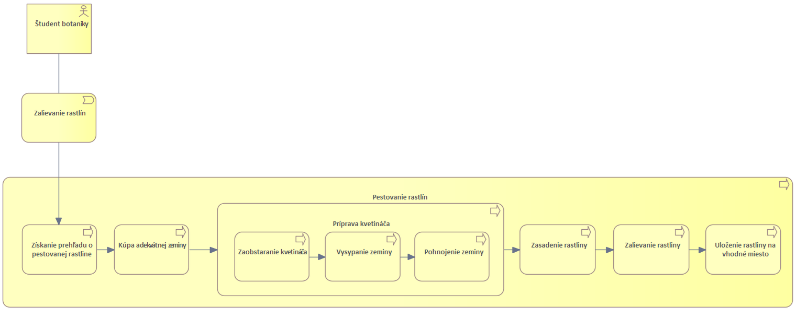
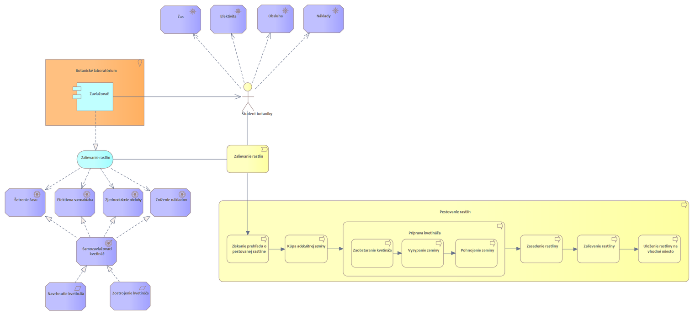
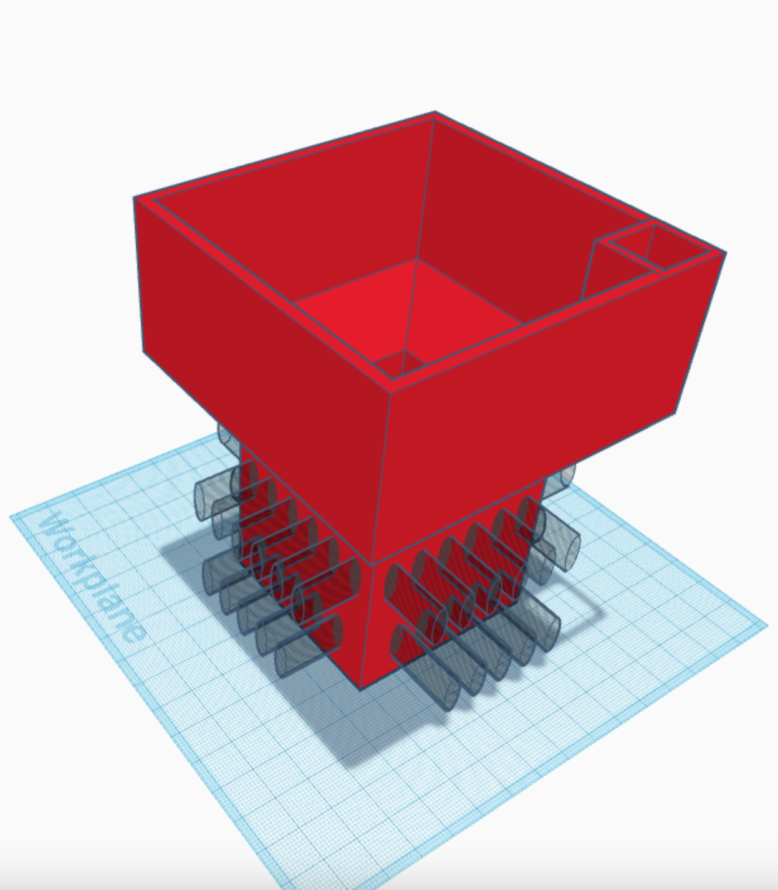
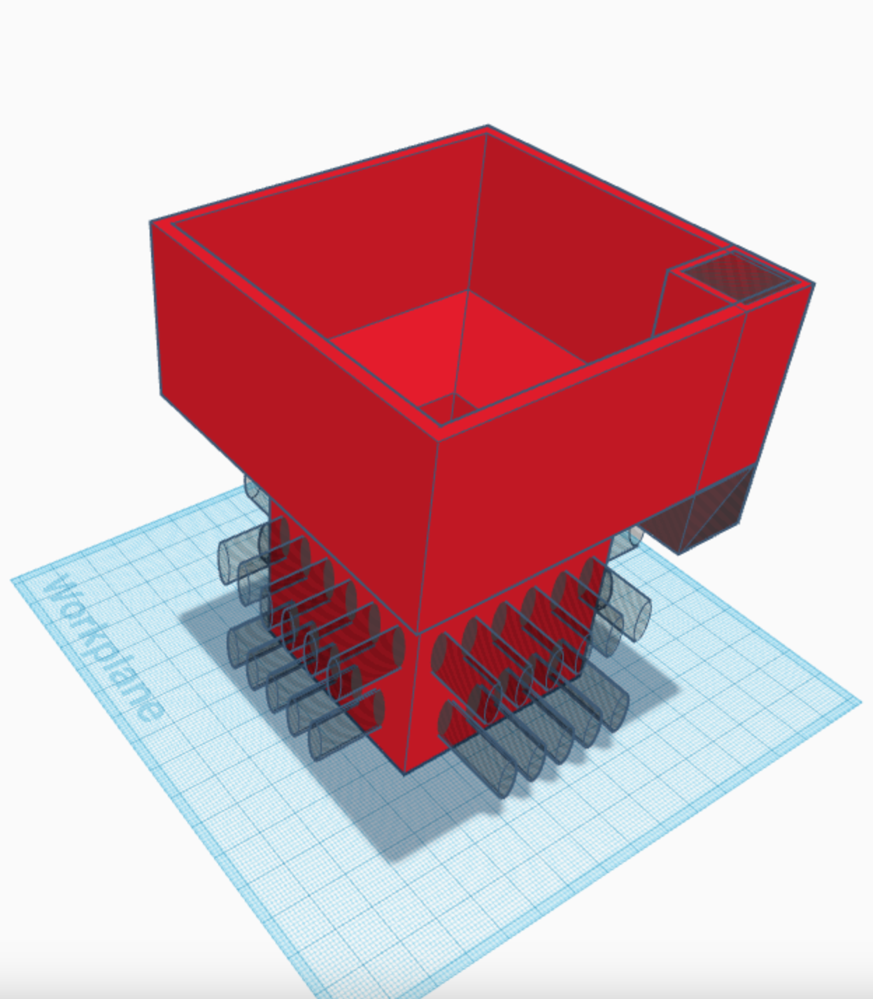
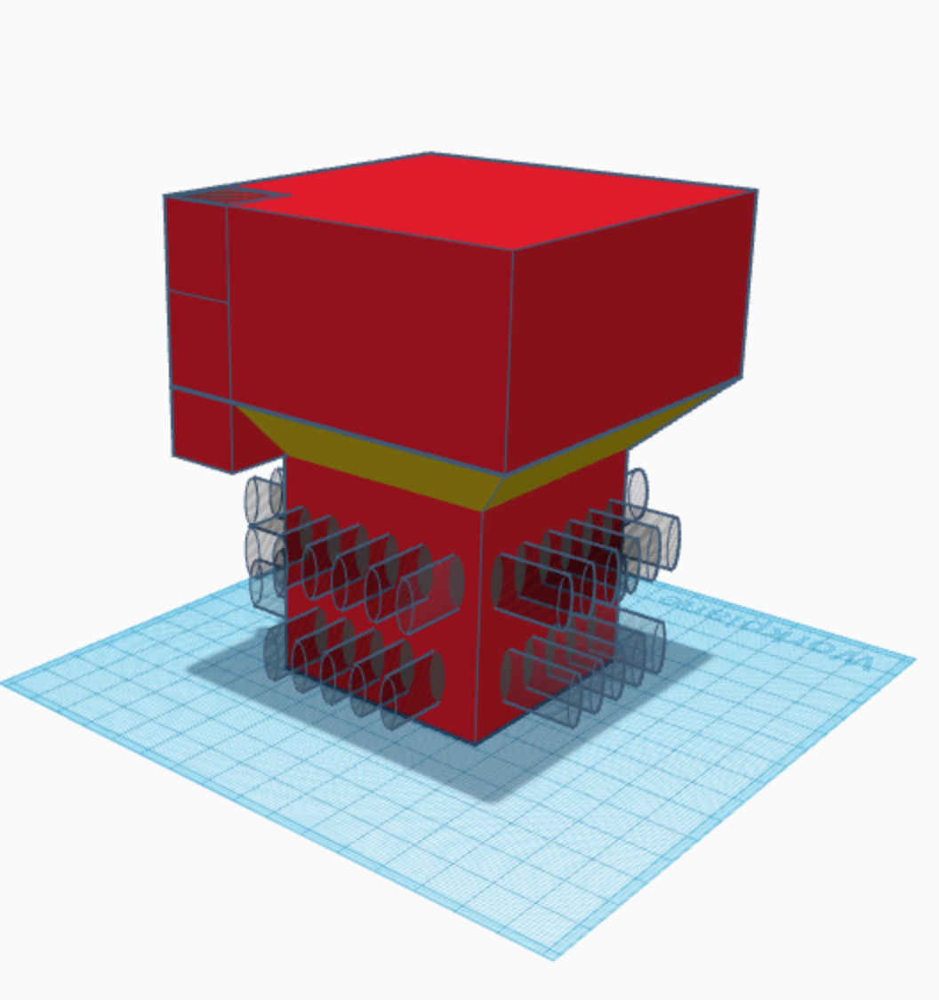
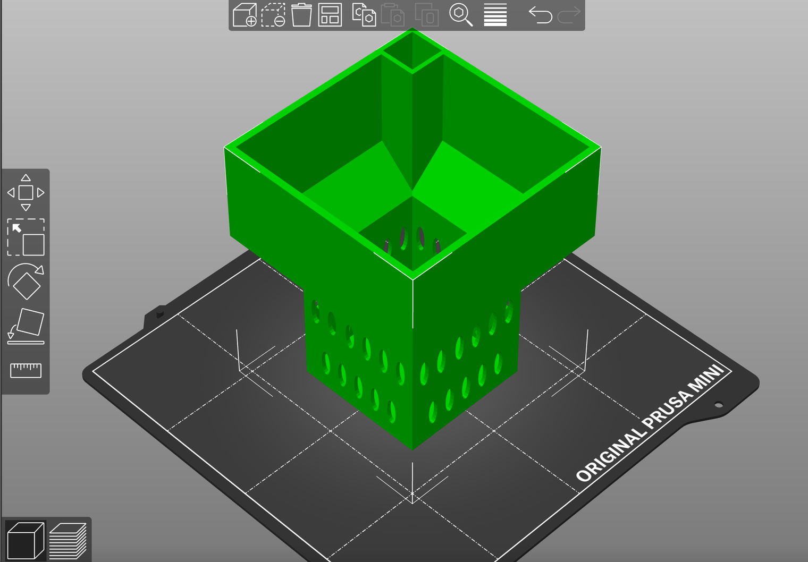
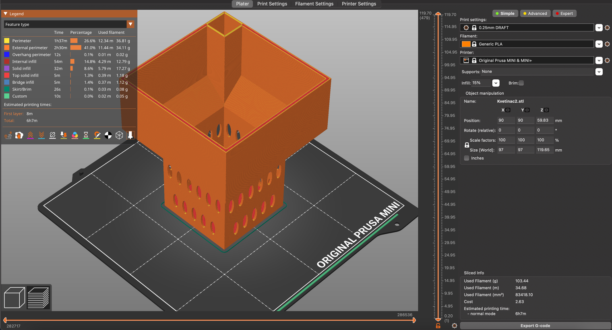
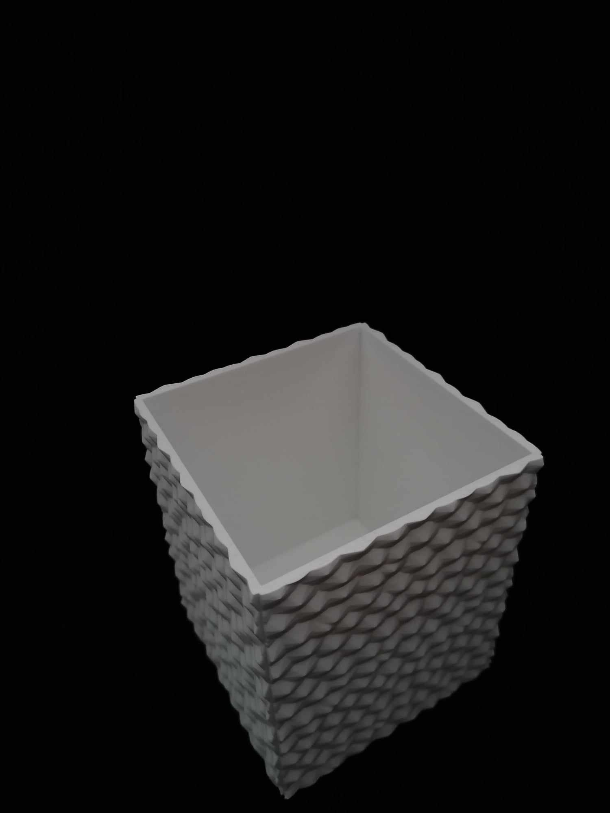
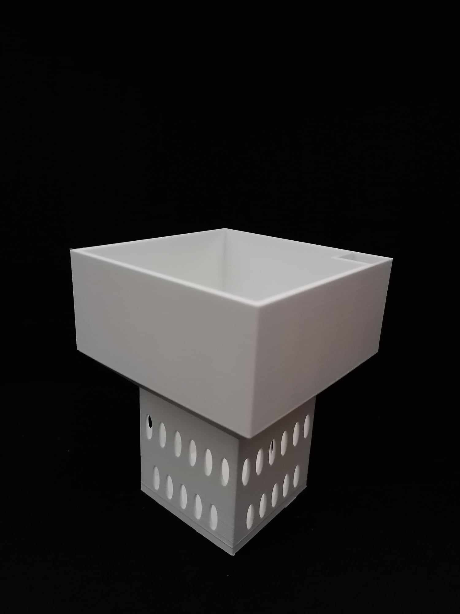
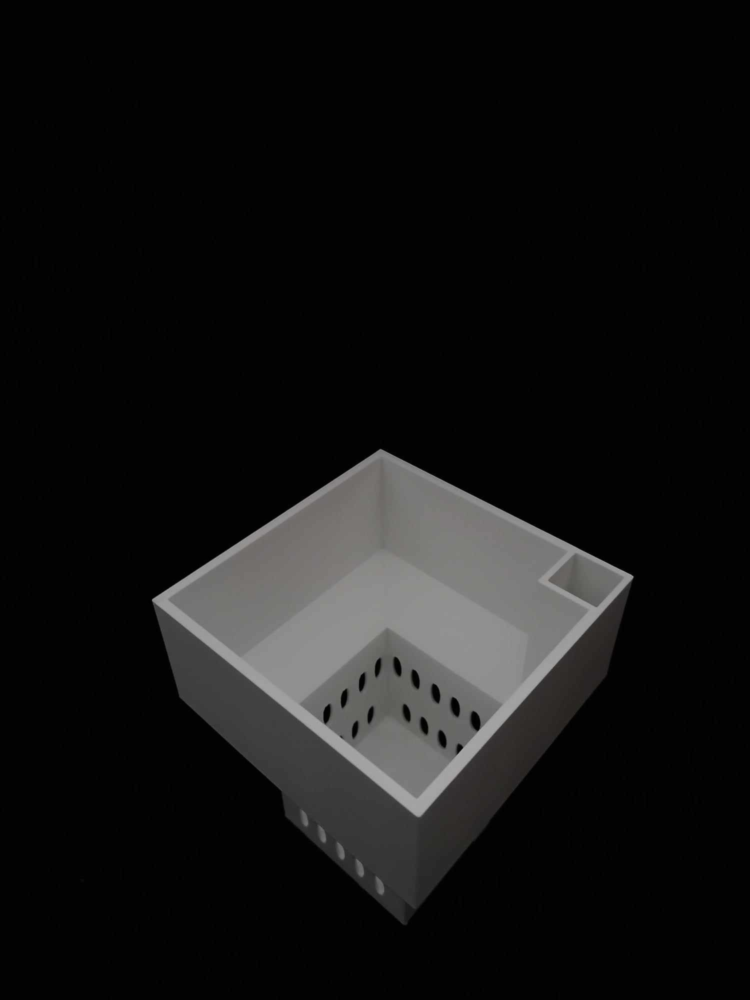

# **WATER PLANTER**
*Authors: Laura Bieliková & Natália Mačugová*

Samozavlažovací kvetináč je zariadenie na automatizované zalievanie rastlín, resp. zalievanie rastlín bez každodennej kontroly a polievania.

Našim cieľom je zjednodušiť a skrátiť čas pre študentov botaniky pri starostlivosti o ich rastliny určené na štúdium.

**Motivation**

Použitím 3D tlačiarne vytvoriť užitočný model kvetináča pre študenta botaniky.

Vytvorenie samozavlažovacieho kvetináča bez použitia moderných technológií, s ktorým nie je potrebné každý deň sledovať stav vlhkosti zeminy.

Zariadenie bude schopné samostatne poskytovať závlahu bez každodenného fyzického polievania.

**Use cases**

1.  **Automatická závlaha:**
    
    -   Kvetináč sa automaticky zavlažuje, čo umožní rastline prijímať vodu z dolnej časti kvetináča podľa potreby.
        
2.  **Dlhodobá absencia používateľa:**
    
    -   Používateľ môže ponechať kvetináč bez zavlažovania, keď je na dovolenke alebo v škole, čím zabezpečí, že rastlina bude mať dostatok vody aj bez prítomnosti používateľa.
        
3.  **Presné dávkovanie vody:**
    
    -   Kvetináč umožňuje presné dávkovanie vody na základe potreby rastliny, čím sa minimalizuje riziko pretečenia alebo vysušenia pôdy.
        
4.  **Zachovanie optimálnych podmienok:**
    
    -   Kvetináč môže byť využitý na udržanie optimálnych podmienok pre konkrétny druh rastliny.
        
5.  **Záchrana rastlín v prípade choroby:**
    
    -   Kvetináč môže pomôcť zachovať zdravie rastlín poskytovaním presne regulovanej závlahy, čím minimalizuje riziko chorôb spôsobených prebytkom alebo nedostatkom vody.
        
6.  **Estetický prvok:**
    
    -   Kvetináč môže byť využitý aj ako dekoratívny prvok v interiéri alebo exteriéri, kde prispieva k estetike prostredia.
        

**Business process viewpoint:**

Diagram zjednodušene zachytáva celkový proces pestovania rastlín, ktorý zahŕňa aj náš hlavný proces zalievania rastlín. Tento proces je zameraný hlavne na študentov botaniky, ktorí v rámci štúdia pestujú veľmi veľa rôznych rastlín, pričom každá rastlina vyžaduje konkrétny spôsob pestovania. Hlavnou úlohou pri pestovaní rastlín je ich správne zalievanie. V rámci celkového pestovania rastlín ide o získanie potrebných informácií k ich zalievaniu. Ďalším krokom je kúpa vhodnej zeminy a samotnej prípravy kvetináča. Tento proces prípravy kvetináča zahŕňa zaobstaranie kvetináča a jeho následné vyplnenie zeminou, ktorú je potrebné aj pohnojiť. Ďalším procesom je zasadenie rastliny do kvetináča. Podstatnou časťou je aj samostatné zalievanie rastlín, kde je potrebné rastlinu zaliať vhodným množstvom vody. Posledným procesom je uloženie rastliny na vhodné miesto.

Celkový pohľad zachytený business aspektom nášho riešenia poskytuje diagram nižšie. Tento diagram je rozšírený o motiváciu a ciele nášho projektu. Motiváciou je ušetrenie času pri zalievanie rastlín, zjednodušenie obsluhy a samotná efektivita pri zavlažovaní. Zároveň to predstavuje pre študenta botaniky skrátenie času pri pestovaní pestovaní rastlín počas štúdia. Samozavlažovací kvetináč odbremení študenta od každodennej kontroly vlahy zeminy. Diagram teda popisuje ciele vytvorenie samozavlažovacieho kvetináča.

**Business solution concept viewpoint:**

**Technology layer**

Pri návrhu modelu nášho kvetináča sme spoločnou diskusiou v tíme navrhli, ako si predstavujeme náš model kvetináča. Naším nápadom bol kvetináč, do ktorého bude možné naliať vodu a rastlinka si bude brať požadované množstvo, bez toho aby vyschla alebo, aby bola preliatá.

Príklad:

Po analýze existujúcich riešení, kde sme objavili podobné modely v okrúhlom tvare, sme dospeli k záveru, že náš kvetináč sa bude skladať z dvoch častí, vnútornej a vonkajšej. Vonkajšiu časť bude tvoriť klasický kvetináč v tvare kocky alebo obdĺžnika. Vnútornú časť bude podobná klasickému lieviku v tvare kocky, pričom jeho spodná zúžená časť bude mať dierky a cez vrchnú širokú časť bude prechádzať “komín”, cez ktorý sa bude nalievať voda do kvetináča.

Týmto spôsobom po vložení vnútornej časti kvetináča do tej vonkajšej vytvoríme jednoduchý kvetináč, ktorý umožní rastlinke vlastné zavlažovanie bez akejkoľvek námahy.

**Model kvetináča v nástroji Tinkercad:**

Po analýze dostupných nástrojov na 3D modelovanie, sme sa rozhodli pre nástroj Tinkercad, v ktorom sme vytvorili model nášho kvetináča.

Kvetinac1:

Kvetinac2:

**Model kvetináča v nástroji PrusaSlicer:**

Náš model kvetináča bol vytlačený vo FabLabe na tlačiarni typu Prusa mini, preto sme sa rozhodli na tlač modelu nášho kvetináča využiť nástroj PrusaSlicer.

Kvetinac1:

Kvetinac2:

**Fyzický model kvetináča**

**Záver**

V konečnom dôsledku sa nám podarilo vytvoriť samozavlažovací kvetináč, ktorý umožní študentovi botaniky jednoduché pestovanie rastlín rôzneho druhu, s rôznym množstvom závlahy.

Tento kvetináč sa skladá z dvoch častí, pričom rastlina so zeminou bude zasadená do vnútornej časti v tvare lievika, ktorá obsahuje aj “komín”, cez ktorý je možné do kvetináča naliať vodu.

Zoznámili sme sa s rôznymi nástrojmi na modelovanie aj tlač 3D modelov, pričom sme si aj osviežili pamäť s prácou v Enterpirse Architect na tvorbu rôznych diagramov.
