# 022.Technology Layer

Pri návrhu modelu nášho kvetináča sme spoločnou diskusiou v tíme navrhli, ako si predstavujeme náš model kvetináča. Naším nápadom bol kvetináč, do ktorého bude možné naliať vodu a rastlinka si bude brať požadované množstvo, bez toho aby vyschla alebo, aby bola preliatá.

Príklad:

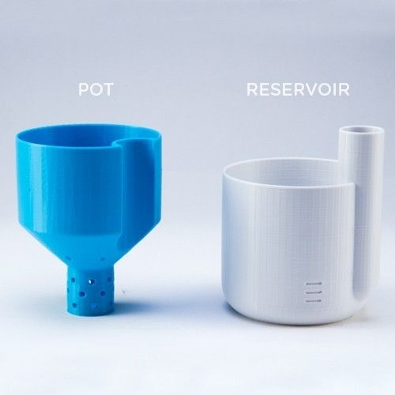

Po analýze existujúcich riešení, kde sme objavili podobné modely v okrúhlom tvare, sme dospeli k záveru, že náš kvetináč sa bude skladať z dvoch častí, vnútornej a vonkajšej. Vonkajšiu časť bude tvoriť klasický kvetináč v tvare kocky alebo obdĺžnika. Vnútornú časť bude podobná klasickému lieviku v tvare kocky, pričom jeho spodná zúžená časť bude mať dierky a cez vrchnú širokú časť bude prechádzať “komín”, cez ktorý sa bude nalievať voda do kvetináča.

Týmto spôsobom po vložení vnútornej časti kvetináča do tej vonkajšej vytvoríme jednoduchý kvetináč, ktorý umožní rastlinke vlastné zavlažovanie bez akejkoľvek námahy.

**Model kvetináča v nástroji Tinkercad:**

Po analýze dostupných nástrojov na 3D modelovanie, sme sa rozhodli pre nástroj Tinkercad, v ktorom sme vytvorili model nášho kvetináča.

Kvetinac1:

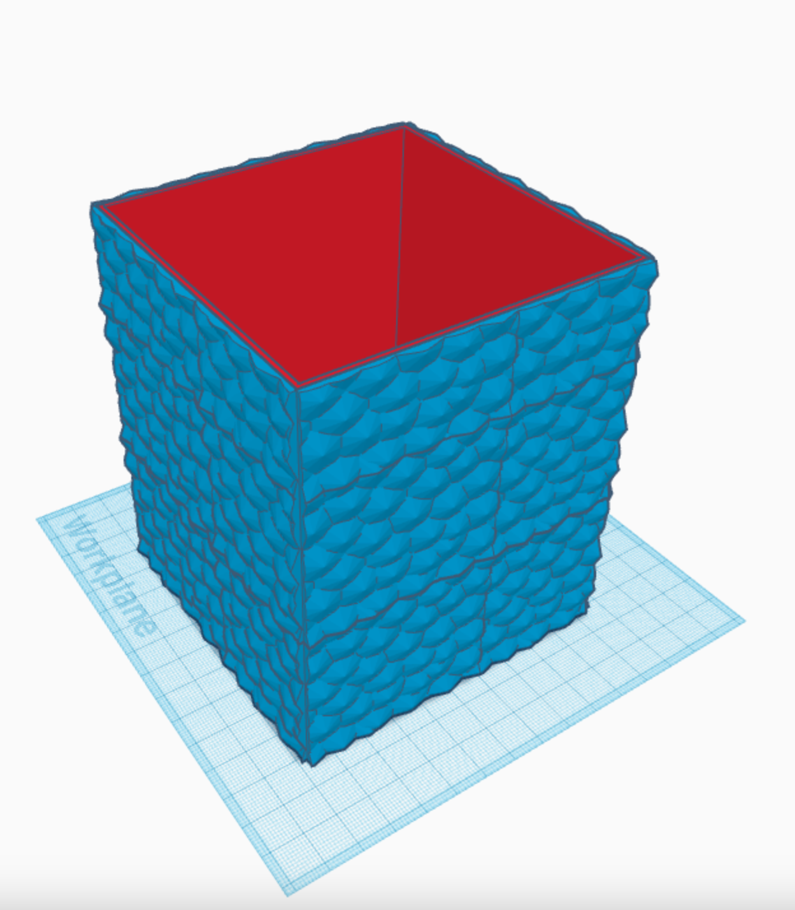

Kvetinac2:

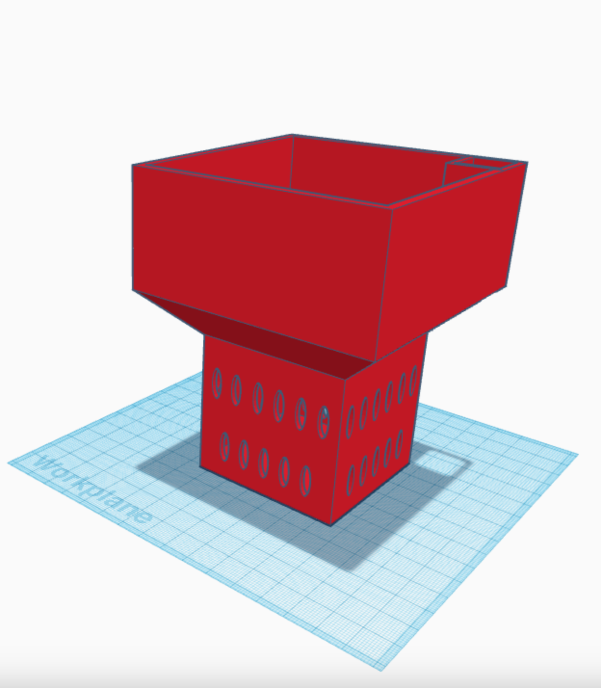

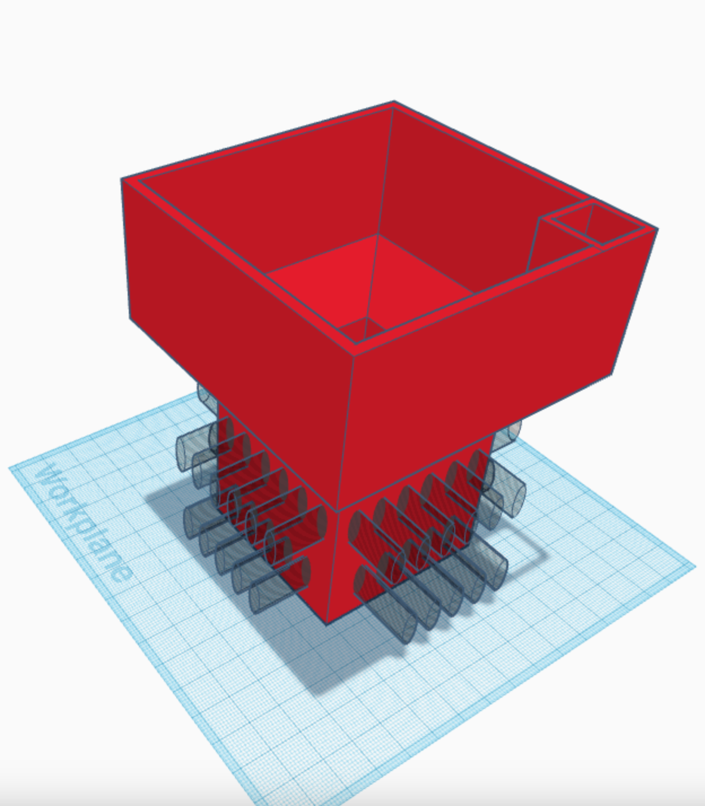

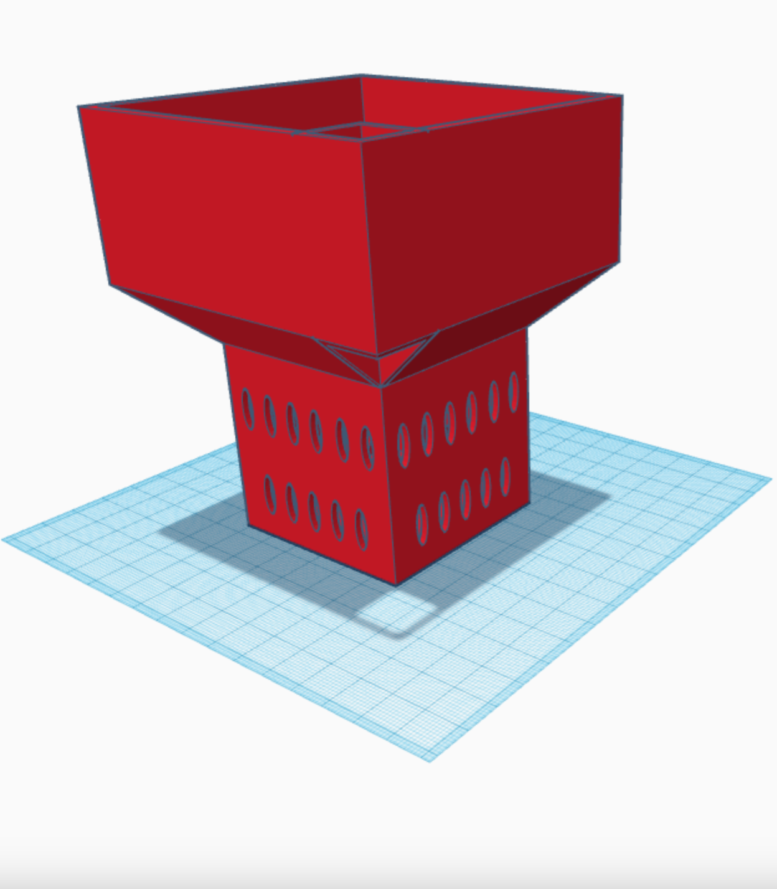

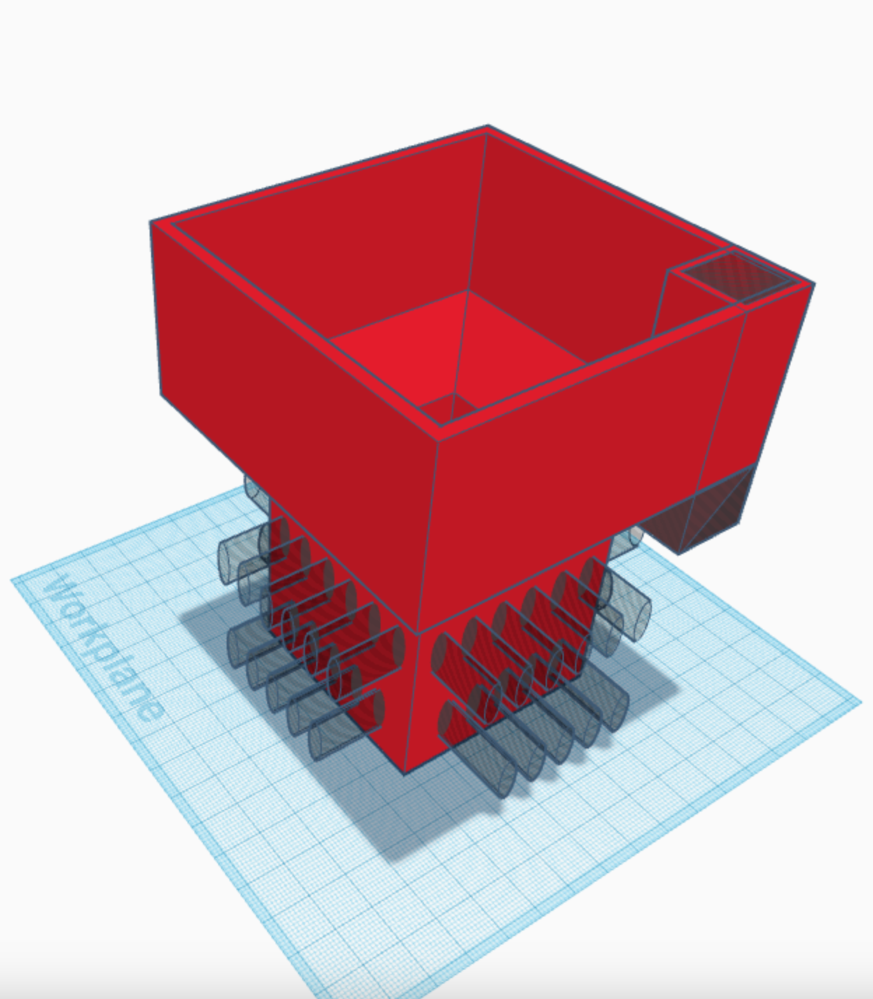

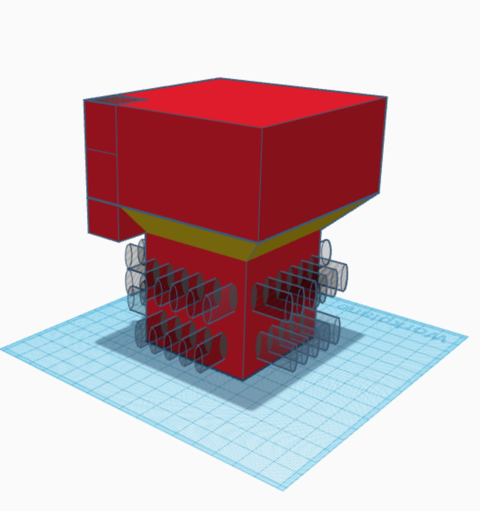

**Model kvetináča v nástroji PrusaSlicer:**

Náš model kvetináča bol vytlačený vo FabLabe na tlačiarni typu Prusa mini, preto sme sa rozhodli na tlač modelu nášho kvetináča využiť nástroj PrusaSlicer.

Kvetinac1:

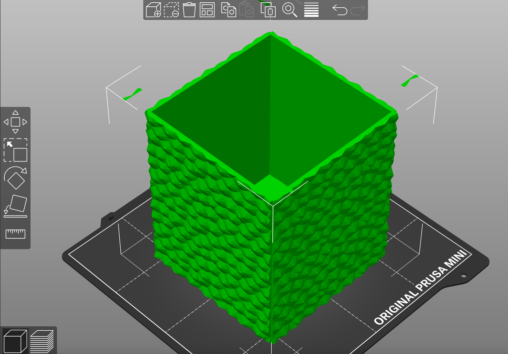

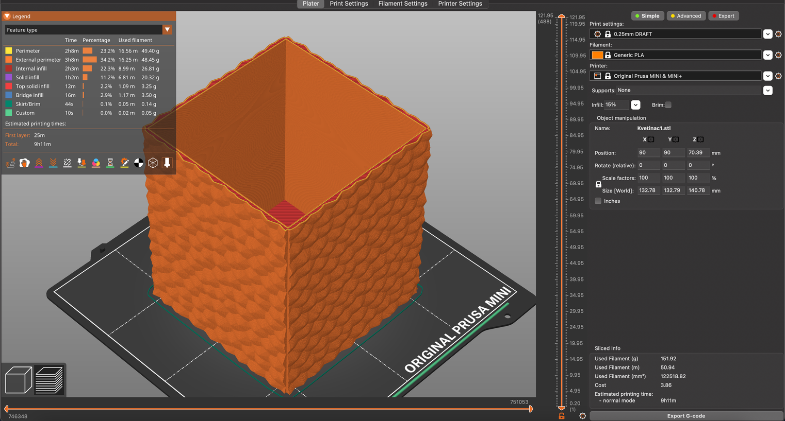

Kvetinac2:

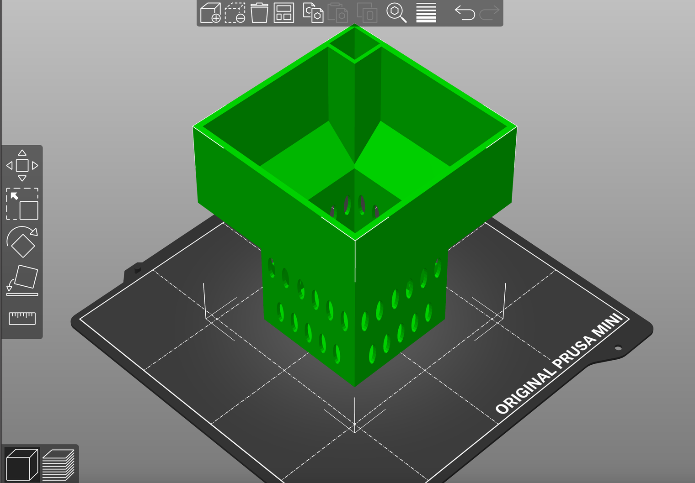

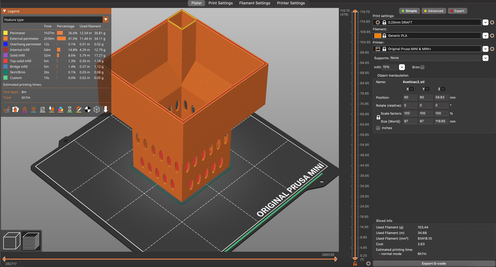