# Useless Cat Box

## Description/Introduction

The useless cat box is a funny contraption/device that primarily seeks to entertain the user. The useless cat box is a mechanical/electrical device that mimics a real cat in a box reacting to user switching a two-positional switch. After the user switches the switch, the box lid is opened, and the cat's head along with its paw are revealed. The cat subsequently presses the switch in order to reset it and the cover subsequently closes. The cat also performs this action in multiple ways, so that the animation does not get stale.

After the user switches the switch to the up-facing position, a positional servomotor opens the box lid to display the attached cat head and give way for the paw. The paw, which is attached to another positional servomotor is then rotated in such a way, that it resets the switch to the down-facing position.

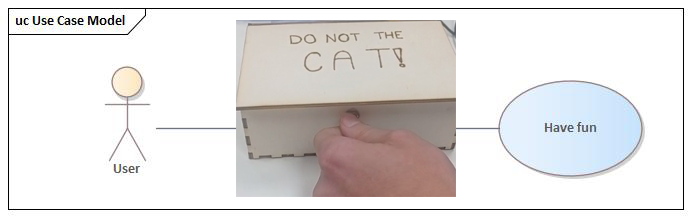

## Business layer

Our business layer contains only single simple use case, because the only purpose of our device is to entertain.

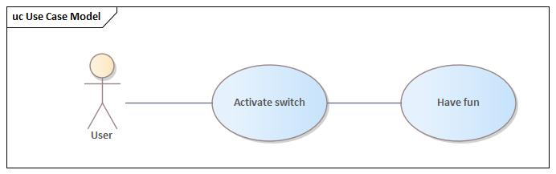

## System layer

In order to best describe the system from the perspective of high level components, a high-level view of the components used in the circuit was created by grouping together all components of the system. The relationships between these components are showcased via association, which describes how each component is connected together via the battery board.

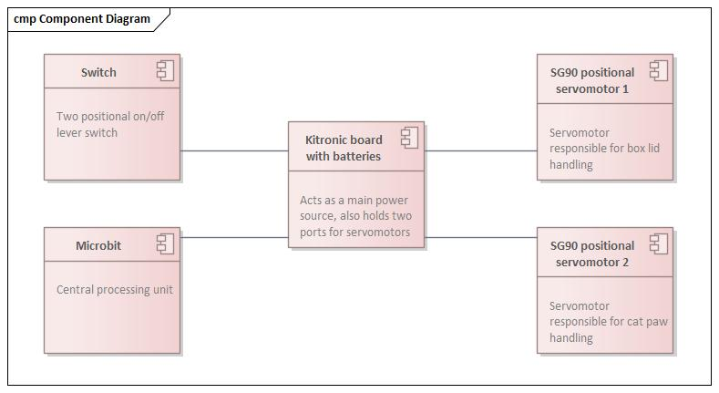

## Technology layer

To best showcase how the technology was being used and connected in a more thorough detail and accuracy, a technology layer is being presented, which has the form of a circuit scheme.

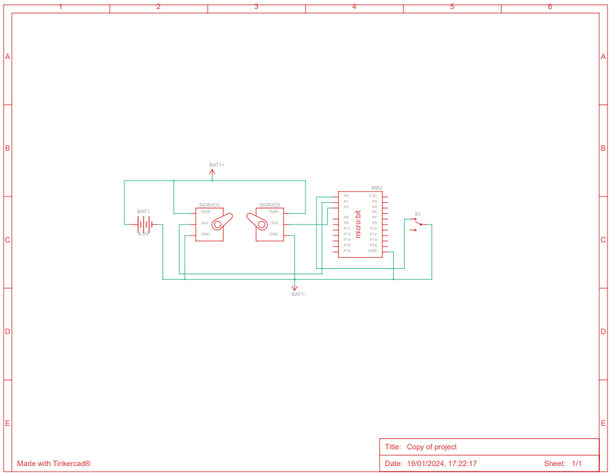 

## Activity diagram

The activity diagram is shown herein order to showcase the flow of the device operation. We have created 6 different animations that the cat performs to turn off the switch after its manual activation. After the switch has been turned down, the whole system subsequently awaits another switch signal.

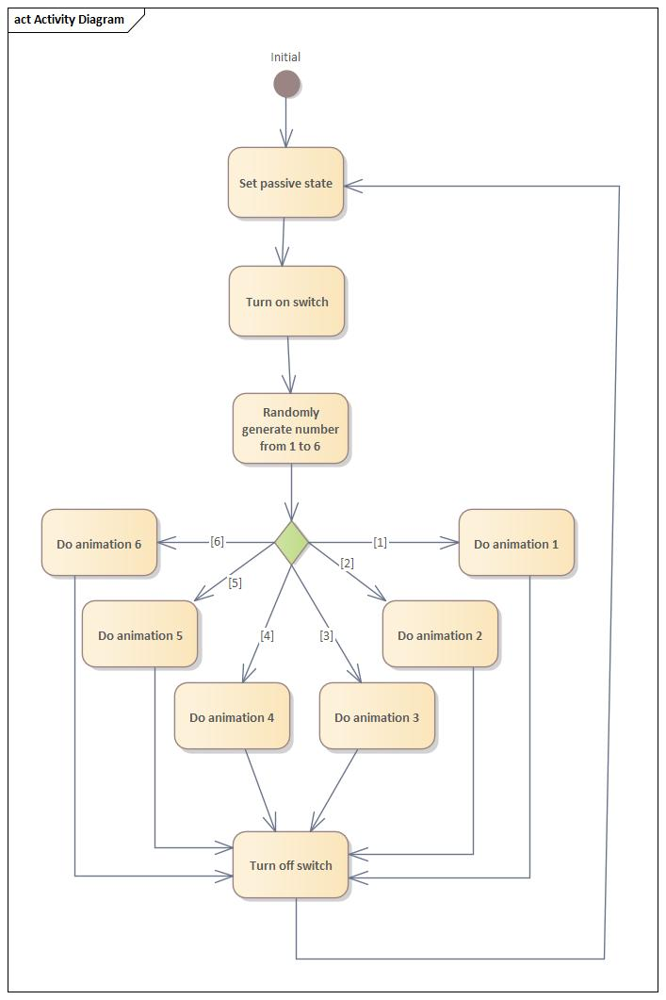

## Design

### The box

The outermost shell of the device, the wooden box, is made out of a 3mm thick sheet of plywood. All sides of the box with the exception of the lid have dovetail joints that have been secured with a permanent glue solution after the box had been assembled. The lid of the box is connected with the box shell with a door hinge, which itself is being attached to the wood with a double sided tape. The dimensions of the box are listed in the table below:

| Dimension | Size (cm) |
|-----------|-----------|
| Width     | 10.1      |
| Length    | 16.4      |
| Height    | 5.72      |

### The head

The head of the cat is a 3D printed piece that's attached to the upper lid of the box using another door hinge. This attachment helps to balance the head in such a way, that it always appears inclined at almost 90° perpendicular to the bottom of the box. The dimensions of the cat head are listed as follows:

| Dimension | Size (cm) |
|-----------|-----------|
| Width     | 3.53      |
| Length    | 6.74      |
| Height    | 5.02      |

### The paw

Similarly to the cat head, the paw is also a 3D printed piece that's being attached to the box via a positional servo motor. The paw is curved in such a way that it can hit the switch and reset it, while having the necessary torque to do so. The length of the arm is 6.63cm.

### The Microbit and electrical parts

All of these parts combined together form the brain and muscle of the box, as they operate all the functionality of it. The Microbit processor has a Kitronik board attached to it with a battery attachment dock, along with two slots for servomotors. Each slot operates a single servomotor, one servomotor opens the lid of the box, the other operates the paw to press the switch. The servomotors being used are the positional SG90 servomotors. Both servomotors are attached to the box using a combination of supporting LEGO pieces and double sided tape. A two positional switch is also connected to the Microbit processor via two wires. This switch is attached to the box via a 6mm wide hole that was drilled to the front side of the box using a power drill. The Microbit itself is positioned on the left back side of the box without being permanently attached as to ease maintenance. While the cover opening servomotor is positioned behind the head of the cat, the paw operating servomotor is positioned on the left side of the cat head.

## Implementation

Before the physical work even begun on the project, the logical part has already been implemented. First, the logical circuit and the corresponding code with the animations had been developed and tested online via Tinkercad. 

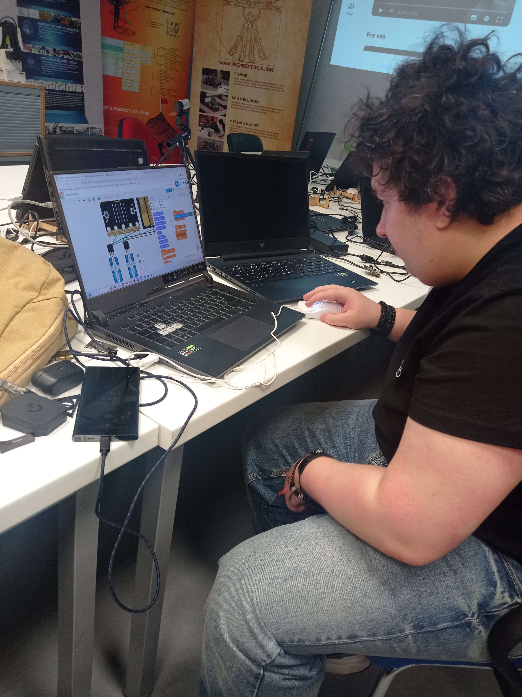{width=50%}

First step of physical implementation was the creation of the shell, that will hold the whole assembly by itself - the box. The box was created on a wood laser cutter. After the parts of the box have been gathered, they were subsequently assembled via the dovetale joints and glued together by a permanent glue solution.

After the box was created, it was time to make the physical components. Both the head and the paw have been 3D printed using a turqoiuse ABS fillament and the details, such as the eyes, paw pads, nose and ears have been painted with paints used for plastic models.

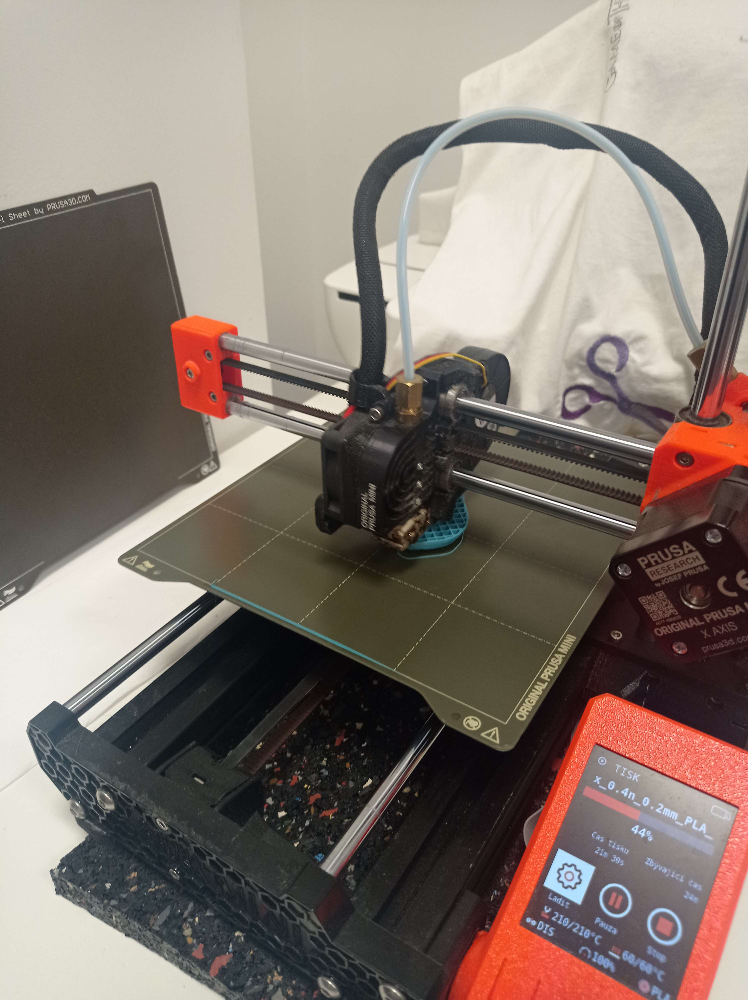{width=50%}

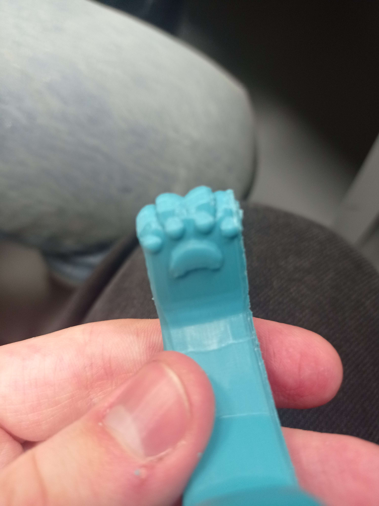{width=50%}

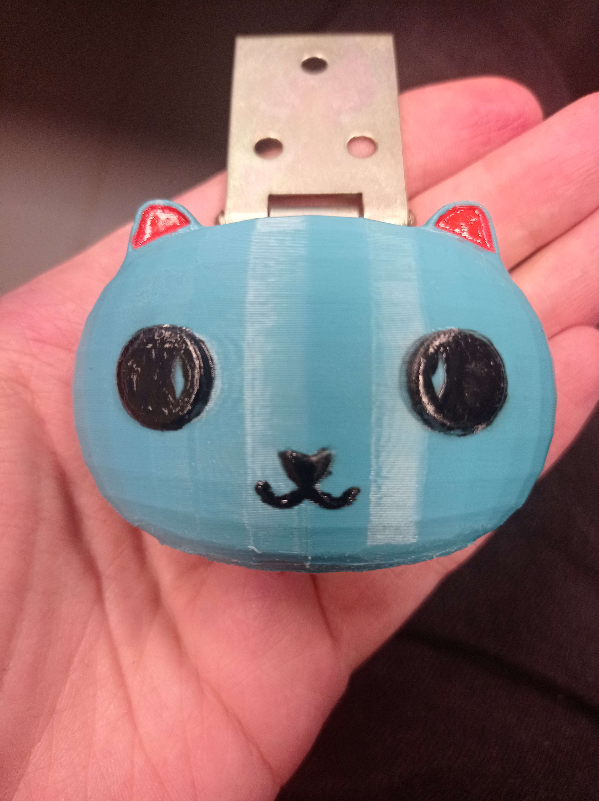{width=50%}

After the 3D parts have been printed, the next logical step was to assemble the circuit as a whole and test out the code using actual electircal parts that will be used in the final prototype.

The models themselves had been modeled in the 3D modeling software Blender. Both the head and the paw were scaled as to fit the real-world dimensions. All together, they were also arranged to create a somewhat representational prototype.

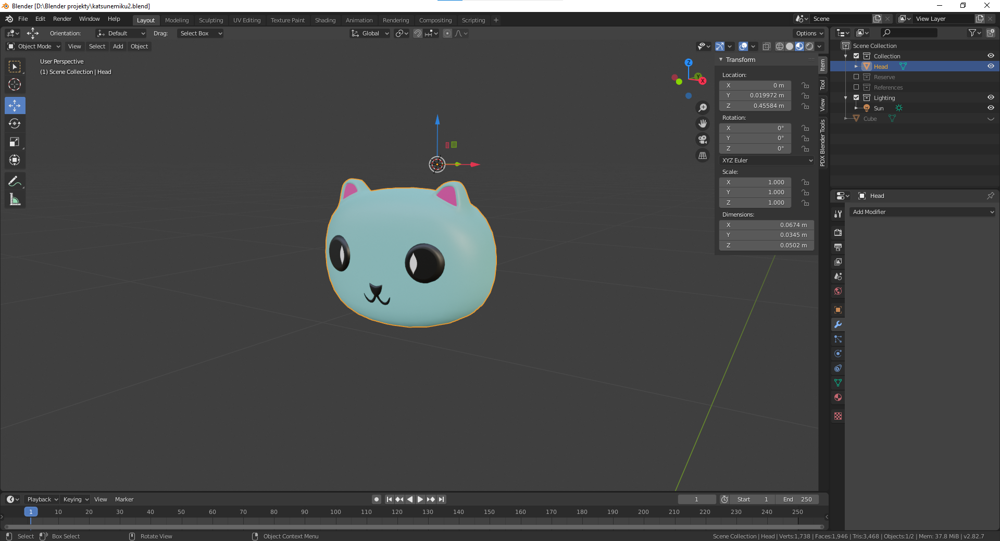

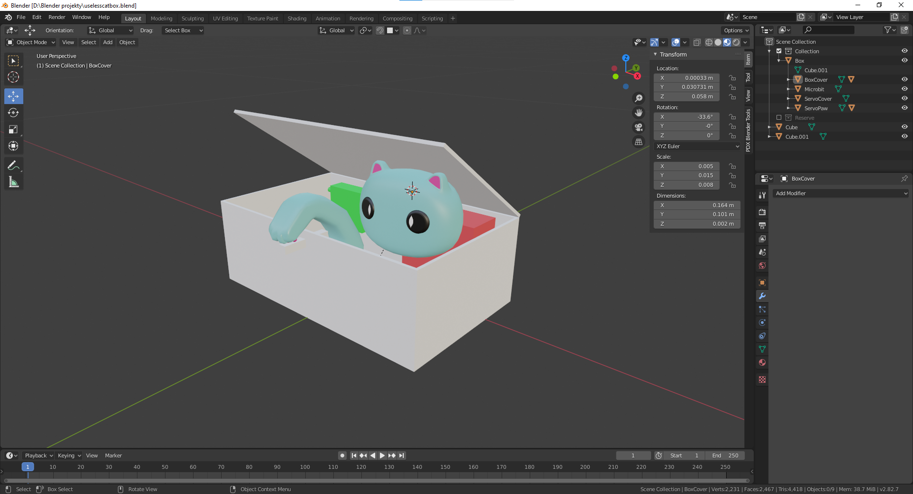

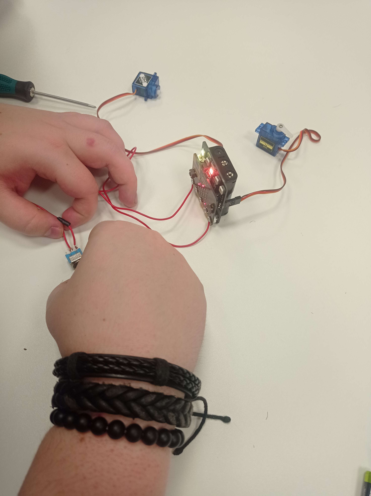{width=50%}

Before the whole circuit could be inserted and permanently attached to the box, the head and the switch had to be added first. Using a 6mm wide power drill a hole was drilled to the front side of the box and subsequently the switch was inserted through it and secured using an attached nut. The cat head was glued to the top lid of the box with the connection being secured with a door hinge.

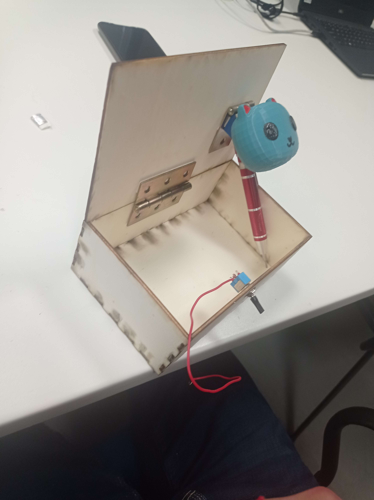{width=50%}

After this was done, the cat paw was secured to the servomotor via a horn attachment that came with the servomotor and screwed to place with accessory screws. The servomotor has also been placed and glued to a LEGO stand to position it correctly.

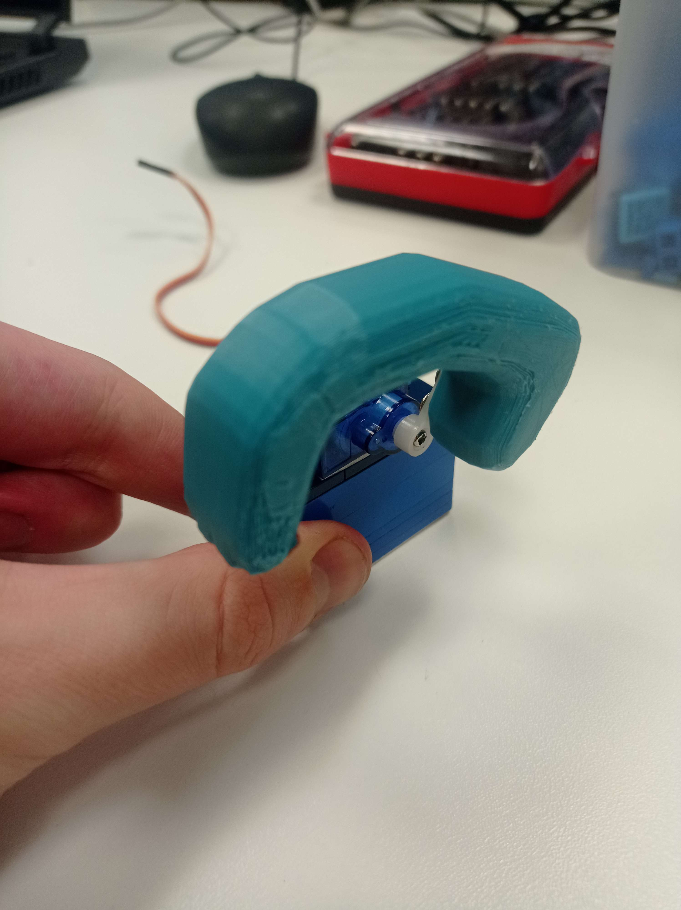{width=50%}

After the hand was attached and tested to correctly reset the switch, it was time to finally assemble the whole thing together. The end result of this assembly is showcased in the video detailed in the [Outcomes section](#outcomes).

Lastly, as a bonus and an artistic touch, a message has been engraved to the top lid of the box that suggests to the user that "they are supposed to do not the cat".

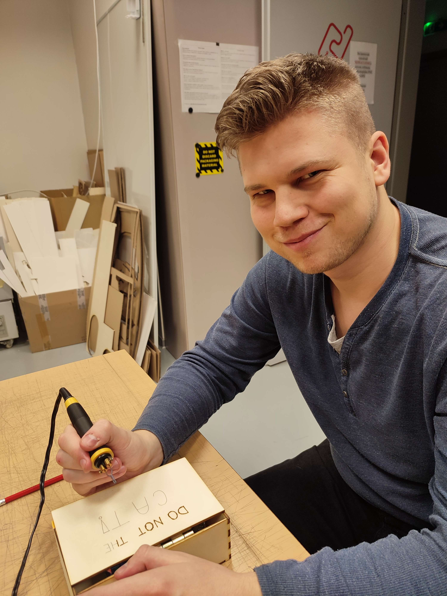{width=50%}

## Outcomes
Useless box is a fun and interactive experience that can keep you occupied for a long time. Arguing with the box to make the switch stay on. The box never allows that, and has fun ways to do it. Merging funny joke and interactive toy to create a fun experience for any age category. The final result is a wooden box with a simple switch and text on the top.

Link to the video of box demonstration:

## Future work
Currently the Useless Box has multiple problems and shortcomings that could be resolved with future upgrades. The main problem to solve is the faulty switch or Micro:bit, where the box is only triggered every 2nd switch. The less important problem that could be fixed is redisigning the box into a more complex one that wouldn't have problems with overhangs and gaps in the box. This requires a more complex box and hinge solution too complicated for the prototype.
The shortcoming of the prototype is the durability. Most of the things are attached together by double-sided tape and supported by Lego. This was to make the implementation and designing process easier and faster. This causes a concern, where after being used multiple times, the tape can slowly start peeling.