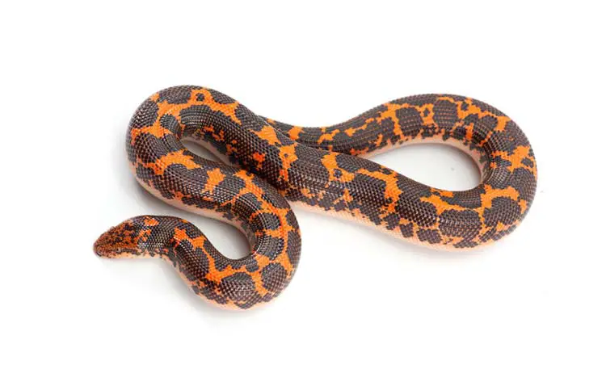
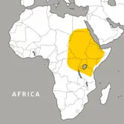
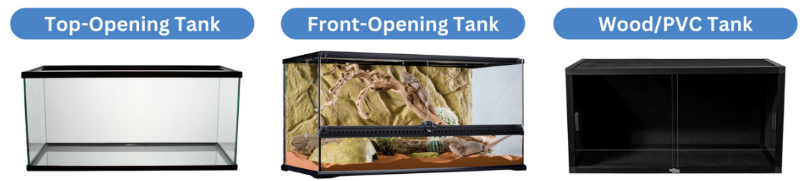
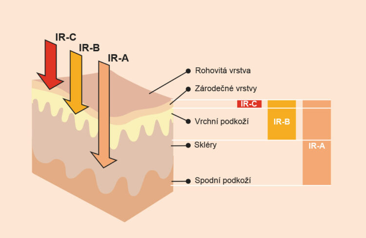

# Startostlivosť o Piesočníka Pestrého Kenského

<figure>
  

    
    <figcaption>Zdroj: https://www.azreptiles.com/kenyan-sand-boa/</figcaption>
  

</figure>

Táto príručka obsahuje moje vedomosti o starostlivosti o tento zaujímavý druh hada. V rámci slovenskej a českej teraristickej internetovej komunity som nenašla nejaké ucelené informácie o starostlivosti k tomuto druhu, a aj anglické príručky sú veľákrát nepresné alebo nejasné.

# Základné informácie

### Krátky opis
Nejedovatý had, škrtič, ktorý žije v severovýchodnej Afrike a loví prevažne večer alebo v noci. Loví zo zálohy. Čaká na malú obeť zahrabaný v zemi, prepadne ju a následne ju buď uškrtí alebo udusí pod zemou. Kvôli tomuto spôsobu lovu má oči vyššie položené na hlave. Tieto hady sú vajcoživorodé, a teda porodia rovno živé mladé jedince. 

### Čeľaď
Veľhadovité

### Vedecký názov  
Gongylophis Colubrinus Loveridgei

### Český názov
Hroznýšek Pestrý Keňský

### Český názov
Kenyan Sand Boa

<figure style="float:right;width:25%;text-align:left;font-size:smaller;padding: 0;">
    
    <figcaption>Zdroj: https://www.zoonewengland.org/franklin-park-zoo/our-animals/reptiles-amphibians/kenyan-sand-boa/</figcaption>
</figure>

### Pôvod  
Keňa, Egypt, Sudán, Čad, Stredoafrická republika, Konžská demokratiská republika, Uganda, Rwanda, Burundi, Tanzánia, Somálsko, Etiópia, Džibuti, Eritrea 

### Dĺžka života  
15-30 rokov

### Veľkosť
**Samec:** ~43 cm  
**Samica:** ~76 cm

### Právny status o chove:
CITES (Convention on International Trade in Endangered Species of wild fauna and flora) je dohovor o medzinárodnom obchode s ohrozenými druhmi voľne žijúcich živočíchov a rastlín.

Pre držanie piesočníka pestrého je potrebné osvedčenie o preukázaní zákonného pôvodu exemplárov druhov uvedených v prílohe B nariadenia Rady 338/97/ES na základe § 8 ods. 5 vyhlášky CITES. Piesočník pestrý je súčasťou CITES prílohy B. Poďla tejto vyhlášky je potrebné na doklade o kúpe uviesť CITES kód, ktorý označuje pôvod kupovaného exempláru.

# Terárium

Vhodné typy terárií:
<figure>
  

    
    <figcaption>Zdroj: https://drive.google.com/file/d/1SKbLFeeE4pxPQdi4EP3-elTuvVSfAw3L/view</figcaption>
  

</figure>

### Veľkosť (dĺžka x šírka x výška)
**Výpočet minimálnych rozmerov terária:**   
dĺžka hada x polovica dĺžky hada x polovica dĺžky hada

**Minimum pre samca:** 50x30x30 cm  
**Minimum pre samicu:** 80x40x40 cm

Väčšie rozmery môžu byť pre hada prospešné.

# Prostredie terária

## Teplota
V teráriu by mal byť gradient teplôt, keďže hady sú chladnokrvné a prispôsobujú teplotu svojho tela vonkajšiemu prostrediu. Terárium by malo mať chladnú a teplú (s výhrevným telesom) stranu.

**Teplá strana:** 32°C  
**Chladná strana:** 25°C

Pokles teplôt na noc nie je potrebný. Nočná teplota by nemala klesnúť pod 18°C.

<figure style="float:right;width:40%;text-align:left;font-size:smaller;padding: 0;">
    
    <figcaption>Zdroj: https://www.prowellness.cz/cs/news/48-vybirame-infrazarice-berte-jen-ty-jejichz-zareni-obsahuje-ira-vlny/</figcaption>
</figure>

Teplo získavajú z červeného žiarenia. To sa delí na:
- infračervené žiarenie (IR-A) (najmenšia vlnová dĺžka)
- stredné infračervené žiarenie (IR-B)
- ďaleké infračervené žiarenie (IR-C)

Vlnová dĺžka žiarenia preniká do rôznych hĺbok ako teplo do pokožky. Slnko vyžaruje všetky tieto typy. Čiže prirodzené teplo vydáva také výhrevné teleso, ak vyžaruje všetky tieto dĺžky infračerveného žiarenia.

### Výhrevné teleso - zdroj tepla
**Vhodné:**
- halogénové alebo iné výhrevné žiarovky (vyžarujú 11% svetlo, 38% IR-A, 39% IR-B a 12% IR-C)
- Deep Heat Projector (DHP) (vyžarujú 8% IR-A, 48% IR-B a 44% IR-C)
- keramické žiarovky (vyžarujú 1% IR-B a 99% IR-C)

**Akceptovateľné:**
- výhrevné podložky (neprirodzené vyhrievanie zdola)(vyžarujú 100% IR-C)

**Nevhodné:**
- výhrevné káble (vyžarujú 100% IR-C)
- výhrevné kamene (vyžarujú 100% IR-C)
- zafarbené výhrevné žiarovky (rôzne)

### Termostat

Akýkoľvek zdroj tepla je potrebné regulovať, aby sa zabránilo popáleniu alebo nesprávnemu ohrevu.

Typy termostatov:
- **Termostat on/off**  
  Vypína zdroj tepla, keď mierne prekročí nastavenú teplotu. Spôsobuje určité kolísanie teplôt.  
  **Vhodné** s tepelnými podložkami, keramickými žiarovkami a DHP.
- **Impulzný proporcionálny termostat**
  Vysiela impulzy do zdroja tepla podľa nastavenej teploty. Vyšle viac impulzov na zahriatie a menej na ochladenie.  
  **Vhodné** s tepelnými podložkami, keramickými žiarovkami a DHP.
- **Stmievací termostat**  
  Riadi presné množstvo energie, ktorú zdroj tepla dostáva na dosiahnutie nastavenej teploty. Spôsobuje najmenšie kolísanie teplôt.  
  **Vhodné** s akýmikoľvek zdrojom tepla.

## Vlhkosť

**Bežná vlhkosť:** 30%  
**Vlhkosť počas zvliekania:** 60%  
V obdobi vzliekania môžeme zvýšiť vlhkosť celkovým zvlhčením terária (nikdy nestriekať vodu priamo na hada).  
**Lepšia** alternatíva je poskytnút úkryt z navlhčeným substrátom (nie dreveným) alebo s machom. 

## Osvetlenie

Aj keď piesočník je večerný/nočný tvor, je vhodné udržavať cyklus dňa/noci. To im vieme zabezpečiť buď inštaláciou UVB žiarovky do terária alebo prirodzeným svetlom.

Z UVB žiarenia vie piesočník benefitovať. UVB žiarovka musí byť vysokokvalitná s nízkou intenzitou, približne má pokrývať 1/2 dĺžky terária, umiestnená na teplej strane. Treba zabezpečiť bezpečnú vzdialenosť pri vystavovaní UVB žiarenia. TODO

## Substrát

Hĺbka subtrátu: ~9 cm

**Vhodný:**  
- rašelina s pieskom (pomer 60-70/40-30)
- rašelina s kokosovými chipsami
- **hobliny** z osiky (osika nezapácha a teda hadom nevadí)(hobliny z ostatných drevín môžu aj nemusia vadiť)

Substrát by mal udržať vyhrabané tunely.

**Nevhodný:**
- piesok
- kokosové chipsy
- štrk
- štiepky z dreva
- céderové podstielky
- kukuričné podstielky
- papierové podstielky
- parfumované podstielky
- rôzne tvrdé alebo hrubozrnné podstielky

## Dekorácie
TODO

# Stratostlivosť 
TODO

## Kŕmenie
TODO

### Doplnky
TODO

## Manipulácia
TODO

# Správanie
TODO
