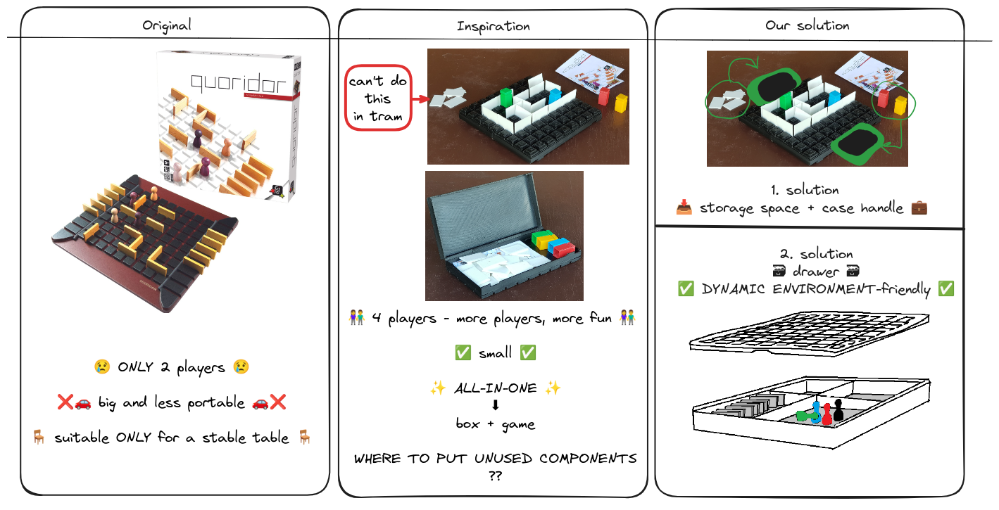
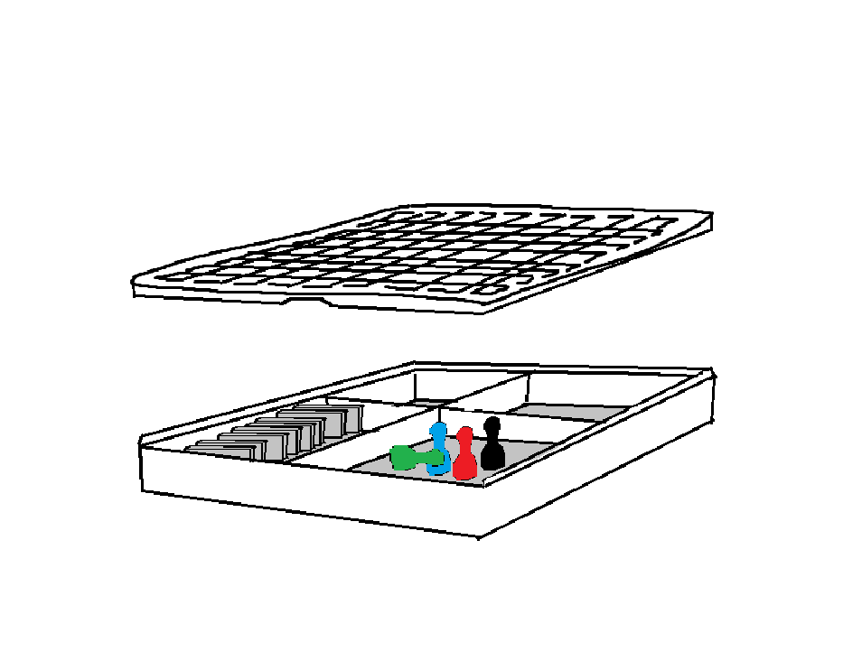

# Business Layer

In this section, we discuss the business side of our projects - the reasons why we think our product would be desirable in a market setting and why it makes sense to produce it our way. On top of that, we discuss how and why our modifications to the original product improve its overall usability and practicality. 

## Analysis

### Original Product

As we have stated before, our product is a modification of an already established product. The board game Quoridor was published by Gigamic and created, designed, and artistically stylized by Mirko Marchesi. In its original version, the game consists of a single board with 4 player figurines, and 20 tile pieces. The cover of the game with quite an illustrative view of the board can be seen in the following figure:

As we can see, the board itself features a simple 9x9 grid made with ridges representing the play area and 20 side ridges that players can utilize to comfortably store the tiles that they are playing with. This not only provides ease of access to the tiles but also allows for easy readability of the state of the game - part of the strategy is knowing how many pieces the opponent has left. 

This version of the game has a few drawbacks though. Our version of the product aims to counter and eliminate these drawbacks and provide a different experience for the users, while also counting on the fact that this version will be used in slightly different use cases. 

Drawbacks of the original:

Limited portability - because the game is stored in a classic cardboard box (like most board games) the portability of the game is limited to the size of the box. What this means practically is that the players have to hustle with the impracticality of the box. By no means is this a major drawback for the majority of board games, but it could be improved upon. 

Slightly favoring a two-player setup - because the ridges for storing tiles are placed at opposite sides, this creates a bilateral symmetry that favors the two-player setup. However, Quoridor, in essence, is a game that can be played by 4 players at a time. This, again, is not a major issue but it can still be improved upon

### Travel-friendly 3D model inspiration

We drew inspiration from an existing 3D model we discovered on Thingiverse, a popular website for sharing user-created digital design files, primarily in .stl format. 

This particular model presents a clever concept for a travel-friendly version of the Quoridor game, serving as both the game and its container, for storing walls and pawns. The design incorporates deep ridges for secure wall placement and features dedicated holes in the pawns, allowing them to "click" securely onto the board. This innovation ensures stability during gameplay in dynamic environments such as cars or trams, where a stable table might be lacking, allowing players to focus on the game's strategy without worrying about keeping the pawns and walls secure on the board.

During brainstorming we came up with some use cases, in which this design would be impractical. Like in tram, when we would open a container and want to play, where we place unused components of game? Like other pawns and wals? We can put them in our pockets, but we can lost them easily or forget about them. Also where players will hold their remaining walls? In hand? And other hand will be used for moving pawn or placing walls. So we need third hand or table in tram to actually put game on. So we try to design our own solution to this problems.

While brainstorming, we identified some impractical use cases for this existing design. 
For instance, in a tram, if we open the container to play, where do we store the unused game components, such as pawns and walls? Putting them in our pockets risks losing or forgetting them. 
Additionally, holding the remaining walls in one hand while playing—where other hand is occupied with moving the pawn or placing walls—poses a challenge. We realized the need for a solution to address these issues and set out to design our own solution.

### Our 3D model

Our version of the product aims to expand where and in what circumstances the board game can be played. We do this by adding a box to the bottom of the playboard that can store all the pieces and tiles. This way, the game can be transported with greater ease and played more comfortably in scenarios such as public transport (trains) or on travels of any kind (car rides, plane flights, and so on…). As such, this change also provides the players with easier piece management - it is very easy to lose pieces of a board game if you don't have an easily closable and compact storage compartment for them. An early design diagram that we threw together in Paint can be seen in the following figure:

As you can see, our version of the game uses the playboard (the grid) as the cover or the lid of the portable compartment. This does come with a drawback though - we don't have enough space for the side ridges that very nicely display the amount of tiles left for each player. It is not such a big problem though, as the storage compartments (4 of them) can each be utilized to do the same thing - while not so visually pleasing they provide a way to distribute the tiles among 4 players if needed. This gets rid of the unwanted bilateral symmetry that we described earlier.

Overall, our product is desirable because it satisfies the needs of players who would like to enjoy the game of Quoridor in more volatile spaces, such as transport. It solves a few practical issues that this game (but also the majority of board games have) - ease of organization of the pieces and visual separation of pieces among players.