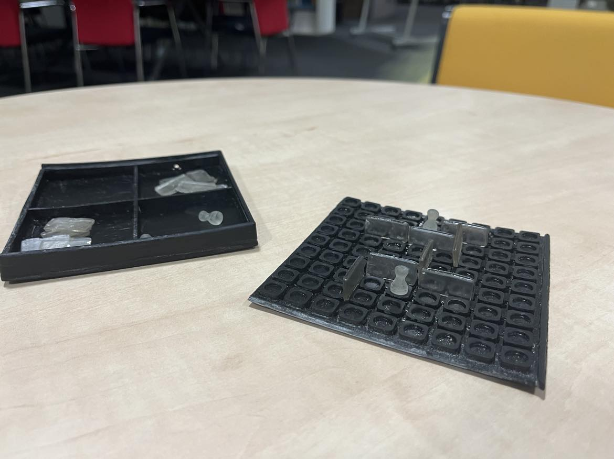
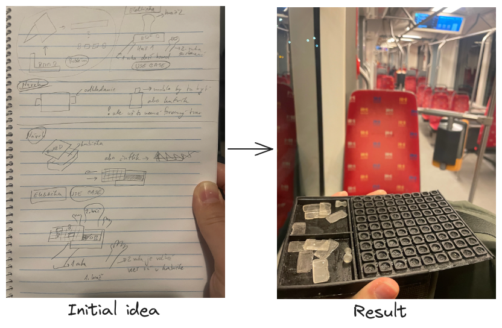
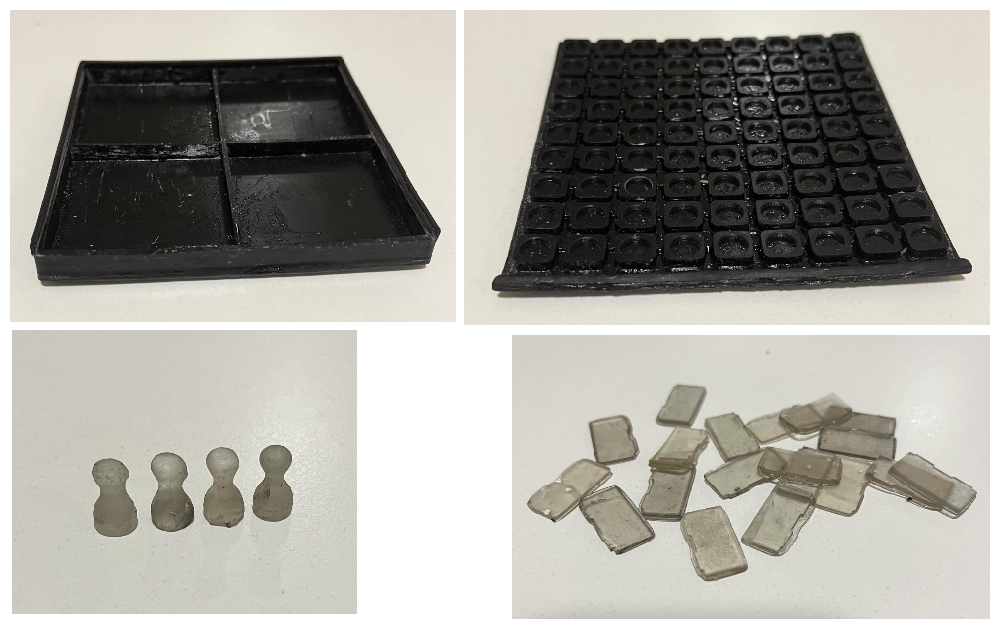
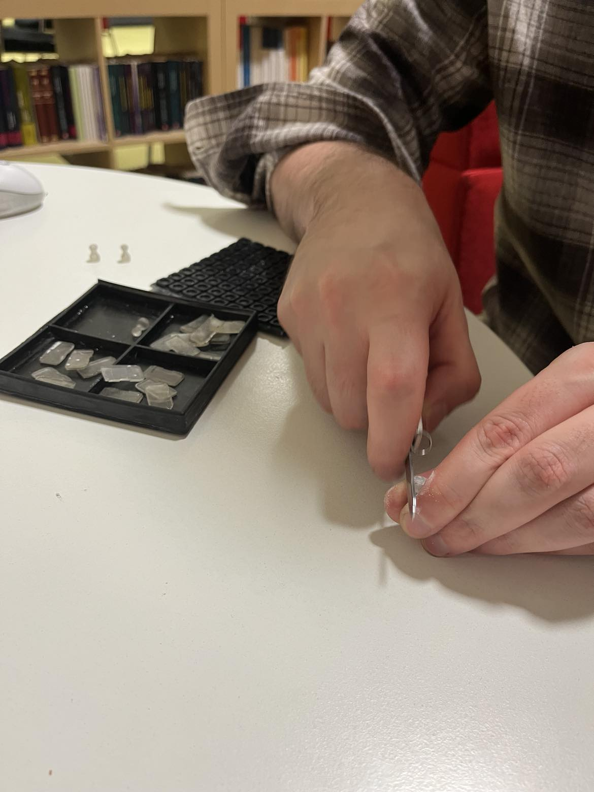

# Outcomes and Results

## Game introduction

Welcome to Quoridor, a hidden gem in the world of board games that has quietly captured the hearts of strategy enthusiasts. Born in 1997, Quoridor may not be as widely known as some classics, but its brilliance lies in its subtlety.

Despite not being a household name, Quoridor offers a rich history of tactical gameplay, where players strategically navigate a labyrinth while strategically placing walls to impede their opponents. Its simplicity in rules and depth in strategy make it an ideal choice for those seeking a game that is easy to learn yet challenging to master.

Perhaps the game's relative obscurity is due to its unassuming appearance, but Quoridor's true beauty reveals itself in the intense battles of wits that unfold on the board. As players delve into the nuances of blocking paths and plotting their route to victory, Quoridor transforms into a captivating journey of skill and foresight.

So, why is Quoridor worth your attention? It's a game that transcends the need for flashy components or elaborate themes. Instead, it relies on the purity of strategic gameplay, offering a refreshing and intellectually stimulating experience. With every move, players engage in a dance of strategy and anticipation, making Quoridor an underrated masterpiece waiting to be discovered. Join us in uncovering the hidden joys of this timeless board game.

### Game rules

#### Objective:

The goal of Quoridor is to be the first player to reach the opposite side of the game board.

#### Setup:
The game board is set up as a 9x9 grid, and each player starts with a pawn.

Players decide who goes first.

#### Player Turns:
Player have two options:

1. Pawn Movement: The pawn can move to an adjacent square horizontally or vertically (not diagonally).

2. Wall Placement: Players can place a wall on the board to impede their opponent's progress. Walls are two squares long and can be placed vertically or horizontally. However, they cannot completely block a player's path, leaving at least one open route to the other side.

#### Rules for Wall Placement:
1. Walls cannot overlap or intersect with other walls.

2. Walls cannot be placed in such a way that they completely enclose any player, trapping them in a section of the board.

3. Each player has a limited number of walls (usually 10 walls in total), so they must use them strategically.

#### Winning: 

The game ends when one player successfully moves their pawn to the opposite side of the board. That player is declared the winner.

## [Analysis → business layer](./Business_Layer.md )

## [Project design, use cases, production process→ system layer](./System_Layer.md)

## [3D modeling and printing→ technology layer](./Technology_Layer.md)

## Results

