# Technology Layer

## 3D modeling

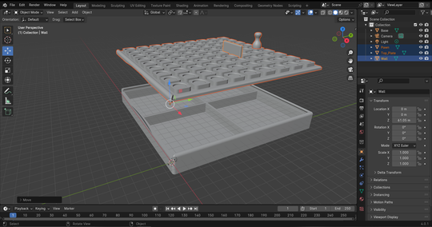

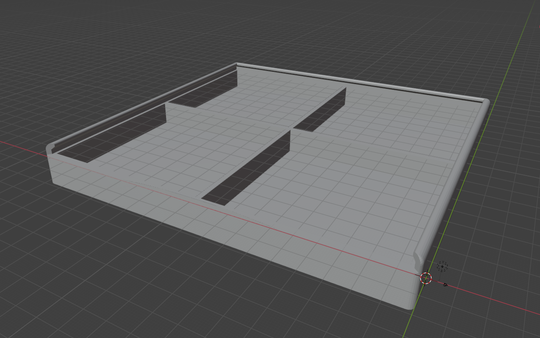

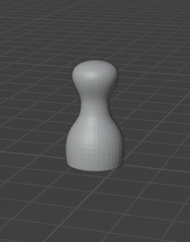

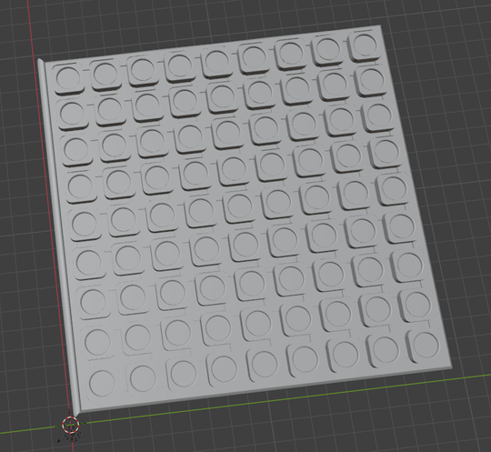
 

## Model revisions

### 1. revision
Solid bottom tray  
Top lid with smooth gaps and smooth pawn place  
Rectangular walls  
Regular pawns  

### 2. revision
Solid bottom tray  
Top lid with gaps **with holes and blocks for pawns have dedicated holes too** (holes can secure walls and pawns on place)  
Walls with **ridges**  
Regular pawns  

### 3.revision (after first printed prototype)
Bottom tray **with holes** (break vacuum during printing)  
**Little cut from edges** from top lid and **blocks were raised** (so it could be closed)  
Walls with ridges  
Regular pawns  

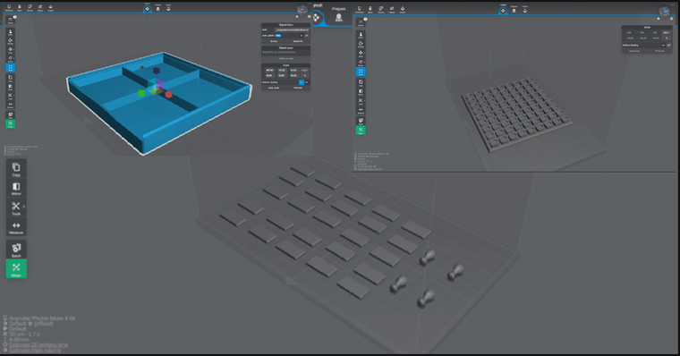

## 3D printing

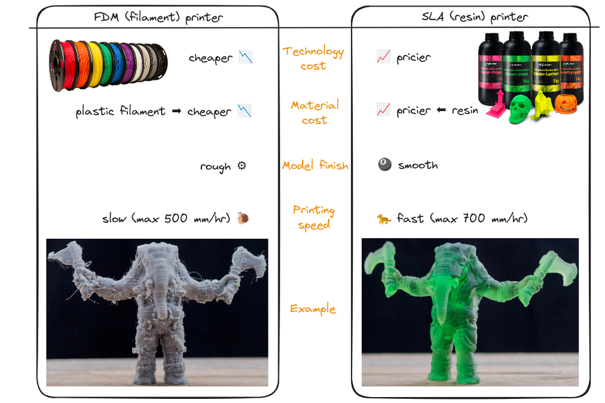

For this project, we didn’t choose traditional fused deposition modeling (FDM) 3D printers (with plastic filament). We chose more unusual 3D printer - Resin 3D printer. Also known as stereolithography (SLA) (another likewise technology is digital light processing (DLP)). It is a technology that uses liquid photopolymer material (resin)(higly toxic!) for creating three-dimensional objects.

### SLA printer basics:
- **Technology:** SLA printing utilizes stereolithography (SLA) technology. It uses liquid photopolymer (resin) that solidifies when exposed to ultraviolet (UV) light.
- **How It Works:** In SLA, a laser or light source selectively solidifies the liquid resin layer by layer, creating a solid object.
- **Resin Material:** The resin used in 3D printing is a photopolymer, meaning it changes its physical properties when exposed to light. It starts as a liquid and solidifies into a solid form during the printing process.

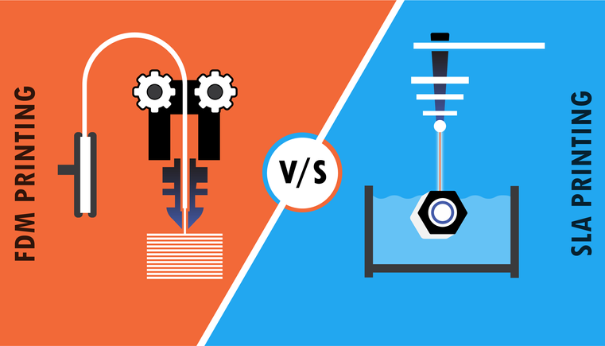

#### Pros of SLA 3D printing:
- **High Resolution:** SLA printers can achieve higher levels of detail and smoother surfaces compared to traditional FDM printers, making them ideal for intricate and small-scale prints.
- **Diverse Material Options:** SLA printers offer a variety of specialized resins, including flexible, castable, and engineering-grade resins, expanding the range of applications.
- **Smooth Finish:** Prints from SLA 3D printers often have a smoother finish, requiring less post-processing compared to prints from FDM printers.
- **Accuracy:** Resin 3D printing is known for its high dimensional accuracy, producing prints that closely match the original digital design.
- **Faster:** SLA printers produce one layer within a specified exposure time, whether it involves a single dot or covers the entire print volume.

#### Cons of Resin 3D Printing:
- **Limited Build Size:** SLA printers typically have smaller build volumes compared to FDM printers, limiting the size of objects that can be printed in a single run.
- **Messy and Smelly:** Working with resin can be messier and emit strong odors, requiring good ventilation and careful handling. Longer or frequent exposure can lead to strong allergic reactions.
- **Post-Processing Requirements:** Resin prints require post-processing steps such as cleaning in isopropyl alcohol and UV curing, adding extra steps compared to the simplicity of FDM prints.
- **Material Cost:** Resin material can be more expensive than traditional filament used in FDM printers.

In summary, resin 3D printing offers high precision and diverse material options, making it suitable for applications where detail and accuracy are crucial. However, it comes with some challenges such as limited build size, messiness, and additional post-processing steps. The choice between SLA and FDM 3D printing depends on the specific requirements of the project.

### 3D printing process
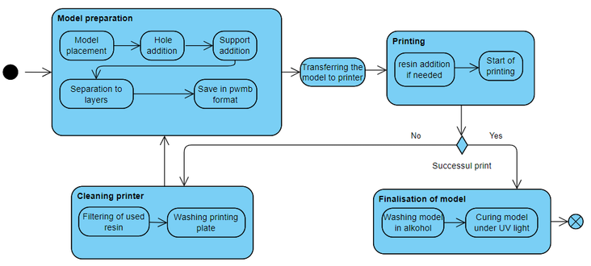

#### Steps
1. Creating a design (.stl format).
2. Division into parts for printing (bottom, top, walls and pawns).
3. Processing in the Lychee slicer software (setting the rotation, adding supports, adding holes to bottom, so there was no negative pressure in the lower part, export to print .pwmb format).
4. Filling the printer tub with resin.
5. Start printing.
6. After print finish, detach model from the printer plate.
7. Wash model in alcohol (99% isopropyl alcohol).

8. Cure model under UV light in the curing station.

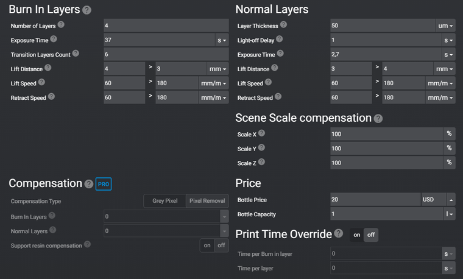  
SLA printer setting (light emission: 78%)

#### Devices
**Printer** - Anycubic Mono X 6K

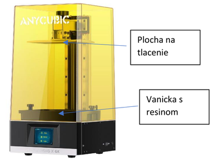  
SLA printer - Anycubic Mono X 6K

A SLA 3D resin printer, uses a 6K mono LCD display for resin curing. It is a monochromatic UV highly precise display with adjustable brightness.

**Curing Station** - Anycubic Wash & Cure

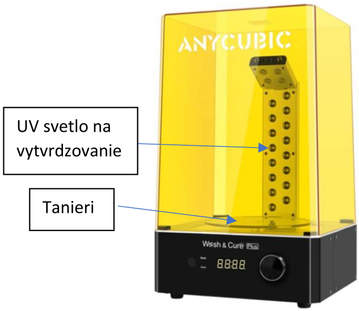  
Curing station - can be exchange for a tank with alcohol

Is a station for treating the printed objects, with two modes - curing and washing. During curing, the bottom tray on which the printed object is placed slowly rotates and is illuminated with UV light (usually for 2 minutes; if too long, the object may become fragile, and if too short, it may not be adequately cured). The bottom tray can be replaced with a tank containing alcohol for washing the printed object before curing. The same motor spins a magnetic vortex that stirs the alcohol in tank during object cleaning (it rotates much faster during cleaning than during curing, hence the different modes).

#### Printing knowledge
The ideal temperature for printing a model is above 25 °C. 

To save time, the larger parts (bottom and top) were printed directly on the printing surface without tilting and supports. Smaller parts were first printed with supports, but since they were too small, deformation occurred in the place of contact  with the supports.

In another attempt, smaller parts were also put directly on the surface without supports and tilting.
The upper part had to be modified by raising the blocks for pawns, since they were to low for walls and the walls fell out.

Models was wahsed with alcohol, then underwent a 2 minute curing process in the rotating curing station, followed by an additional 1 minute curing. Then left to cure for several hours in daylight.

The upper and lower parts are slightly curved, probably due to the small height and positioning of the layers.

#### Printing time
Top - 27 min  
Bottom - 43 min  
Walls and pawns - 20 min  

#### Material - resin
Black and transparent resin from Creality was used.
There are black traces on the transparent resin, because it mixed with black resin residue in printer tub.

#### Printer care
If printing failed (model peeled off or it falls from print plate), it is necessary to remove all stuck remains of model from tub and filter all the resin through the print micro sieve. Everything needs to be removed before another printing.

Leave the model remains in the sunlight for them to fully solidify and become non-toxic.

It is ideal to wash the surface of printing tub and plate from resin between printing. Isopropyl alcohol can be used for this or a cleaning detergent for smooth surfaces (e.g. for windows).

Between printing, the liquid resin can remain in the tub for an indefinite period of time thanks to the wind-resistant walls, which also don’t let ultraviolet light in.