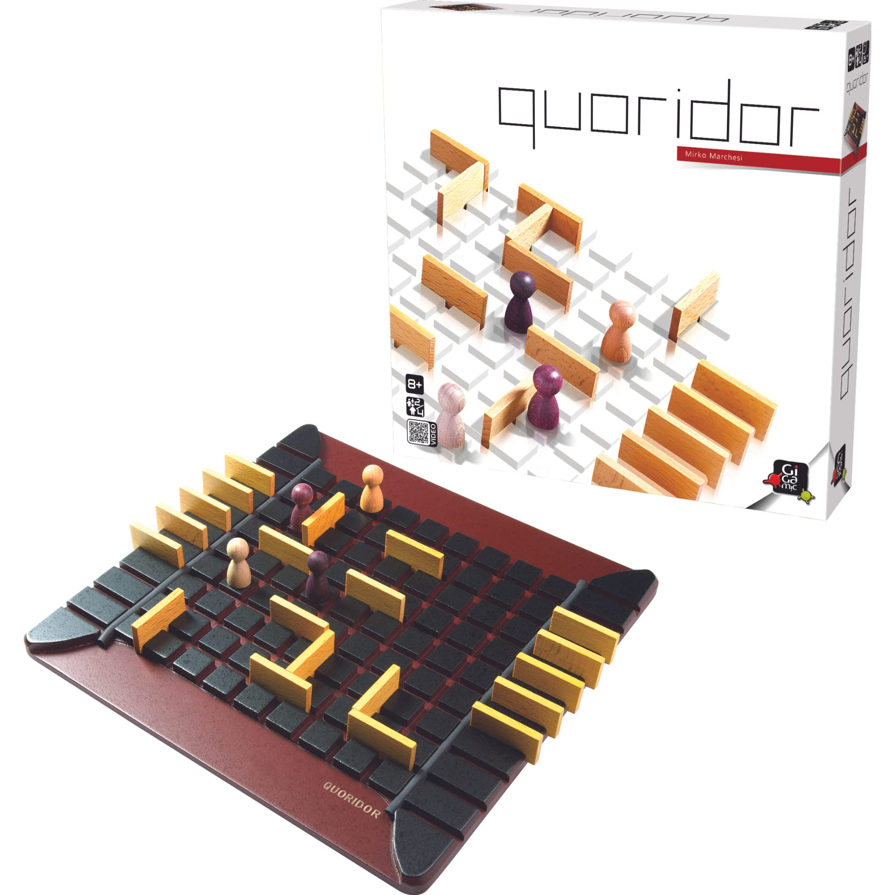
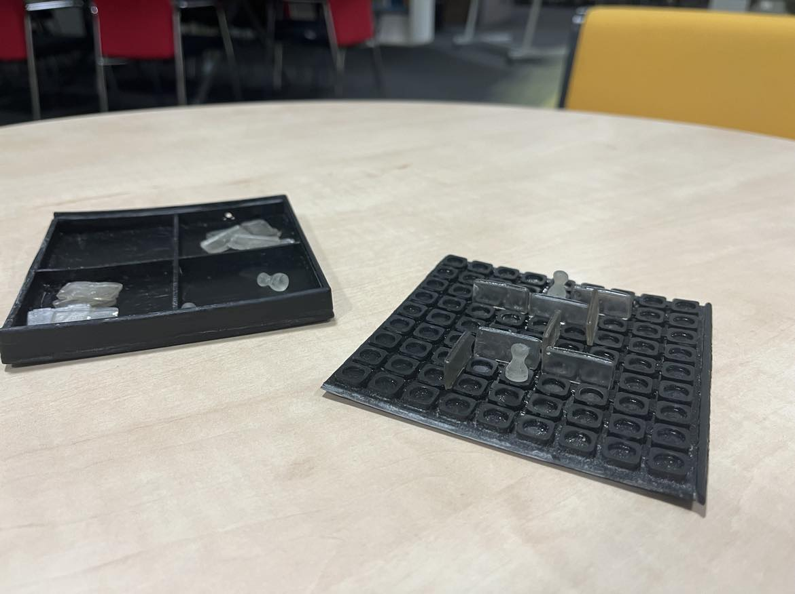

# Portable Board Game - Quoridor

## Authors - Leonard Puškáč, Ema Richnáková

This project involves the redesign of a relatively popular board game called Quoridor. The game itself is about finding the shortest path to the other end of the board, while making the path of the opponent longer.

The original rendition of the game has a classic board game format - a board with some game pieces - all in a cardboard box.

## The aim of our project is to:
1. Redesign the form of the game such that it is more portable
2. Learn to use a resin based 3D print

## The Project Structure

Information about the authors of this project can be found in [About Us](./About%20Us/)

Our Knowledge Contribution documents can be found in [Knowledge Contribution](./Knowledge%20Contribution/)

All the figures used in our documents can be found in [Figures](./Figures/)

And finally the main parts of our project can be found in the [Project](./Project/) folder. Inside it, there are 5 documents describing the project, as well as the [Models](./Project/Models/) folder containing the model of the game.

## The Original Game

## Our Result

